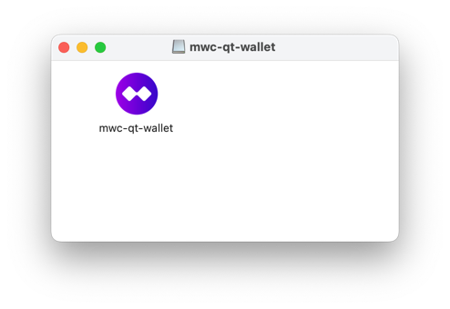
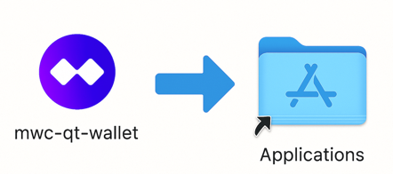

<!-- TOC -->

- [Installing the MWC Qt-Wallet on macOS](#installing-the-mwc-qt-wallet-on-macos)
    - [1. Download the correct archive for your Mac](#1-download-the-correct-archive-for-your-mac)
    - [2. Verify the checksum (optional but recommended)](#2-verify-the-checksum-optional-but-recommended)
    - [3. Unpack the archive and run installer](#3-unpack-the-archive-and-run-installer)
    - [4. Move the app to Applications](#4-move-the-app-to-applications)
    - [5. Run MWC QT Wallet](#5-run-mwc-qt-wallet)
- [Installing the MWC Qt-Wallet on Windows](#installing-the-mwc-qt-wallet-on-windows)
    - [1. Download installer](#1-download-installer)
    - [2. Verify File Integrity (SHA256)](#2-verify-file-integrity-sha256)
    - [3. Run installer](#3-run-installer)
    - [4. Run MWC QT Wallet](#4-run-mwc-qt-wallet)
- [🐧 Linux Installation Guide](#-linux-installation-guide)
    - [1. Download the Files](#1-download-the-files)
    - [2. Verify File Integrity (SHA256)](#2-verify-file-integrity-sha256-1)
    - [3. Install required Qt5 Libraries](#3-install-required-qt5-libraries)
    - [4. Install MWC QT Wallet](#4-install-mwc-qt-wallet)
    - [5. Launch the App](#5-launch-the-app)

<!-- /TOC -->

# Installing the MWC Qt-Wallet on macOS

## 1. Download the correct archive for your Mac

Go to the release page  
👉 [https://github.com/mwcproject/mwc-qt-wallet/releases](https://github.com/mwcproject/mwc-qt-wallet/releases)

| CPU | Archive to download                       |
|---|-------------------------------------------|
| **Apple Silicon (M1 / M2 / M3 …)** | `mwc-qt-wallet_X.X.X-macos-arm.tar.gz` |
| **Intel** | `mwc-qt-wallet_X.X.X-macos-x64.tar.gz`   |

Each archive has a companion file ending in `.sha256sum` - download that too.

---

## 2. Verify the checksum (optional but recommended)

Open **Terminal** and `cd` to the folder where you downloaded the files (usually `~/Downloads`).

```bash
shasum -a 256 -c mwc-qt-wallet_*-macos-*.tar.gz.sha256sum
```
If the file is valid you'll see:
```
mwc-qt-wallet_1.2.14-macos-*.tar.gz: OK
```
Any other message means the download is corrupted - delete and re-download.

## 3. Unpack the archive and run installer

In Terminal:

```bash
tar -xzf mwc-qt-wallet_*-macos-*.tar.gz
mwc-qt-wallet/install.sh
```

You should see the app window.



Please note: the MWC Qt Wallet has not yet been copied to your Applications folder.  
You can still run it by clicking the app icon directly in the extracted folder.

## 4. Move the app to Applications

Drag the mwc-qt-wallet icon onto the Applications folder.



## 5. Run MWC QT Wallet  

MWC QT Wallet is ready. Go to your Applications and run mwc-qt-wallet.

# Installing the MWC Qt-Wallet on Windows

## 1. Download installer

Go to the release page  
👉 [https://github.com/mwcproject/mwc-qt-wallet/releases](https://github.com/mwcproject/mwc-qt-wallet/releases)

| Platform                                      | Archive to download                                |
|-----------------------------------------------|----------------------------------------------------|
| **Intel/AMD x64 CPU**                         | `mwc-qt-wallet_X.X.XX-win64-setup-standardcpu.exe` |
| **Low end Intel/AMD x64 CPU (Atom, Celeron)** | `mwc-qt-wallet_X.X.XX-win64-setup-basiccpu.exe`    |
| **32 bit Windows**                            | `mwc-qt-wallet_X.X.XX-win32-setup.exe`           |

Each archive has a companion file ending in `.sha256sum` - download that too.

## 2. Verify File Integrity (SHA256)

To ensure the installer is not corrupted or tampered with:

1. Open **PowerShell**
2. Navigate to the download folder:

```powershell
cd .\Downloads\
Get-FileHash mwc-qt-wallet_*-win*-setup*.exe -Algorithm SHA256
```

You will see output similar to this (your hash might be different)

```powershell
Algorithm       Hash                                                                   Path
---------       ----                                                                   ----
SHA256          D705CA53064E1AD9FF4AA646E3CED39DA133FE561FC362C9C5741EC6751484C7       C:\Users\XXXXX\Downloads\mwc-qt-...
```

Print the contents of the .sha256sum file to compare the hash:
```powershell
Get-Content mwc-qt-wallet_*-win*-setup*.exe.sha256sum
```

You should see the content with expected value of the hash:

```powershell
d705ca53064e1ad9ff4aa646e3ced39da133fe561fc362c9c5741ec6751484c7  mwc-qt-wallet_1.2.14-win32-setup.exe
```

Compare the hash values, if they are different, the download is corrupted - delete the installer and re-download.

## 3. Run installer

If hash verification was successful, from the Powershell run the installer:

```powershell
./mwc-qt-wallet_*-win*-setup*.exe
```

You should see the installer UI:


Follow the installer steps.

## 4. Run MWC QT Wallet

- Open the **Start Menu**
- Search for **MWC GUI**
- Launch the app

# 🐧 Linux Installation Guide

MWC QT Wallet provides packages for major Linux distributions:

- `.deb` for **Debian / Ubuntu**
- `.rpm` for **Red Hat / Fedora / CentOS**
- `.tar.gz` for **generic installation**

Download the latest release from:  
👉 [https://github.com/mwcproject/mwc-qt-wallet/releases](https://github.com/mwcproject/mwc-qt-wallet/releases)

## 1. Download the Files

Choose one of the following packages based on your system:

Use `basiccpu` for lowend Intel/AMD x64 CPUs (Atom, Celeron), `standardcpu` for more advanced x64 CPUs.  

| Package Type | Installer File                                 
|--------------|----------------------------------------
| DEB | `mwc-qt-wallet_X.X.XXX-linux64-standardcpu.deb` 
| RPM | `mwc-qt-wallet_X.X.XXX-linux64-standardcpu.rpm`
| TAR.GZ | `mwc-qt-wallet_X.X.XXX-linux64-standardcpu.tar.gz`

Each archive has a companion file ending in `.sha256sum` - download that too.

## 2. Verify File Integrity (SHA256)

Open **Terminal** and `cd` to the folder where you downloaded the files (usually `~/Downloads`).
```bash
shasum -a 256 -c mwc-qt-wallet_*-linux64-*.sha256sum
```
If the file is valid you'll see:
```
mwc-qt-wallet_1.2.14-linux64-standardcpu.deb: OK
```
Any other message means the download is corrupted - delete and re-download.

## 3. Install required Qt5 Libraries

Install Qt5 runtime libraries (required to run the app):

On Debian/Ubuntu:
```bash
sudo apt update
sudo apt install -y libqt5widgets5 libqt5gui5 libqt5core5a
```

On Fedora/RHEL/CentOS:
```bash
sudo dnf install -y qt5-qtbase qt5-qtbase-gui
```

If you're using another distro, install the Qt5 GUI runtime libraries via your package manager.

## 4. Install MWC QT Wallet

For .deb (Debian/Ubuntu):
```bash
sudo dpkg -i mwc-qt-wallet_*-linux64-*.deb
```

For .rpm (Fedora/RHEL/CentOS):
```bash
sudo rpm -i mwc-qt-wallet_*-linux64-*.rpm
```

For .tar.gz unpack and run the MWC QT Wallet:
```bash
tar -xzf mwc-qt-wallet_*-linux64-*.tar.gz
cd mwc-qt-wallet
./mwc-qt-wallet
```

## 5. Launch the App

For .deb or .rpm installs you can launch the app from your system's app menu.


