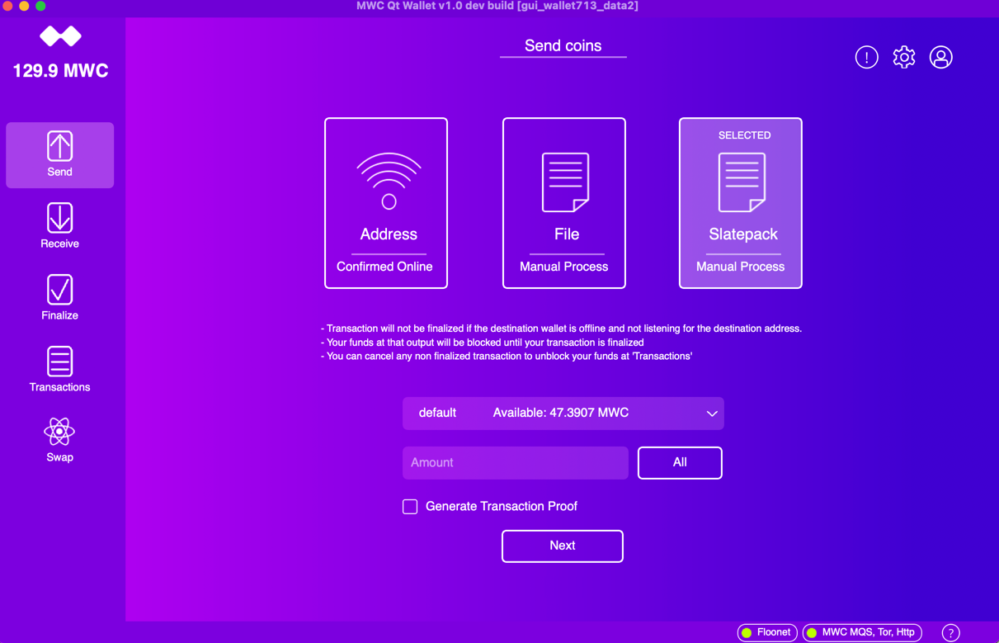
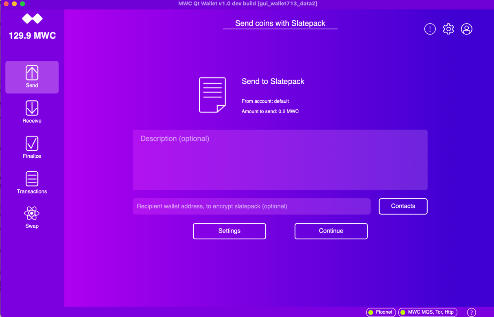
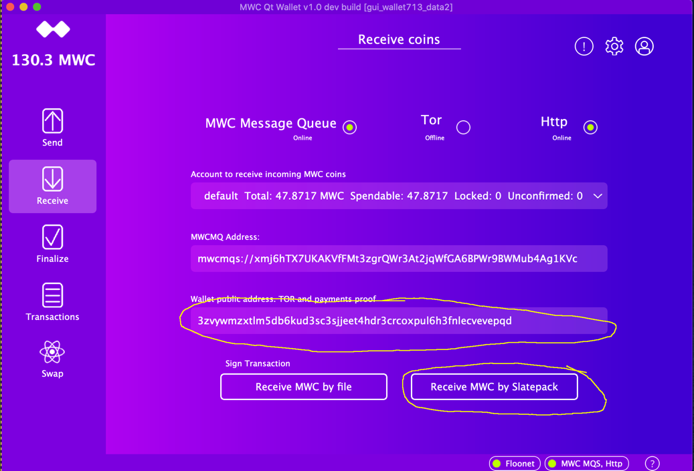
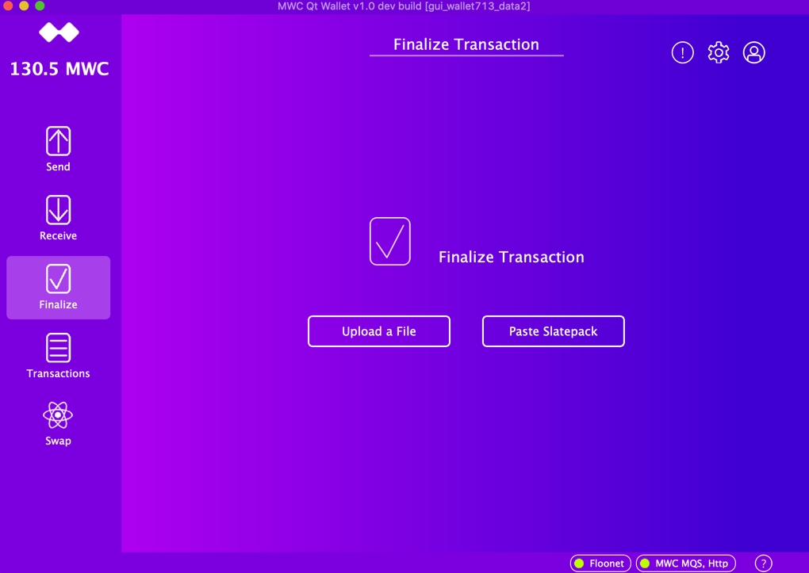
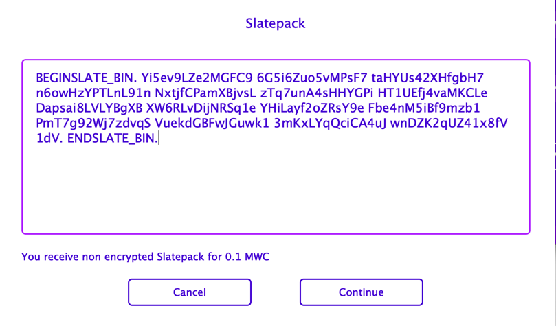
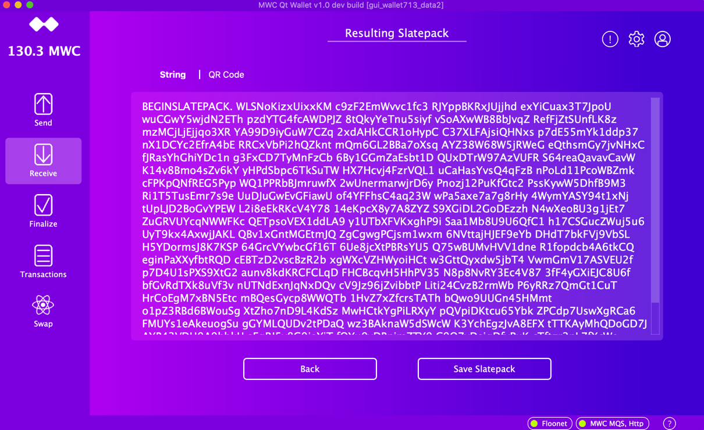
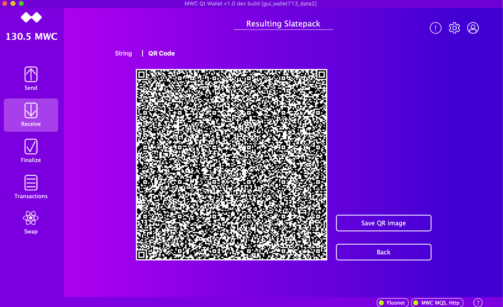
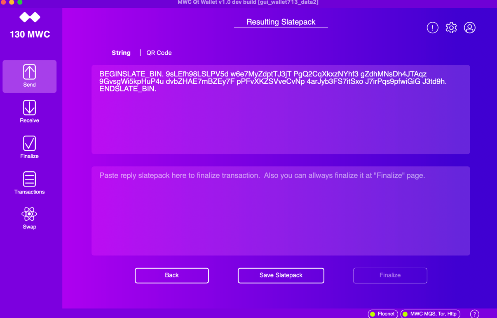
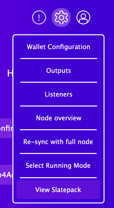
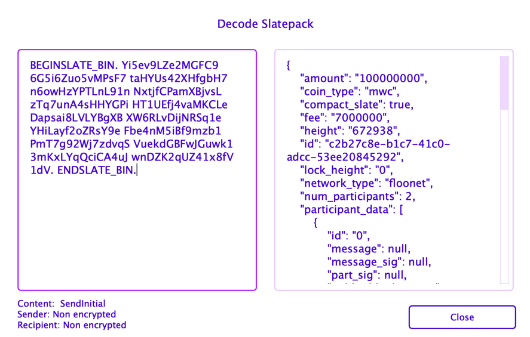

# About #

In this document we are tracking the changes that are made on the Bridges level. 

It is needed for Mobils and Desktop integrations.

# August 9, 2020 #

### Changed at Bridge: InitAccount 

From:

```
// newWalletChoice: see values at state::InitAccount::NEW_WALLET_CHOICE
// network: see values at state::InitAccount::MWC_NETWORK
Q_INVOKABLE void submitWalletCreateChoices(int newWalletChoice, int network);
```
To: 
```
// network: see values at state::InitAccount::MWC_NETWORK
// newInstanceName: Name of the new wallet instance
Q_INVOKABLE void submitWalletCreateChoices(int network, QString newInstanceName);
```

Note: QML code is updated at  InitAccount.qml    Line: 326


### Change at Bridge:  WalletConfig

**Deleted method 'setDataPathWithNetwork'**

**Add method:**
```
// Specify if the Online Node will run as a mainnet.
Q_INVOKABLE void setOnlineNodeRunsMainNetwork(bool isMainNet);
```

### Change at Bridge:  WalletConfig

From:
```
Q_INVOKABLE bool updateWalletConfig(QString network, QString dataPath,
                    QString mwcmqsDomain, QString keyBasePath, bool need2updateGuiSize);
```
To:
```
Q_INVOKABLE bool updateWalletConfig( QString mwcmqsDomain, QString keyBasePath, bool need2updateGuiSize );
```

Note: Wallet data path & network managed with different methods. Both those methods not releated to Mobile.

### Created a new Bridge  StartWallet

New method:
```
// Create a new Wallet Instance
// path - wallet data location or empty for the next available_path (new wallet case only)
// restoreWallet - true if the next new wallet will be restore from the seed.
Q_INVOKABLE void createNewWalletInstance(QString path, bool restoreWallet);
```
Note: Mobile will need that new bridge and method to support of creation of a new instance.  Mobile should specify path as empty string ("")

### Change at Bridge:  Config

**Deleted metod: "doesSeedExist"**

**Deleted metod: "readNetworkArchFromDataPath"**

**Deleted metod: "saveNetwork2DataPath"**

Note: New wallet managed differently now, more simple way. Mobile shouldn't use deleted methods yet.


**Add new methods:**
```
// Request wallet instances.
// hasSeed - true if needed initialized wallet instances.
// Returns the data as:
// <selected path_id>, < <path_id>, <instance name>, <network> >, ...  >
Q_INVOKABLE QVector<QString> getWalletInstances(bool hasSeed);
// Request current wallet instance details.
// Returns the data as 4 items tuple:
// < <path_id>, <full_path>, <instance name>, <network> >
Q_INVOKABLE QVector<QString> getCurrentWalletInstance();

// Set this instance as active
Q_INVOKABLE void setActiveInstance(QString instancePathId);
// Update instance name
Q_INVOKABLE void updateActiveInstanceName(QString newInstanceName);
```
Note: Mobile will need to adopt them for instance management.

# August 26, 2020 #

Add a new bridge: Swap

# October 13, 2020 #

Add support for proofs.

### Change at Bridge:  Config

Add GenerateProof flag getter and setter
```
    // Get 'generate proof' flag value
    Q_INVOKABLE bool getGenerateProof();
    // Update 'generate proof' flag value
    Q_INVOKABLE void setGenerateProof(bool generate);

```

### Change at Bridge:  Wallet

Method to Request proof address
```
    // Request a wallet address for file/http transactions
    // Return: signal  sgnFileProofAddress
    Q_INVOKABLE void requestFileProofAddress();
```
Signal that returned that address
```
    // Get wallet provable address. Please note, address will be changed
    // When address index will be changed. Normally it is the same as a tor address
    void sgnFileProofAddress(QString proofAddress);
```

# January 5, 2021 #

Slatepacks support. Here I try to cover all changes that are done on bridges and UI. The 
purpose of this document is to track changes on Desctop, so we migth update mobile with the same

##bridge::Config 
```c++
    // Slatepack format, selected value
    Q_INVOKABLE int getSendMethod();
    Q_INVOKABLE void setSendMethod(int method);

    // Lock outputs for slatepacks send
    Q_INVOKABLE bool getSendLockOutput();
    Q_INVOKABLE void setSendLockOutput(bool lock);
```

##bridge::Send
add parameters `bool isSlatepack, bool isLockLater, QString slatepackRecipientAddress`

QML code is upadted with false values 
```c++
    // Updated signature for 1st argument:
    Q_INVOKABLE int initialSendSelection( int sendSelectedMethod, QString account, QString sendAmount );


// Handle whole workflow to send offline
    // apiSecret - is not needed. Pass empty String
    // return true if some long process was started.
    Q_INVOKABLE bool sendMwcOffline( QString account, QString amountNano, QString message, bool isSlatepack, bool isLockLater, QString slatepackRecipientAddress);
```

##bridge::Receive
```c++
    // Sign slatepack transaction. The primary data is a slatepack.  slateJson can be calculated, passed because we
    // already have this info after verification.
    Q_INVOKABLE void signSlatepackTransaction(QString slatepack, QString slateJson, QString slateSenderAddress);
```

##bridge::FileTransaction
```c++
    // Files transaction page, continue with a Slatepack
    Q_INVOKABLE void ftContinueSlatepack(QString slatepack, QString txUuid, QString resultTxFileName, bool fluff);
```

##bridge::Finalize
```c++
    // Finalize slatepack slate.
    Q_INVOKABLE void uploadSlatepackTransaction( QString slatepack, QString slateJson, QString sender );
```

##bridge::Util
```c++
    // Generating a QR image for the text content
    // Result is 2 element array:
    // res[0]  - size of the QR code
    // res[1]  - SVG string that can draw the QR code. Seems like both Desctop and QML can draw the SVG path.
    Q_INVOKABLE QVector<QString> generateQrCode(QString content);

    // Parsing slate as a Json. Respond back with error or with Slate details
    // slateContent  - slate sjon string to parse.
    // fileTransactionType  - value of FileTransactionType
    // Error case:
    // res[0] - error message
    // Normal case:
    // res[0] = transactionId
    // res[1] = amount
    Q_INVOKABLE QVector<QString> parseSlateContent( QString slateContent, int fileTransactionType, QString slateSenderAddress );

    // Open QFileDialog::getSaveFileName with all standard verificaitons that we normally have
    // Return file name or empty value is request was cancelled or error happens
    Q_INVOKABLE QString getSaveFileName(QString title, QString callerId, QString extentionsDlg, QString extentionFile);

    // Open QFileDialog::getOpenFileName with all standard verificaitons that we normally have
    // Return file name or empty value is request was cancelled or error happens
    Q_INVOKABLE QString getOpenFileName(QString title, QString callerId, QString extentionsDlg);

    // Write some text into the file
    Q_INVOKABLE bool writeTextFile(QString fileName, QStringList lines );
```

##bridge::Wallet
```c++
    // Decode the slatepack data
    // Check Signal: sgnDecodeSlatepack( QString tag, QString error, QString slatepack, QString slateJSon, QString content, QString sender, QString recipient )
    Q_INVOKABLE void decodeSlatepack(QString slatepackContent, QString tag);

    // Finalize a slatepack.
    // Check Signal sgnFinalizeSlatepack
    Q_INVOKABLE void finalizeSlatepack( QString slatepack, bool fluff, QString tag );
```

##WndManager
pageShowSlatepack  shows new ResultedSlatepack page.
```c++
    // Removeed   virtual void pageSendOffline( QString selectedAccount, int64_t amount ) override;
    virtual void pageSendFile( QString selectedAccount, int64_t amount ) override;
    virtual void pageSendSlatepack( QString selectedAccount, int64_t amount ) override;


    // Show open file dialog. Might not be needed for mobile
    virtual QString getOpenFileName(const QString &caption, const QString &dir, const QString &filter) override;

    // slatepack - slatepack string value to show.
    // backStateId - state ID of the caller. On 'back' will switch to this state Id
    virtual void pageShowSlatepack(QString slatepack, int backStateId, QString txExtension, bool enableFinalize) override;
```

Change:   `const QString & fileName`  to `const QString & fileNameOrSlatepack`

There are some logic change inside that window to handle files or slatepacks.
```c++
    virtual void pageFileTransaction(QString pageTitle, QString callerId,
                                     const QString & fileNameOrSlatepack, const util::FileTransactionInfo & transInfo,
                                     int nodeHeight,
                                     QString transactionType, QString processButtonName) override;
```

## Send Page (initial)

Add 'Slatepack' button.


## Send Page (Slatepacks)
Recipient wallet address is optional and it is a tor address.

The contact selection dialog must show ONLY tor addresses. Please check chenges at implementaiton of SelectContactDlg.



Please note, in the code it is seend to files dialog with some options. 

## Receive page:
1. No tor address, instead the wallet public address that will be converted into tor if needed.
When we retire the MQS, that will be the only wallet public address.
2. New button 'Receive MWC By Slatepack'


## Finalize page

Add a new button `Paste Slatepack`



## InputSlatepackDlg
This dialog accept the slatepack and does some verification.
It is used for "Receive" and "Finalize" pages to request incode slate. 



## ResultedSlatepack

In this example you can see responding encrypted slate with messages, so it is pretty large,

Here is string representation at Receive 


And a QR code. Because message can be long, I made QR code window as large as possible.

For QML implementaiton we might add method that generate SVG image for the QR code.
Underling library does that, descktop just drawing on the image. Just check the implemntation.



The string representaiton at Send include the finalize same transaction feature.



## Decode Slatepack Dialog
The purpose of this dialog is mostly troubleshooting or just data exploring.

Calling from the navigation menu:



The dialog with data looks like this:

