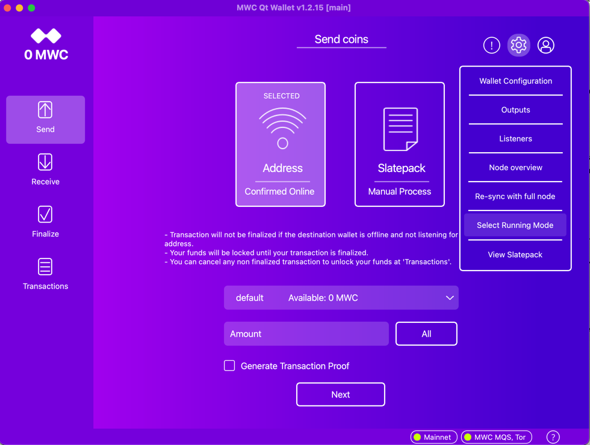
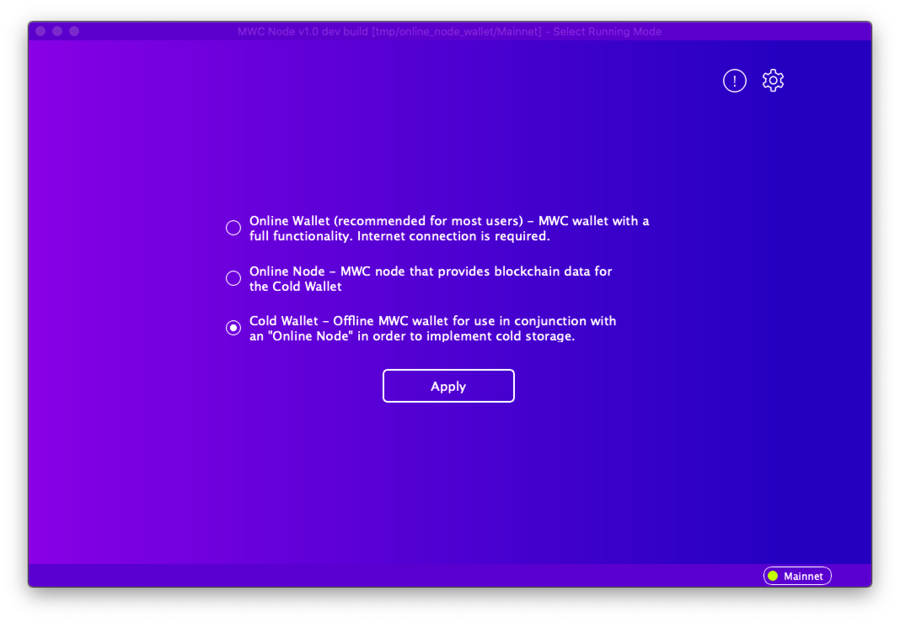
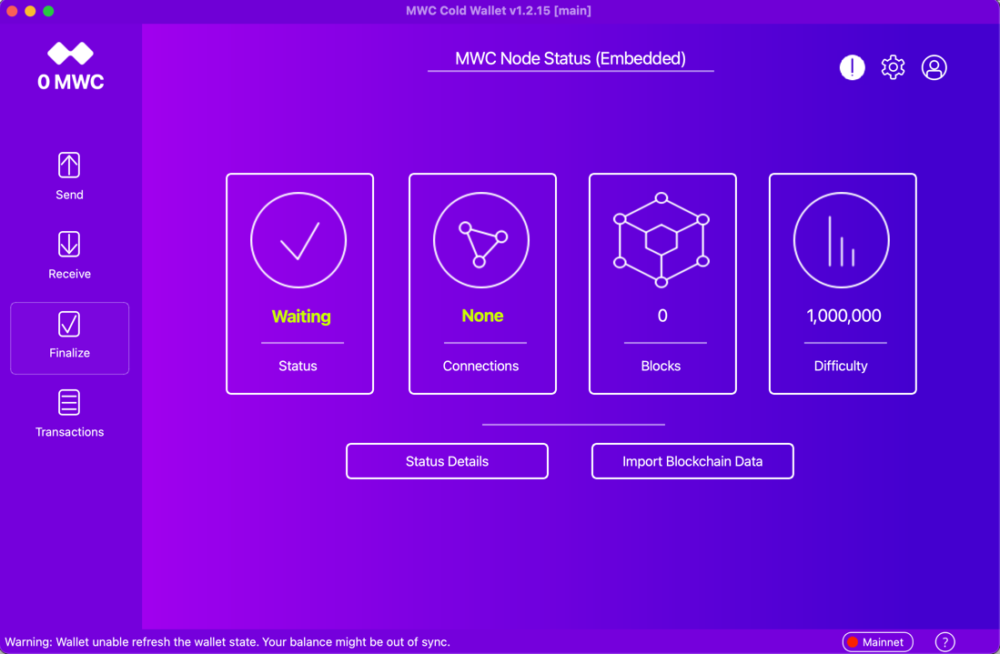
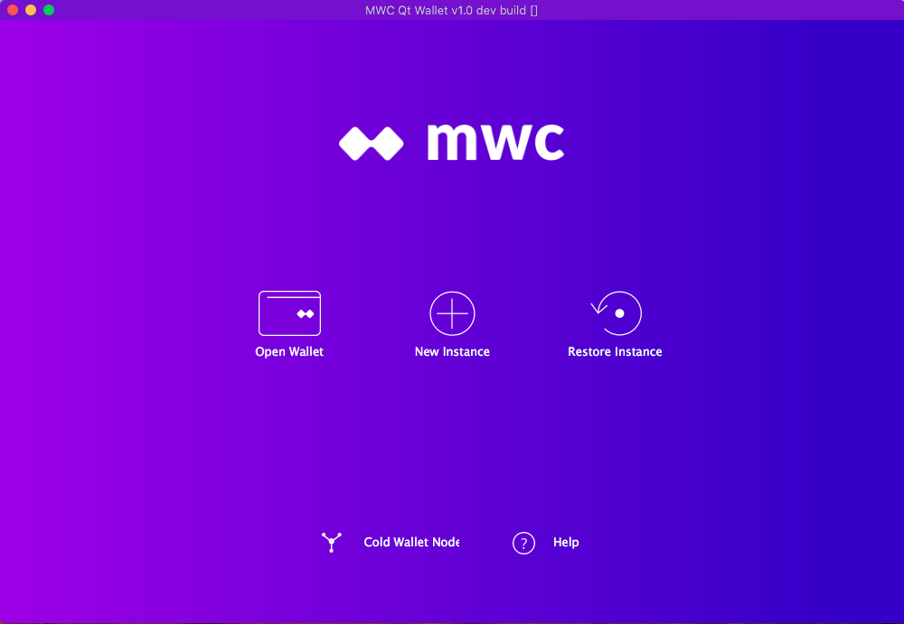
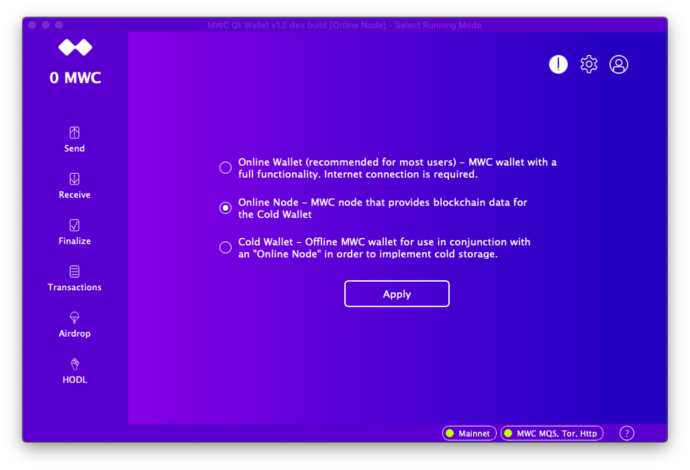
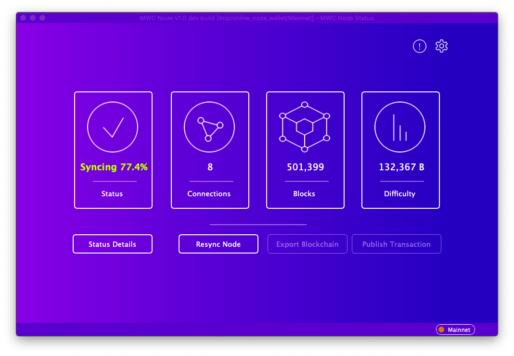
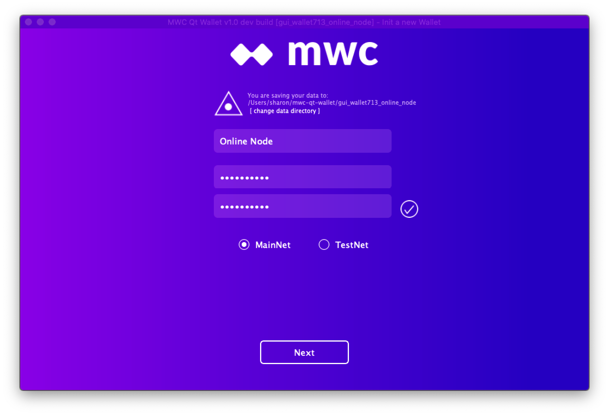
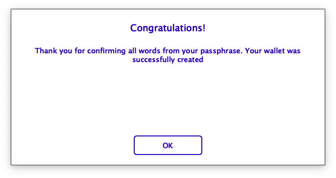

**Create/Manage MWC Cold Wallet**

**Contents:**
- [Overview](#overview)
- [Prerequisites](#prerequisites)
  * [Cold Wallet Host](#cold-wallet-host)
  * [Online Node Host](#online-node-host)
- [Setup](#setup)
  * [Online Node Setup](#online-node-setup)
  * [Cold Wallet Setup](#cold-wallet-setup)
  * [First Time Wallet Login](#first-time-wallet-login)
- [Transfer Online Node Blockchain Data](#transfer-online-node-blockchain-data)
  * [Export Blockchain Data From Online Node](#export-blockchain-data-from-online-node)
  * [Import Blockchain Data Into MWC Cold Wallet](#import-blockchain-data-into-mwc-cold-wallet)
- [Trade Using MWC Cold Wallet](#trade-using-mwc-cold-wallet)

# Overview
A cold wallet is an offline wallet used to safely store your MWC funds. An offline wallet is a wallet that runs on hardware which is never connected to a network and thus prevents attackers from gaining access to your MWC funds. A USB stick can be used to run your cold wallet. See the following documents on how to create the USB stick and install MWC Qt Wallet on it.

*    [Creating a USB Device With Persistent Storage For MWC Cold Wallet](https://github.com/mwcproject/mwc-qt-wallet/blob/master/DOC/cold_wallet_persistent_usb_drive_creation.md)

*    [MWC Cold Wallet Software Installation Guide](https://github.com/mwcproject/mwc-qt-wallet/blob/master/DOC/cold_wallet_software_installation_guide.md)

Transports such as HTTP or Tor are not available unless a wallet is online. Therefore an MWC cold wallet exchanges funds using files.

A separate online node is run on a different machine so that the most recent blockchain data, from the network, can be exported from the node and then imported into the cold wallet. Whenever a trade is made using your MWC cold wallet, in order to see your transaction confirmations, you will need to import the network blockchain data from an online node. To run an online node, a separate machine which is online is used to run MWC Qt Wallet with a run mode of _online node_.

This document will guide you through the steps necessary to:
*    Run and configure your MWC cold wallet on a bootable USB device with MWC Qt Wallet already installed.
*    Run and configure an MWC Online Node on a second computer so that current blockchain data from the network can be exported from the node and then imported into your cold wallet.
*    Perform trades using your MWC cold wallet

# Prerequisites

Two computers are needed to bring up and sync your _MWC cold wallet_. One computer, your _cold wallet host_, is offline and is used to run your _MWC cold wallet_. The second computer, your _online node host_, is online and runs an _MWC online node_. 

The _MWC cold wallet_ and the _online node host_ can run on different OSes. The data to be transferred between the node and the cold wallet is compatible at the OS level.

### Cold Wallet Host

To follow the procedures in this document you will need the following:
*    A bootable Ubuntu USB device with MWC Qt Wallet installed. This is your MWC Cold Wallet USB device.
*    A second USB device with 128GB to use for transferring files. This is your file transfer USB device. It will be used to transfer transaction and blockchain data between your offline cold wallet and your online node.
*    An x86 laptop or desktop that has at least 2 USB drives and which can be used to boot your MWC Cold Wallet USB device.

### Online Node Host

A second pc/laptop with internet access will be needed to run an _online MWC node_. Data from the _online MWC node_ will be exported and transferred to your _cold wallet host_ using your file transfer USB device.

Please note, this online host will never have access to your wallet passphrase or other sensitive data.

# Setup

### Cold Wallet Setup

1) If you haven't already, create a bootable Ubuntu USB device with persistent storage following the directions at: 
       
    [Creating a USB Device With Persistent Storage For MWC Cold Wallet](https://github.com/mwcproject/mwc-qt-wallet/blob/master/DOC/cold_wallet_persistent_usb_drive_creation.md)

2) If you haven't already, install MWC Qt Wallet onto your bootable Ubuntu USB device with persistent storage following the directions at: 

    [MWC Cold Wallet Software Installation Guide](https://github.com/mwcproject/mwc-qt-wallet/blob/master/DOC/cold_wallet_software_installation_guide.md)

      If you have followed the directions correctly, you should be at the point where you have booted up your Ubuntu USB device with persistent storage and installed MWC Qt Wallet and its software dependencies. Your USB device should not have any connections to the network. Both wired and wireless connections should have been disabled.

3) Run the mwc-qt-wallet executable you have just installed. You will be presented with a login screen.

   

   If this is your first time running your cold wallet, follow the directions for [First Time Wallet Login](#first-time-wallet-login) at the end of this section. Because your host is offline, you will see several failure notifications related to not being online. You can ignore them as they are expected. Then continue with _Step 4_.

   Otherwise, login to your cold wallet instance and continue with _Step 4_.

4) Click on the _Wallet Settings_ gear icon at the top right of the page. Scroll down the menu that appears and click _Select Running Mode_.

   

5) In the _Select Running Mode_ screen that appears, select _Cold Wallet_ and then click _Apply_.

   

6) In the _Wallet Run Mode_ pop-up that appears, click _Continue_ to cause your wallet to restart.

   Your wallet will restart and you will see some failure notifications because your wallet is offline.

7) Switch to the _Node Overview_ screen. 
   * Click the _Wallet Settings_ gear icon at the top right of the page.
   * Scroll down the menu that appears and click _Node Overview_.

   

   You should see that the node is not able to sync.
   The first time you run your cold wallet, it will have 0 blocks.

   Important! If your node is syncing, you are connected to the network. Shutdown MWC Qt Wallet immediately and review the steps for ensuring you are disconnected from the network in the section _Disable All Network Connections_ in: 

   [MWC Cold Wallet Software Installation Guide](https://github.com/mwcproject/mwc-qt-wallet/blob/master/DOC/cold_wallet_software_installation_guide.md)

### Online Node Setup

1) Install mwc-qt-wallet from the [Wallet Downlod](https://www.mwc.mw/downloads) page onto your _online node host_ computer.

2) Run the mwc-qt-wallet executable you have just installed.

   * If this is your first time running mwc-qt-wallet on this machine, you will be presented with the following screen:

      

      * Click on _Cold Wallet Node_
      * When the _Running Mode_ pop-up appears: Click _Continue_

   * If you last used MWC Qt Wallet on this host to run an online node, the online node should have come up and not required a login. Skip to _Step 6_.

   * If you last used MWC Qt Wallet on this host to run MWC Qt Wallet as an online wallet, you will be presented with a login screen. Login to your wallet instance and then continue with _Step 3_.

3) Click on the _Wallet Settings_ gear icon at the top right of the page. Scroll down the menu that appears and click _Select Running Mode_.

   

4) In the _Select Running Mode_ screen that appears, select _Online Node_ and then click _Apply_.

   

5) In the _Wallet Run Mode_ pop-up that appears, click _Continue_ to cause your wallet to restart.

   Your wallet will restart and you will see some messages about your wallet being out of sync. It will now take a while for your wallet to sync with the network.

6) Switch to the _Node Overview_ screen to watch the progress of your wallet as it is syncing.
   * Click the _Wallet Settings_ gear icon at the top right of the page.
   * Scroll down the menu that appears and click _Node Overview_.

   

7) Wait until your node finishes syncing. Once your node has finished syncing you should see the following where your node's status is _Ready_ and your connection status to Mainnet at the bottom of the screen has switched from red to green.

    

   Until your node finishes syncing, 'Export Blockchain' and 'Publish Transaction' will be disabled.

### First Time Wallet Login
Whether you are running an online node for the first time or a cold wallet for the first time, you will need to create a wallet instace and configure it appropriately.

1) Run the mwc-qt-wallet executable.

2) Create a new wallet instance to dedicate to running the online node or cold wallet by selecting _New Instance_ on the wallet login page.

3) Finish creating your new wallet instance by: 
   * If you do not like the data directory name generated by MWC Qt Wallet at the top of the screen, click _change data directory_ to specify a different data directory for your node. (optional) 
   * Enter a name 
   * Enter a password and confirm the password 
   * Select _MainNet_ 
   * Click _Next_ 

    

4) In the next screen that appears, copy the mneumonic passphrase onto a sheet of paper. Once we have finished setting up the wallet instance, you will need to keep this passphrase in a safe place where you will remember to find it, if you ever need to restore your wallet.

5) Enter each of the words in your mneumonic passphrase and continue to click _Submit_ until all words of your passphrase have been entered. Once you have entered all of the words in your passphrase successfully, you will see the following:

    

   When you see this pop-up, your wallet will be logged in and start running.

6) Click _OK_

# Transfer Online Node Blockchain Data

Once your _cold wallet_ and _online node_ have been set up and they are both running, you are now ready to move blockchain data from the _online node_ to your _offline cold wallet_.

The steps here should be performed any time you want to see the latest status of your transactions from within your _cold wallet_. So you would typically repeat these steps after you send or receive MWC funds using your cold wallet.

### Export Blockchain Data From Online Node

On the machine running your _online node_,  perform the following steps to export the latest blockchain data:

1) In your _online node_, wait until synchronization is finished and the button _Export Blockchain_ is enabled. 

2) Click _Export Blockchain_

3) Save the blockchain data to a file on your file transfer USB drive. These files will by default have an extension of _.mwc-blc_

4) Wait for the pop-up that says "MWC Blockchain data is ready".

   * Click _OK_

5) Eject the file transfer USB drive from the machine running your _online node_.

### Import Blockchain Data Into MWC Cold Wallet

Perform the following steps on the machine running your _cold wallet_ to import blockchain data from an online node:

1) Plug your file transfer USB device, with the file containing the exported blockchain data, into the machine running your _cold wallet_.

2) In the MWC Node Status screen:

    

   *  Click _Load Blockchain Data_
   *  Select the file, on your file transfer USB device, with the exported blockchain data from your _online node_.
   *  Click _Open_ at the top of the file selection screen.
   *  Wait for the pop-up that says "MWC Blockchain data is ready. Click _OK_.

    You should see that _Blocks_ is updated.

4) Now you can view your transactions in the _Transactions_ screen and your output in the _Outputs_ screen. The data will be updated with the new blockchain data.

# Trade Using MWC Cold Wallet

Since the Cold Wallet is offline, you will only be able to use file based transactions.

### Receive MWC

1) Copy the MWC transaction file that is sent from another wallet to your file transfer USB device.
The initial transaction file should have the extension '.tx'.

2) On your _cold wallet host_ computer:

   * Plug the file transfer USB stick with the file transaction into an available USB drive on your _cold wallet host_ computer.

   * Click on the _Receive_ icon in the left hand menu bar of MWC Qt Wallet.

   * Click _Receive MWC by file_ to sign the incoming transaction.

       

   * Select the transaction file with the .tx file extension on your file transfer USB device.
     
     The signed transaction file will be created in the same path as your transaction file. New file extention will be '.response'.

   * Eject your file transfer USB device from your _cold wallet host_ computer.

3) On your _online node host_ computer:

   * Insert the file transfer USB device.

   * Send the signed transaction file back to the MWC coin sender for finalization. This is by whatever means you have agreed upon for exchanging files with the sender.

   * Check the block explorer at https://explorer.mwc.mw to see that the transaction has been finalized. 

4) To verify that your transaction has been finalized, use the 'Transfer Online Node Blockchain Data' procedure to export blockchain data from your online node to your cold wallet. Continue to the next step once your cold wallet has been updated with the blockchain data.

   * On your _cold wallet host_ computer:

      * Click on the _Transaction_ icon in the left hand menu bar of MWC Qt Wallet. 
      * Check the number of confirmations for your transaction.

Congratulations, you received the MWC in your offline wallet.

Note: You will not be able to send coins you have received using your cold wallet until the transactions with the coins have been fully confirmed. The only way your cold wallet will know if the transactions are confirmed is if you import blockchain data which shows that the transactions are confirmed.

### Send MWC

1) On your _cold wallet host_ computer:

   * Click the _Send_ icon in the left hand menu bar of MWC Qt Wallet.

     

   * In the _Send coins_ screen:

      * Enter the amount of MWC you would like to send.
      * Click _Next_

   * In the _Send to File_ screen:

      * Optionally enter a note for the transaction.
      * Click _Send_

   * In the _Confirm Send Request_ screen:

      * Enter your password.
      * Click _Confirm_

   * In the file window that appears:

      * Select the file transfer USB device as where to store the transaction file.
      * Enter a name for your file. The file will be saved with a .tx extenstion.
      * Click _Save_

   * Eject the file transfer USB device.

2) On your _online node host_ computer:

   * Insert the file transfer USB device.
   * Send the transaction file to the person whom you want to send MWC. This is by whatever means you have agreed upon for exchanging files with the receiver.
   * Wait for the signed transaction file to be returned from the receiver.
      * Save the signed transaction file to the file transfer USB device.
      * Eject the file transfer USB device

3) On your _cold wallet host_ computer:

   * Insert the file transfer USB device
   * Select the _Finalize_ icon in the left hand menu bar of the cold wallet.
   * Click _Upload a File_

     

   * In the _Finalize Transaction_ screen that appears:
      * Note the location of the file in the _Result location_. This is the file that contains the slate that needs to be broadcast to the network so it can be recorded in the blockchain.
      * Click _Finalize_

        

   * Save the resulting _.mwctx_ file to the file transfer USB device.
   * Eject the file transfer USB device

4) On your _online node host_ computer:

   * Insert the file transfer USB device.
   * Select the gear icon, then _Node Overview_
   * Click _Publish Transaction_

     
  
   * Select the _.mwctx_ file from your file transfer USB device.

    You should see a success message when your slate is published. If you see an error message:
    * Check that the transaction has not already been published.
    * Check that the transaction does not contain an output that was already used in another transaction. If so, cancel the transaction. Ensure you have a recent blockchain imported on your cold wallet, and start over.

      
    * Wait for some time until the transaction is accepted by the network and a few blocks have been mined.

    * Repeat the steps for transferring blockchain data from your online node to your cold wallet as described in:  
      * [Transfer Online Node Blockchain Data](#transfer-online-node-blockchain-data)

5) On your _cold wallet host_ computer:
   * Ensure the blockchain data has been imported from your online node.
   * Select _Transactions_ in the left hand menu bar.
   * In the _Transactions_ page, verify that your transaction has been confirmed.

   Congratulations, you sent MWC.
