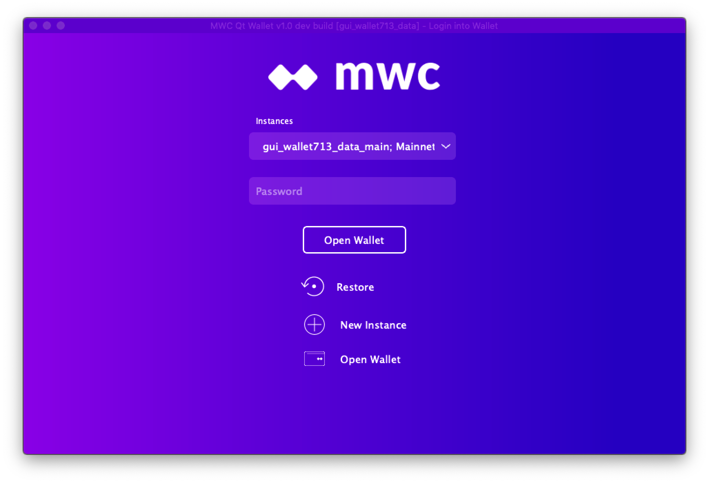
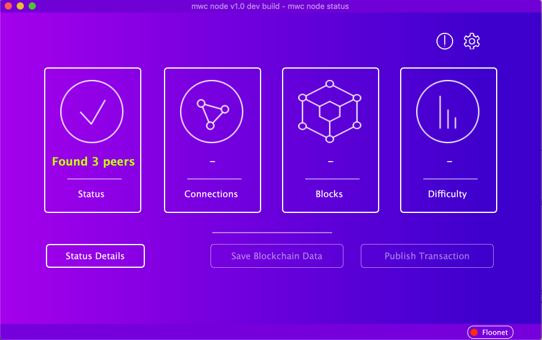
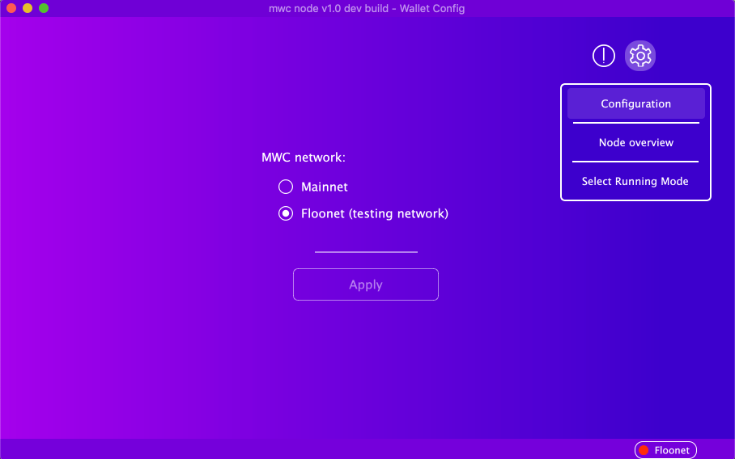
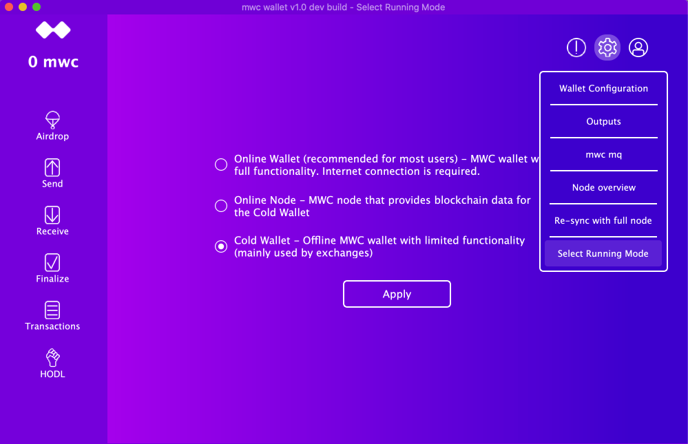
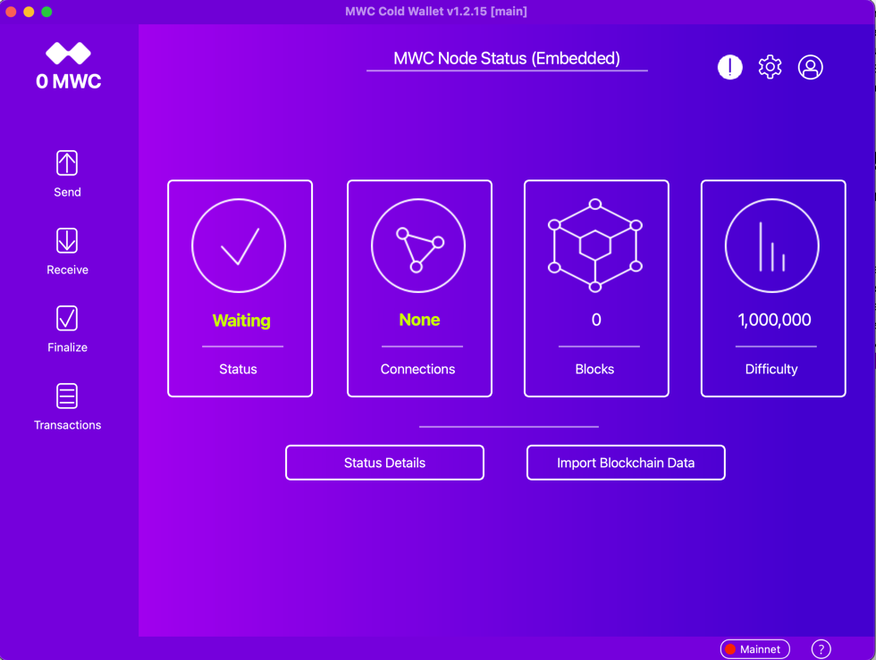
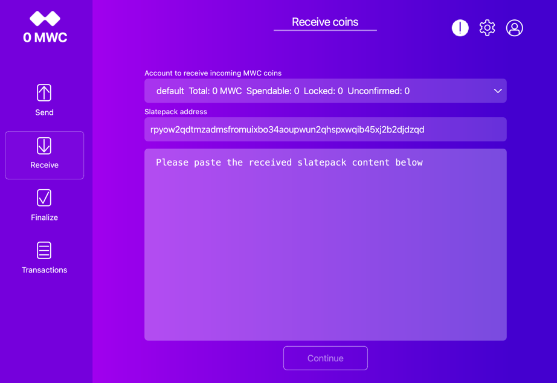
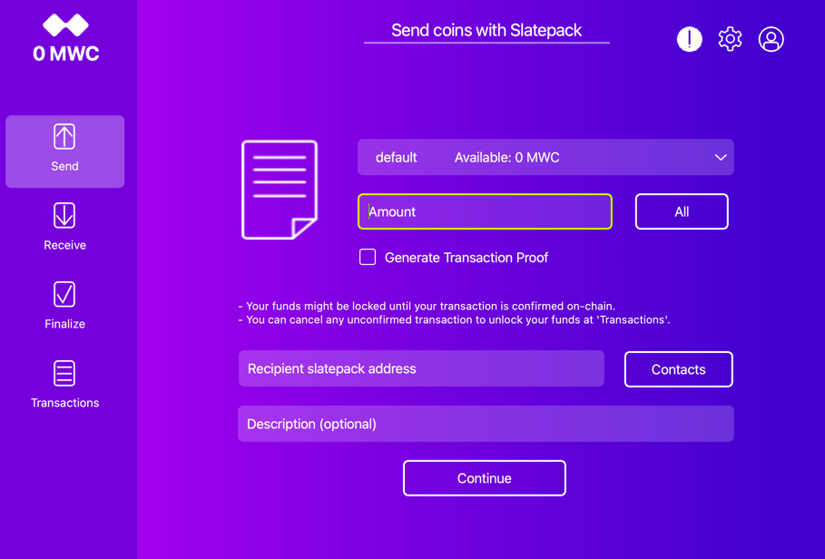
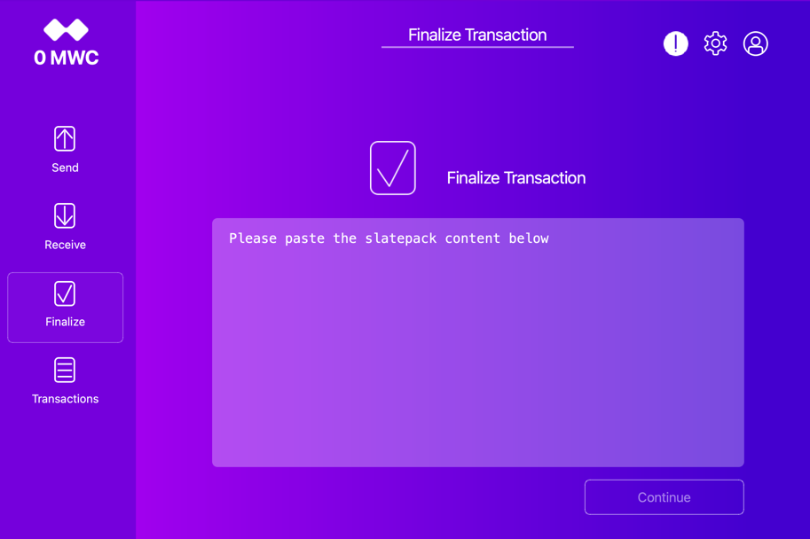
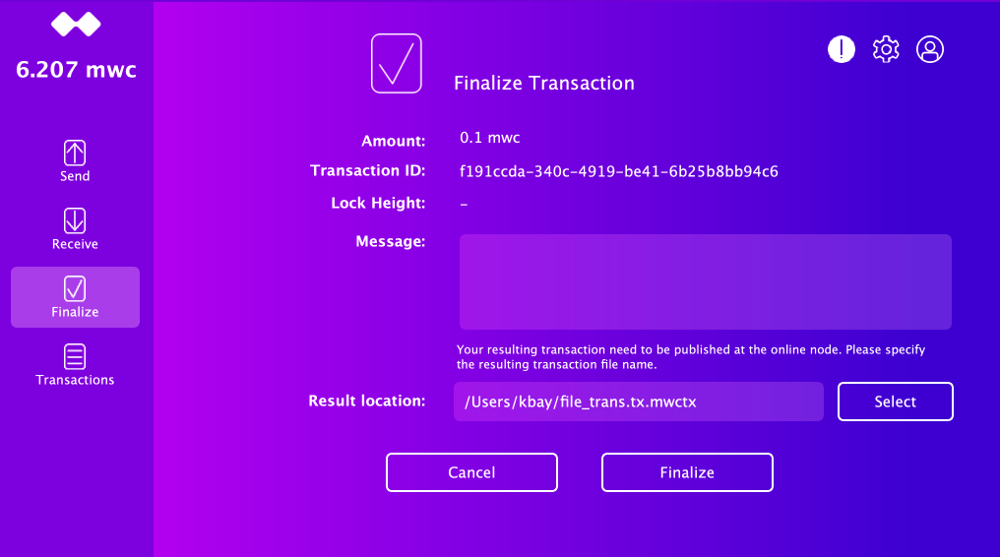
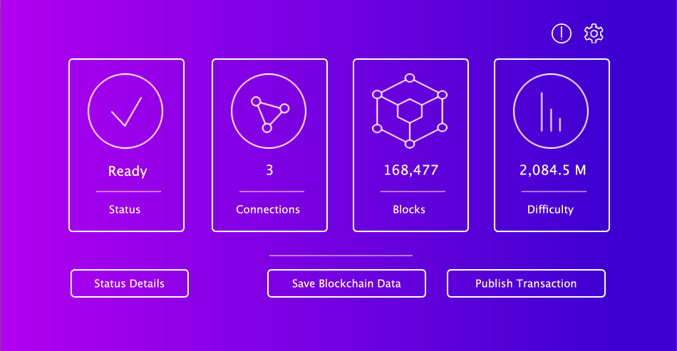

# Overview

This project allows the user to easily configure a cold storage USB stick for Ubuntu 18.04.3.

# Prerequisites

### Cold Wallet host

You will need an x64 laptop or desktop that has two USB drives or more. Generally speaking most 
pc/mac/linux hardware will work. You also need two USB sticks. The first USB stick will contain 
Ubuntu 18.04.03 or later (requires 2 GB+ of storage space). You can find instructions for installing 
this here: https://tutorials.ubuntu.com/tutorial/tutorial-create-a-usb-stick-on-ubuntu#0. The second USB 
stick will contain the binary to mwc-qt-wallet. 

This USB stick also will be used to transfer the data between this Cold Wallet Host and Online Node Host.
Currently for mainnet almost any size will be fine since the chain state is very small, but at some 
point a larger size might be required. We suggest getting a 128 GB stick for now which will be 
sufficient for the foreseable future and since they cost about $25 or less it is fairly reasonable. 

When installing Ubuntu, qt libraries are required. If you boot from USB, you need to use try-ubuntu 
which will have the qt libraries installed. **Please note, try-ubuntu doesn't have any permanent storage.
As a result you will not be able to keep your transaction history or any other historical data.
You will need to recover from the recovery seed each time to get access to your coins.** 

The better option is probably to dedicate a laptop or other hardware device that you will 
never connect to the internet. In this case, install the OS and ensure the Qt libraries are present. 
There is some information on how to do this on this page: 
[https://askubuntu.com/questions/974/how-can-i-install-software-or-packages-without-internet-offline].

If dedicated hardware doesn't work for you, you might concider more light weight option by installing Ubuntu 
on a USB stick. For occasional usage it might work. [https://linuxhint.com/run-ubuntu-18-04-from-usb-stick/]

Please note, by running Ubuntu on USB stick you might get the following issues:
 - UEFI Bios might not handle the removable boot drive well.
 - USB stick will wear relatively fast.
 - You will need to install needed packages offline. For example qt libraries need to be installed. 

Full explanation is out of scope for this document.

### Online Node Host

A second pc/laptop with internet access will be needed to run a online MWC Node. Internet access is required for that host.

The Cold Wallet and the Online Node can be different OS. Data is compatible on OS level.

Please note, this online host will never have access to your wallet passphrase or other sensitive data.

# Setup

### Online Node Setup

1) Install mwc-qt-wallet from the [Wallet Downlod](https://www.mwc.mw/downloads) page.

2) Press the 'Run as MWC Node' button

    

Press 'Continue'

3) After restart, you should see:

    

Until your node finished syncing, 'Save Blockchain Data' and 'Publish Transaction' will be disabled.

4) You can select the Node network from the Configuration menu.

    

5) Switch back to 'Node overview' and wait until the synchronization process is finished.

### Cold Wallet Setup

1) Follow the Ubuntu tutorial for creating a bootable USB stick Ubuntu instance: https://tutorials.ubuntu.com/tutorial/tutorial-create-a-usb-stick-on-ubuntu#0

2) Insert your second USB stick and ensure it is empty. If it is not, delete any existing files on it.

3) Download mwc-qt-wallet from the [Wallet Downlod](https://www.mwc.mw/downloads) page and save it on your second USB stick.

4) Boot your USB stick with Ubuntu OS so that you are in Ubuntu Linux.

    IMPORTANT: Do not configure networking as that will compromise the offline nature of the setup.

5) Once you are in Ununtu, insert a second USB stick with mwc-qt-wallet installer and install mwc-qt-wallet.

6) Start mwc-qt-wallet and follow the directions. On your first run, you will create a wallet with a new seed, 
or restore your wallet from the existing passphrase. Please note, at this moment your wallet is running as an online wallet.
Because your host is offline, you will see several messages about that. Please ignore them and switch to 'Cold Wallet' mode.

7) Switch to Cold Wallet mode:

    

8) Switch to 'Node Overiview' page. You should see that the node is not able to sync, it has 0 blocks.
Now, we should move data from the 'Online Node' to your offline host.

# Transfer Node Data

1) In your 'Online Node', wait until synchronization is finished and the button "Save Blockchain Data" is enabled. 
Press this button and save the blockchain to your USB drive.

2) Unplug the USB drive from the 'Online Node' and plug it in the 'Cold Wallet'.

3) In the cold Wallet, on the "mwc node status" page press "Load Blockchain Data" and read that data from your USB stick.

    

    You should see that your node numbers, like the block number, are updated.

4) Now, you can veiw your transaction's, output. The data will be updated with the new blockchain data.

# Receive/Send MWC

Since the Cold Wallet is offline, you will only be able to use file based transactions.

### Receive MWC

1) Copy the MWC transaction file that is sent from another wallet to your USB drive.
The initial transaction file should have an extention '.tx'.

2) Plug the USB stick with the file transaction into your 'Cold Wallet'.

3) In the 'Receive' tab sign the transaction.

    

    The signed transaction file will be created in the same path as your transaction file. New file extention will be '.response'.

4) Move the signed transaction file to the online host and send the file back for finalization.

5) Check the block explorer to see that the transaction has been finalized. 

6) To verify the fact that your transaction was finalized, use the 'Transfer Node Data' as explained in the previous steps.

7) Now your "Cold Wallet" has updated blockchain data that should contain the output of this transaction.

8) Go to "Transaction" page at "Cold Wallet" and check that "Confirm" for your transaction is "Yes"

9) Congratulations, you received the MWC in your offline wallet.

### Send MWC

1) In the "Cold Wallet", initiate a file based send transaction normally.

    

    Save transaction file to the USB stick.

2) From the online host send Transaction file to the person whom you want to send MWC.

3) Wait for singed transaction file to be returned and save to USB stick.

4) Move the USB stick to the "Cold Wallet".

5) Finalize transaction from the "Finalize" tab.

    

    
    
    Please note that **"Result location"** points to the location of the slate that needs to be broadcast to the network.
    
6) Save resulting 'mwctx' file to the USB drive and move it to the "Online Node" host.

7) In the "Online Node", "node status", page press the "Publish Transaction" button and select the .mwctx file.

     
  
    You should see a success message about that. If you see an error message, it is likely that this transaction is already published to the network or it has an invalid output.
      
8) Wait for some time until the transaction is accepted by the network and a few blocks have been mined.

9) To verify the fact that your transaction was finalized sucessfully, transfer the blockchain data as explained above.

10) Now, your 'Cold Wallet' has updated blockchain data that should contain the output from your transaction.

11) Go to 'Transaction' page in the 'Cold Wallet' and check that the "Confirm" field for your transaction is 'Yes'

12) Congratulations, you sent MWC.
