# Creating a USB Drive With Persistent Storage For MWC Cold Wallet

Last Updated: September 1, 2020

# Overview

A cold wallet is intended to keep your MWC safe by storing your MWC in offline storage. Once set up, your cold wallet should never be connected to the internet. This will prevent hackers from being able to access your wallet and steal your funds.

Our previous instructions for creating or running an MWC Cold Wallet using USB drives required the use of a bootable live Ubuntu USB drive and a second USB drive for your MWC Cold Wallet. The live Ubuntu USB drive could not store files, hence the reason for the second USB drive to hold your wallet.

With Ubuntu it is now possible to create a live USB drive with persistent storage. Therefore you can create a USB drive which can be booted and also contains your cold wallet. Persistence doesn’t work with every Linux distribution but it is known to work with versions of Ubuntu 18.04 LTS or later. I’ve tested the following procedure using the latest version of Ubuntu available at the time of this writing (20.04.1).

This document describes the procedure where you can create a USB drive running Ubuntu and which supports persistent storage. This USB drive can then be used to install and set up an MWC cold wallet. Your MWC cold wallet will then run on a single USB drive which you boot to whenever you want to access your cold wallet. 

The procedure to install the software needed to run an MWC cold wallet can be found at:

*   [MWC Cold Wallet Software Installation Guide](https://github.com/mwcproject/mwc-qt-wallet/blob/master/DOC/cold_wallet_software_installation_guide.md)

The procedure to set up an MWC cold wallet, after the software has been installed on your USB stick, can be found at:

*   [Create/Manage Cold Wallet](https://github.com/mwcproject/mwc-qt-wallet/blob/master/DOC/cold_wallet.md)

Once you have your MWC cold wallet set up on a USB stick you’ve created following this procedure, it will no longer be necessary to boot from a separate live Ubuntu USB stick in order to access your cold wallet.

# Prerequisites

*   A USB drive with at least 64GB of memory. 

You will have the best cold wallet experience with a faster USB drive. At the time of this writing, you can get a USB 3.1 stick with 128GB of memory and a data transfer rate of 300mb/s for around $20.

# Run Ubuntu

In order to make a live Ubuntu USB drive with persistent storage, you need a computer already running Ubuntu. If you do not have such a system, you can create a bootable Ubuntu USB drive to use for this procedure only. This USB drive will not have persistent storage and is meant only to allow you to boot up Ubuntu so that you can create a USB drive with Ubuntu that has persistent storage and so can also contain your cold wallet.

The following links contain procedures for creating this type of bootable Ubuntu USB drive depending upon your computer OS. This procedure is using Ubuntu Desktop so the size requirements for the USB drive are larger than what is documented in the article in the link.

Mac: [https://ubuntu.com/tutorials/create-a-usb-stick-on-macos#1-overview](https://ubuntu.com/tutorials/create-a-usb-stick-on-macos#1-overview)

Mac Requirements:

*   40GB or larger USB drive
*   An Apple computer or laptop running macOS
*   Etcher, a free and open source USB drive writing tool. See [https://www.balena.io/etcher/](https://www.balena.io/etcher/)
*   An Ubuntu Desktop ISO file from [http://ubuntu.com/download/desktop](http://ubuntu.com/download/desktop)

Windows: [https://ubuntu.com/tutorials/create-a-usb-stick-on-windows#1-overview](https://ubuntu.com/tutorials/create-a-usb-stick-on-windows#1-overview)

Windows Requirements:

*   A 40GB or larger USB drive
*   Microsoft Windows XP or later
*   Rufus, a free and open source USB drive writing tool. See [https://rufus.ie/](https://rufus.ie/)
*   An Ubuntu Desktop ISO file from [http://ubuntu.com/download/desktop](http://ubuntu.com/download/desktop)

The following site describes a similar procedure on Windows using Etcher:

*   [https://linuxize.com/post/how-to-create-a-bootable-ubuntu-18-04-usb-stick/](https://linuxize.com/post/how-to-create-a-bootable-ubuntu-18-04-usb-stick/)

Once you have created your bootable live Ubuntu USB drive, boot your computer using it.

Mac:

*   Hold the alt/option button after hearing the power on chimes.
*   Connect to your network
*   Select Try Ubuntu (Runs Ubuntu from the USB drive without installing it. Do not install it onto your computer.)

# Create Live Ubuntu Drive With Persistent Storage

Once you have Ubuntu running on your computer, you can now create a second USB drive which will also contain a bootable image of Ubuntu but with persistent storage. After you create this new USB drive, you will no longer need to boot using the USB drive which erases its data every time it is booted.

The following procedure has been extracted from [https://www.howtogeek.com/howto/14912/create-a-persistent-bootable-ubuntu-usb-flash-drive/](https://www.howtogeek.com/howto/14912/create-a-persistent-bootable-ubuntu-usb-flash-drive/)

and doesn’t contain the full explanation of each step to make it faster to follow. If you’d like to understand each step of the process, please refer to the article at the link above.

## Procedure

### Download Ubuntu

Now that you are running Ubuntu, you need to download an Ubuntu Desktop ISO file so that it is accessible locally. See [http://ubuntu.com/download/desktop](http://ubuntu.com/download/desktop)

Note: Clicking the download arrow at the top-right of the Firefox status bar will show you the progress of your download.

### Install mkusb

The tool we are going to use to create our persistent drive is called mkusb. mkusb is not part of the standard Ubuntu installation so we need to update the Ubuntu repository to install it. Open a terminal window and run the following commands;

*   sudo add-apt-repository universe
*   sudo add-apt-repository ppa:mkusb/ppa
*   sudo apt-get update
*   sudo apt install --install-recommends mkusb mkusb-nox usb-pack-efi

### Identify Empty USB Drive

After running the commands above, and before inserting a new empty USB drive, you want to clearly identify the devices currently on your system. This will help to make sure you don’t mistakenly wipe-out a different drive.

Run the following command and examine the output:

*   lsblk

Each device is listed with its partitions (e.g. sda, sdb, etc.).

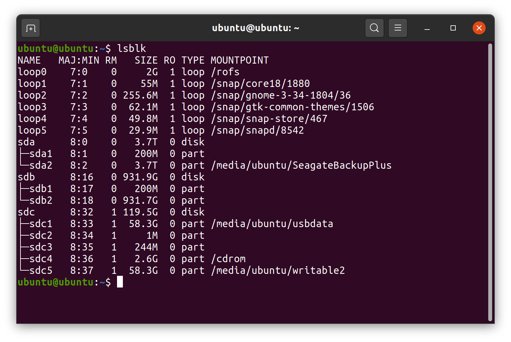

Plug in your new USB drive and run _lsblk_ again.

*   lsblk

Your USB drive should show up as an additional device at the bottom of the list. The device that was not listed when you previously ran _lsblk_ is your USB device. Make a note of the name of the new USB device (e.g. sde).

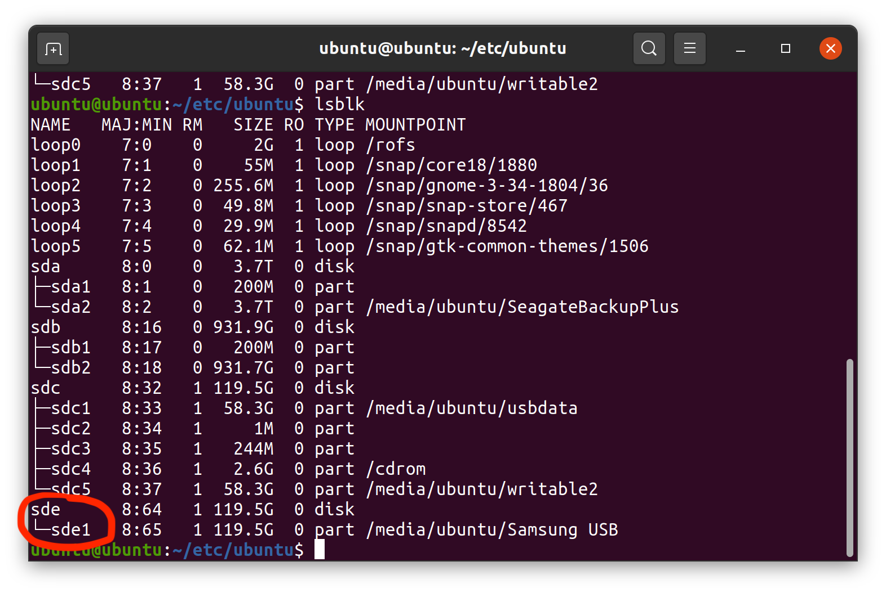

### Run mkusb 

Now you can launch _mkusb_.

*   Select _Activities_ in the upper left of your screen
*   Enter _mkusb_ in the search box
*   Double click the _mkusb_ app

 

When the _Run mkusb dus _dialog appears and asks: _Run mkusb version dus?_

*   Click ‘Yes’.

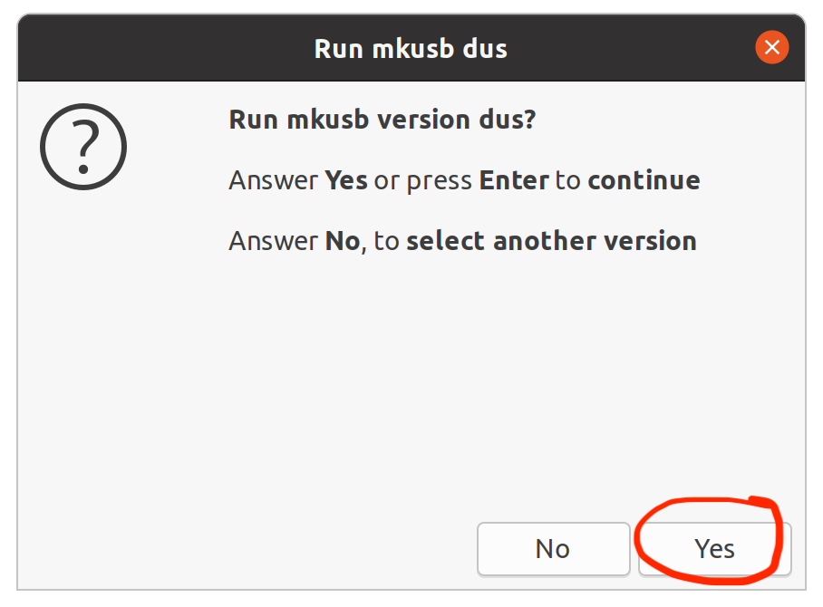

When the warning dialog about overwriting the USB device appears:

*   Click ‘Yes’

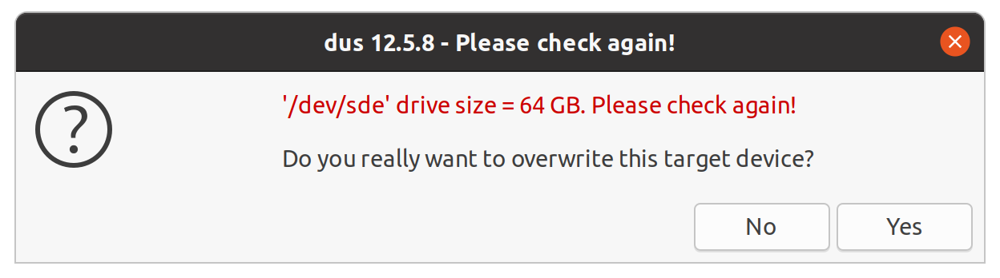

In the next window select:

*   Install (make a boot device)
*   Click ‘OK’

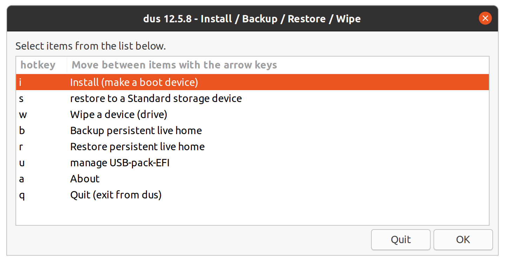

Then in the next window select:

*   ‘Persistent live’ - only Debian and Ubuntu
*   Click ‘OK’

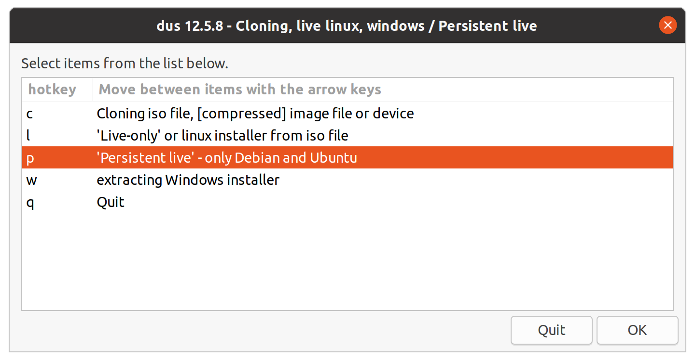

You may see the following _Select source device_ window appear, if mkusb determines that it can create a bootable drive from your existing Ubuntu operating system. We want to create a bootable USB device for just our cold wallet and do not want any extra features on our device, which may get loaded if you use the current operating system. If this window appears:

*   Click ‘No’

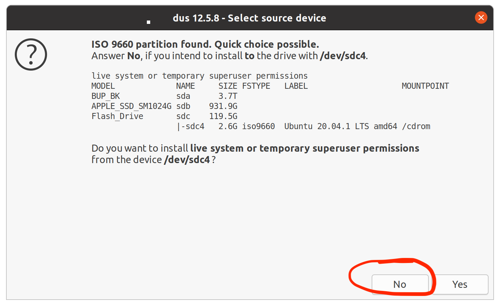

A file browser now appears. Browse to find the Ubuntu Desktop ISO file you previously downloaded.

*   Select the Ubuntu Desktop ISO file
*   Click ‘OK’

The _Select Target Device_ window allows you to select the USB drive to use.

*   Select the USB drive you identified earlier using lsblk
*   Click ‘OK’

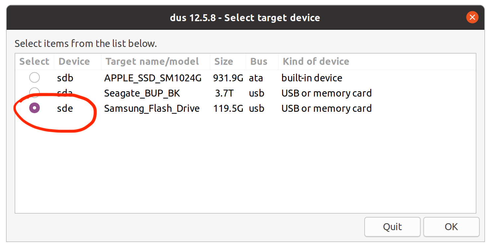

In the next window select:

*   upefi  usb-pack-efi  (default grub from ISO file)
*   Click ‘OK’

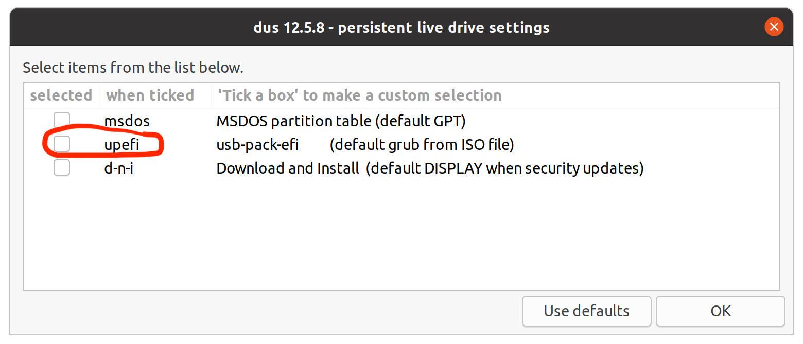

Now select the percentage of the storage space on the USB drive you want to use for persistence vs data. Since you won’t be using the USB drive for anything other than your cold wallet, you won’t need that much space for persistence. But you will need to download and install some software such as mwc-qt-wallet and Qt5 which is required to run a cold wallet. If uncertain, just keep the default setting of 50%.

*   Select persistence percentage
*   Click ‘OK’

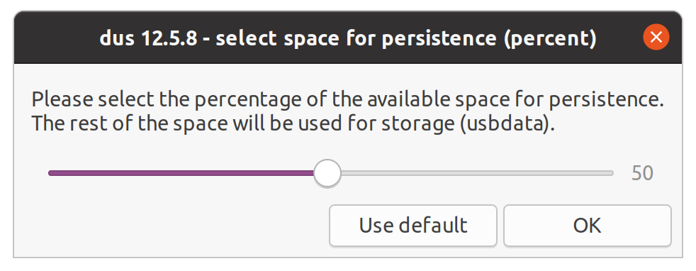

At the _Final checkpoint_ confirmation screen:

*   Select the ‘Go’ radio button
*   Click ‘Go’

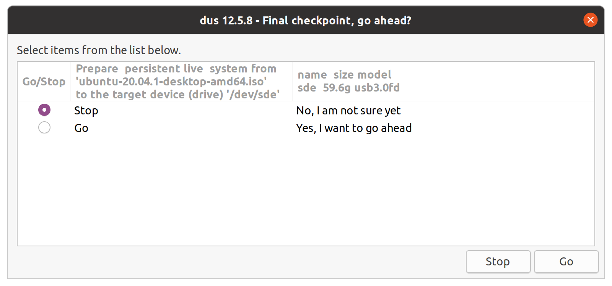

Now the USB drive with Ubuntu will be created. It takes a little while. You will see a dialog with “Work done” highlighted in green when everything is finished.

*   Click ‘OK’
*   Click ‘Quit’ for any dialogs which appear afterward.

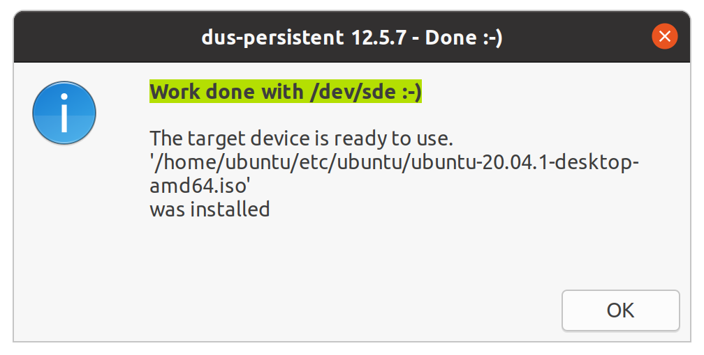

At the terminal window which appeared when mkusb was launched, you will be prompted to press ‘Enter’:

*   Press ‘Enter’

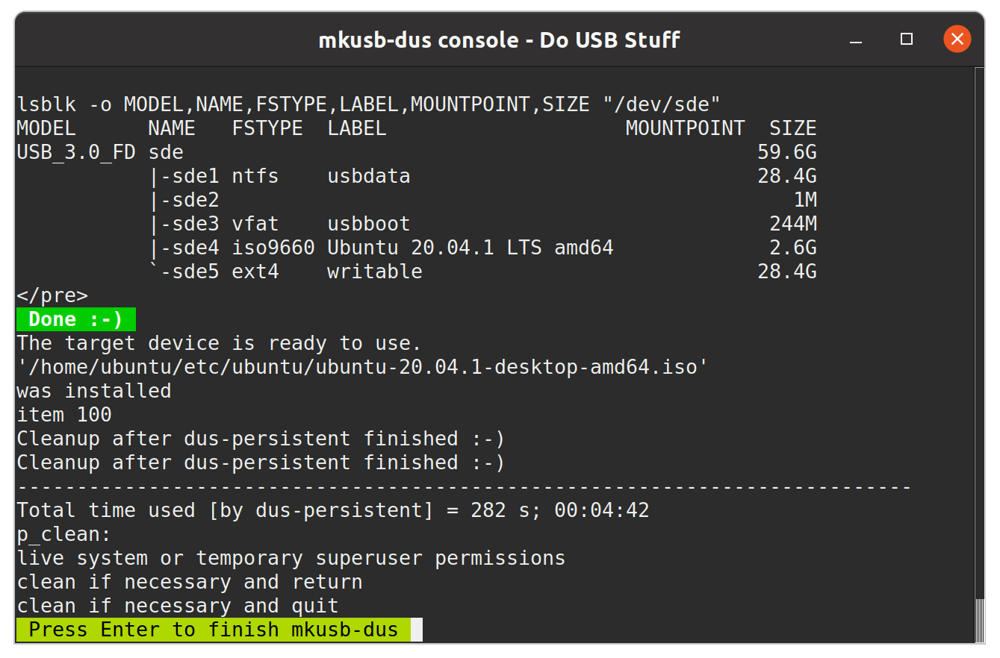

You can now eject your new bootable live Ubuntu USB with persistent storage and label it.

Then power off your computer and remove the USB drive, without persistent storage, that you had previously booted with. Place this drive somewhere so you don’t mix it up with your new persistent USB drive.

# MWC Cold Wallet Software Installation

You are now ready to install the software needed to create and run an MWC cold wallet onto your new bootable live Ubuntu USB drive with persistent storage. See the installation instructions at the following link:

*   [MWC Cold Wallet Software Installation Guide](https://github.com/mwcproject/mwc-qt-wallet/blob/master/DOC/cold_wallet_software_installation_guide.md)

# Cold Wallet Setup

One you have installed the software necessary to create and run an MWC cold wallet, you then need to setup your cold wallet following the instructions in:

*   [Create/Manage Cold Wallet](https://github.com/mwcproject/mwc-qt-wallet/blob/master/DOC/cold_wallet.md)

Since you have created a live Ubuntu USB drive with persistent storage and installed the software necessary to run a cold wallet, you will not need 2 USB drives to startup your wallet as described in the first part of the instructions. You now only need to use the one we just created with mwc-qt-wallet on it. However, you will still need a second USB drive to transfer files between your online node and cold wallet.

To set up your MWC cold wallet, start with the section in the instructions titled “Online Node Host”.

When you come to the section “Cold Wallet Setup” you can skip steps 1 thru 5. Instead do the following:

*   Boot from your USB drive but *DO NOT CONNECT TO YOUR NETWORK*
*   Once you have booted from your USB drive, verify that you are *not* connected to your network. See the section in the installation guide _Verify Network Connection_ for information on how to see if your computer has any network connections. From this point on and whenever you use your cold wallet, you do not want any network connections.

Note: Some versions of Ubuntu (e.g. 18.04.5) will automatically reconnect to the network they have previously been connected to, even though you do not connect to a network during initial boot up.

Then continue to follow the directions in “Cold Wallet Setup” starting with step 6.
