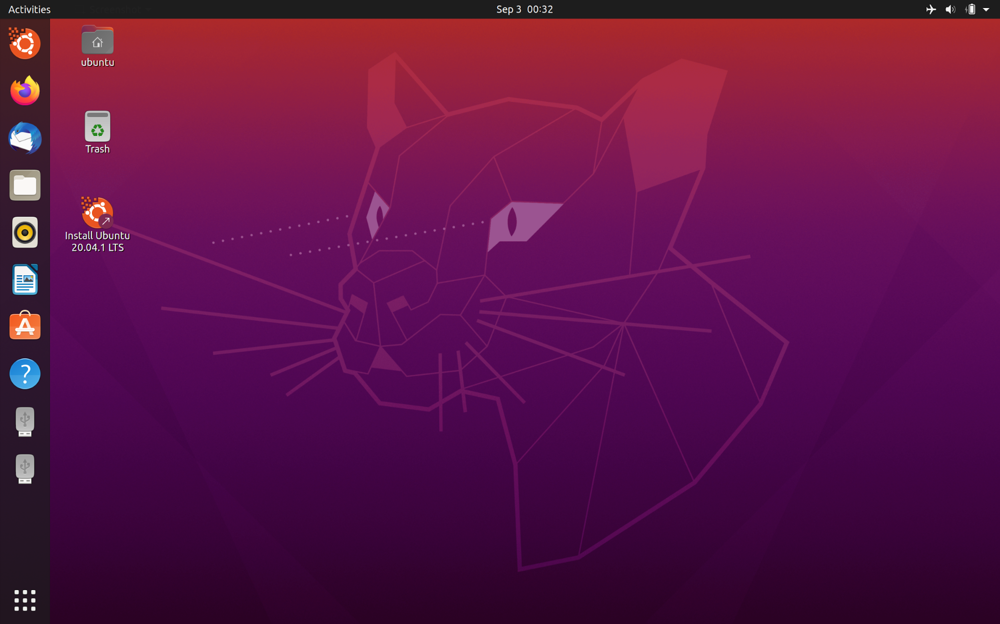
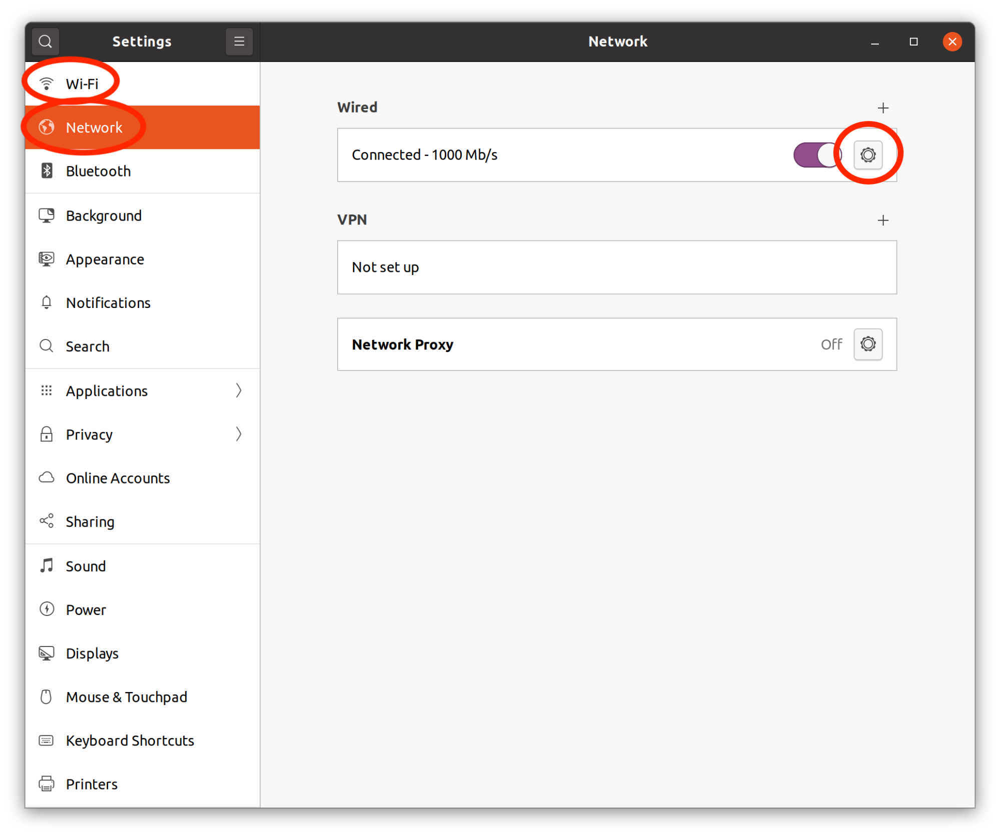
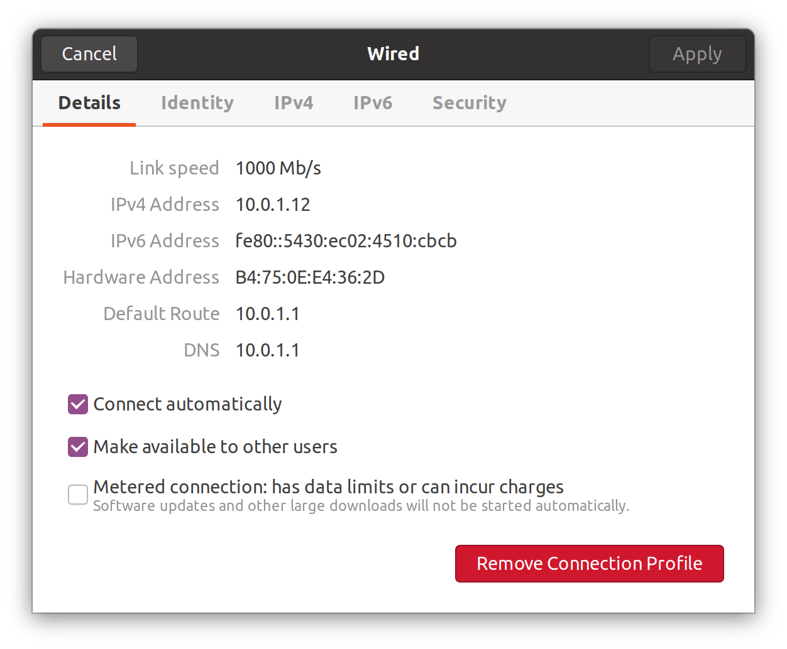

# MWC Cold Wallet Software Installation Guide

Last Updated: September. 3, 2020

# Overview

A cold wallet is intended to keep your MWC safe by storing your MWC in offline storage. Once set up, your cold wallet should never be connected to the internet. This will prevent hackers from being able to access your wallet and steal your funds.

An MWC Cold Wallet runs on a USB device which you boot to whenever you want to access your cold wallet. This guide is intended to help guide you through the process of initially installing the software needed to run your cold wallet and then later upgrading your software while keeping the cold wallet offline.

# Prerequisites

Prior to installing MWC Qt Wallet as a cold wallet, you will need:
*   Bootable live Ubuntu USB device
*   A second USB device for transferring file

For the best cold wallet experience, it is recommended that you create a bootable live Ubuntu USB device with persistent storage. Using a device with persistent storage will allow you to set up and run your cold wallet using a single USB device. The following link contains the procedure for creating this type of bootable Ubuntu USB device depending upon your computer OS.

*    [Creating a USB Device With Persistent Storage For MWC Cold Wallet](https://github.com/mwcproject/mwc-qt-wallet/blob/master/DOC/create_usb_with_persistent_storage_for_cold_wallet.md)

# Copy Files

To prepare for installing MWC Qt Wallet as a cold wallet, we first need to copy the files needed onto your USB device intended for transferring files.
*   Insert your file transfer USB device into a system that is connected to a network

Now you are ready to transfer the files needed as described in the following sections.

## Download MWC Qt Wallet Release

Download the latest version of mwc-qt-wallet: 
*   Open a browser
*   Enter the URL: [https://www.mwc.mw/downloads](https://www.mwc.mw/downloads)
*   Select the latest _standard_ version of mwc-qt-wallet for Linux which ends with .deb and download it. For example:
	* _mwc-qt-wallet_1.0.22-linux64-standardcpu.deb_.

By default, the downloaded file is stored in the Downloads directory under your home directory. Copy the downloaded .deb file to your file transfer USB device.
*   cd /Volumes/&lt;USB device name>    (MacOS example)
*   cp \~/Downloads/mwc-qt-wallet_1.0.22-linux64-standardcpu.deb .

## Additional Files Needed for Ubuntu 20.04 and Above
If you created a bootable Ubuntu USB device using a version of Ubuntu beginning with version 20.04 (Try Ubuntu or Ubuntu with persistent storage), you will need to additionally download Qt5, libncursesw5, and libtinfo5. These software packages were already contained in versions of Ubuntu prior to 20.04 (e.g. Ubuntu 18.04) but have since been moved to other package repositories. Since we will not be using a network connection with our bootable Ubuntu USB device, we will not be able to load the repositories which contain these software packages.

### Download Qt5
Qt5 comes by default in the package repository for Ubuntu versions prior to 20.04. If you have created your bootable live Ubuntu USB device with the latest version of Ubuntu (version 20.04 and above), you will need to download the offline installer for Qt5.
*   Open a browser
*   Enter the URL: [https://www.qt.io/offline-installers](https://www.qt.io/offline-installers)
*   Scroll down and click on Qt 5.12.x Offline Installers
*   Under _Linux Host_ click on [Qt 5.12.9 for Linux 64 bit](http://download.qt.io/official_releases/qt/5.12/5.12.9/qt-opensource-linux-x64-5.12.9.run)

A file named _qt-opensource-linux-x64-5.12.9.run_ will be downloaded to your Downloads directory. Copy the downloaded Qt file to your file transfer USB device.
*   cd /Volumes/&lt;USB device name>    (MacOS example)
*   cp \~/Downloads/qt-opensource-linux-x64-5.12.9.run .

### Download libncursesw5 and libtinfo5
libncursesw5 comes by default in the package repository for Ubuntu versions prior to 20.04. However, if you have created your bootable live Ubuntu USB device with the latest version of Ubuntu (version 20.04 and above), you will need to download the debian file for libncursesw5.
*   Open a browser
*   Enter the URL: [https://packages.debian.org/buster/libncursesw5](https://packages.debian.org/buster/libncursesw5)
*   Under the section _Download libncursesw5_, click _amd64_
*   Select a mirror site that is close to your location. For example: ftp.us.debian.org/debian
*   Click the link

A file named _libncursesw5_6.1+20181013-2+deb10u2_amd64.deb_ will be downloaded to your Downloads folder. Copy the downloaded .deb file to your file transfer USB device.
*   cd /Volumes/&lt;USB device name>    (MacOS example)
*   cp \~/Downloads/libncursesw5_6.1+20181013-2+deb10u2_amd64.deb .

libncursesw5 has a dependency on libtinfo5 which you also need to download and copy to your USB device.
*   Open a browser
*   Enter the URL: [https://packages.debian.org/buster/libtinfo5](https://packages.debian.org/buster/libtinfo5)
*   Under the section _Download libtinfo5_, click _amd64_
*   Select a mirror site that is close to your location. For example: ftp.us.debian.org/debian
*   Click the link

A file named _libtinfo5_6.1+20181013-2+deb10u2_amd64.deb_ will be downloaded to your Downloads folder. Copy the downloaded .deb file to your file transfer USB device.
*   cd /Volumes/&lt;USB device name>    (MacOS example)
*   cp \~/Downloads/libtinfo5_6.1+20181013-2+deb10u2_amd64.deb .

## Eject File Transfer USB

Now that you have transferred all of the files needed to install and run MWC Qt Wallet onto your USB device for transferring files:
*   Eject your file transfer USB device

# Installation Procedure

The following sections describe the installation procedure to follow. You will need both your bootable live Ubuntu USB device and your file transfer USB device.

## Disconnect From Network

To ensure the safety of your MWC funds that you plan to store in your MWC cold wallet, you should ensure that the USB device(s) which will be used for your cold wallet are never connected to the network. So the very first thing you want to do is make sure that the computer you are going to insert your bootable live Ubuntu USB device into is disconnected from the network.
*   Remove your network cable from your computer

## Boot Up Live Ubuntu USB Device
To install the software needed to run an MWC Cold Wallet, you need to boot your computer from your USB device with Ubuntu installed on it. Depending upon your computer, you may need to change the boot order of the bios so that your USB is listed first in the boot sequence your computer follows. The following link contains an article which explains how to boot from a USB drive on Windows, Mac, and Linux:
*   [How to Boot From USB Media](https://www.acronis.com/en-us/articles/usb-boot/)

When you boot from your USB drive, you will see whichever devices are connected to your system which can be booted from. You will also see an option to select a network to connect to.
*   DO NOT connect to a network

To boot from your USB drive:
*   Click on the device named EFI Boot
*   Click the up-arrow that appears under the EFI Boot device

The Ubuntu boot process will begin.

If you are booting from a USB device without persistent storage:
*   Choose _Try Ubuntu without installing_ when presented with the choice of how to run Ubuntu

At the end of the boot process the Ubuntu Desktop will appear.

## Disable All Network Connections
Every time you boot up Ubuntu from your USB device, you should first verify that you do not have any network connections. To verify that you are not connected to your network, click the down arrow in the top right of the desktop menu bar.

*   Select Settings->Wi-Fi
*   Enable Airplane Mode
*   Select Settings->Network
*   Ensure that there is not a network profile. If there is, remove it by clicking on the _Settings_ icon and then clicking on _Remove Connection Profile._

## Copy Files From File Transfer USB Device
Now that we have booted from our Ubuntu USB device and ensured that we are not connected to the network, we can prepare to install MWC Qt Wallet and its dependent software.
*   Insert your file transfer USB device into the newly booted Ubuntu system.
*   Open a terminal window by typing: ctrl-alt-t
*   Transfer the files from your file transfer USB device to the Ubuntu system’s local file system.
    *   cp /media/ubuntu/&lt;USB device name>/mwc-qt-wallet_&lt;version>-linux64-standardcpu.deb .

Where &lt;version> is replaced with the actual version information from the name of the mwc-qt-wallet installation file.

### Additional Files Needed for Ubuntu 20.04 and Later
If you are running Ubuntu 20.04 or later, also type the following commands:
*   cp /media/ubuntu/&lt;USB device name>/qt-opensource-linux-x64-5.12.9.run_ ._
*   cp /media/ubuntu/&lt;USB device name>/libtinfo5_6.1+20181013-2+deb10u2_amd64.deb .
*   cp /media/ubuntu/&lt;USB device name>/libncursesw5_6.1+20181013-2+deb10u2_amd64.deb .
*   chmod +x qt-opensource-linux-x64-5.12.9.run

## Install MWC Qt Wallet onto USB Device
You are now ready to install MWC Qt Wallet and its dependent software packages.

If you do not already have a terminal window open, open one by typing:
*   Ctrl-alt-t

Now install the MWC Qt Wallet by typing:
*   sudo apt install ./mwc-qt-wallet_&lt;version>-linux64-standardcpu.deb

Where &lt;version> is replaced with the actual version information from the name of the mwc-qt-wallet installation file.

### Ubuntu 20.04 and Later
If the version of Ubuntu you have booted with is 20.04 or later, you will need to additionally install Qt 5, libtinfo5, and libncursesw5. If you do not already have a terminal window open, open one by typing:
*   ctrl-alt-t

#### Qt Software Installation File
Install the Qt software package by typing:
*   ./qt-opensource-linux-x64_5.12.9.run

Follow the directions to install all components of Qt.
*   In the _Select Components_ screen, click _Select All_
*   Click _Next_

When the installation is finished:
*   Uncheck the box next to _Launch Qt Creator_
*   Click _Finish_

During installation you may get some warnings about not being connected to the network or needing to Login using your Qt account. You can ignore these messages. The installation will succeed anyway.

If you chose the default options during the installation, Qt will be installed in your home directory as a subdirectory named _Qt5.12.9_. So we need to add the Qt library path to the system.
*   Open a terminal window: ctrl-alt-t
*   Type: sudo cat > /etc/ld.so.conf.d/qt5_lib.conf
*   hit return
*   Type: /home/ubuntu/Qt5.12.9/5.12.9/gcc_64/lib
*   hit return
*   ctrl-d

You have just created a configuration file which will tell the sytem where to find the Qt libraries when you run the cold wallet. Now update the system's configuration.
*   Type: sudo ldconfig

#### Install Other Dependency Files
Install libncursesw5 and its dependency libtinfo5 by typing:
*   sudo apt install ./libtinfo5_6.1+20181013-2+deb10u2_amd64.deb
*   sudo apt install ./libncursesw5_6.1+20181013-2+deb10u2_amd64.deb

## Finish Cold Wallet Setup

Keep your USB device with MWC Qt Wallet installed in your computer.

If you have created a bootable Ubuntu USB device with persistent storage, you will not now need to keep installing MWC Qt Wallet, and restoring your wallet from its seed, each time you want to run your cold wallet. 

You are now ready to setup your cold wallet following the instructions in:
*   [https://github.com/mwcproject/mwc-qt-wallet/blob/master/DOC/cold_wallet.md](https://github.com/mwcproject/mwc-qt-wallet/blob/master/DOC/cold_wallet.md)

Start with the section “Online Node Host”.

When you come to the section “Cold Wallet Setup” you can skip steps 1 thru 5. Continue to follow the directions in “Cold Wallet Setup” starting with step 6.

# Upgrade MWC Cold Wallet on Persistent Drive

## Prerequisites
To upgrade the mwc-qt-wallet software package for your cold wallet on a USB device with persistent storage, you will need a computer with two available USB drives. One will be used to boot from the USB device containing your cold wallet. The other will be used to transfer the latest MWC Qt Wallet installation file to your cold wallet.

## Download Latest MWC Qt Wallet Installation File

To upgrade the version of mwc-qt-wallet running on the USB device with your cold wallet, you first need to copy the .deb installation file for the latest version of MWC Qt Wallet onto a separate USB device to use for transferring the installation file to your cold wallet.

On a system connected to the network, do the following:
*   Open a browser
*   Enter the URL: [https://www.mwc.mw/downloads](https://www.mwc.mw/downloads)
*   Select the latest _standard_ version of mwc-qt-wallet for Linux which ends with .deb and download it. For example, mwc-qt-wallet_1.0.22-linux64-standardcpu.deb.
*   Insert a USB device that does not contain your cold wallet, and can be used for file transfers, into your computer.
*   Copy the downloaded .deb file onto the inserted USB device.
*   Eject the USB device and remove it from your computer.

## Uninstall mwc-qt-wallet Package
You will now uninstall the mwc-qt-wallet package on your cold wallet. Uninstalling mwc-qt-wallet will not affect your cold wallet contents. The uninstallation only removes the executables that are used to run the wallet.

The new software will need to be installed from the command line since the Software Install utility needs a network connection to install software. Therefore the directions for uninstalling mwc-qt-wallet focus on using the command line.

### Boot Without Network Connection
To uninstall mwc-qt-wallet you first need to boot from your cold wallet USB device but do not connect to a network.
*   Shutdown your computer
*   Disconnect your ethernet cable from your computer
*   Insert the USB device with the MWC Cold Wallet
*   Turn on your computer and initiate the boot sequence (See the section _Boot Up Live Ubuntu USB Device_ above).
*   *Do Not* connect to a network
*   Click on the drive named EFI Boot
*   Click the up-arrow that appears under the EFI Boot drive

To ensure that you are not connected to your network, click the down arrow in the top right of the desktop menu bar.
*   Select Settings->Network
*   Verify that you do not have any wired or wireless network connections. If you have a wired connection profile, delete it.
*   Select Settings->Wi-Fi
*   Verify that you are in airplane mode.

See the section _Disable All Network Connections_ in the installation instructions at the beginning of this file for more information.

### Uninstall Using Command Line
To uninstall the mwc-qt-wallet package, follow these steps:
*   Open a terminal window by pressing ctrl-alt-t
*   Type the command: sudo apt-get remove mwc-qt-wallet 

## Install Latest MWC Qt Wallet Software

Now it’s time to install the latest version of MWC Qt Wallet from the .deb installation file on your other USB device.
*   Insert the USB device with the MWC Qt Wallet .deb installation file into the computer booted from your cold wallet USB device.
*   Open a terminal window by pressing ctrl-alt-t
*   Type the command:
    *   cp /media/ubuntu/&lt;USB device name>/mwc-qt-wallet_&lt;version>-linux64-standardcpu.deb .
*   Type the command:
    *   sudo apt install ./mwc-qt-wallet_&lt;version>-linux64-standardcpu.deb
*   Enter ‘Y’ when prompted.

Where &lt;version> is replaced with the actual version information from the name of the installation file.

When the installation finishes, you can now open your MWC Cold Wallet.
*   Type the command: mwc-qt-wallet

