# Claiming process for HODL

This guide will explain how to claim HODL rewards.
Claims are normally processed with an Online Wallet (Hot Wallet), but it is possible to claim with a Cold Wallet instance.

## Claim MWC for Online Wallet

Start your online hot wallet and select the HODL tab. If your wallet is enrolled in the HODL program, you should see non-zero "HODL amount" and something available to claim.

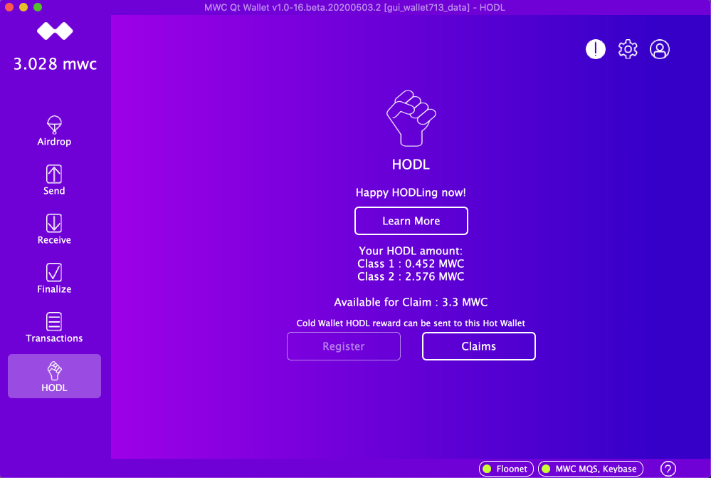

Press Claims Button. Leave checked "I am claiming MWC for this wallet". Press "Continue".

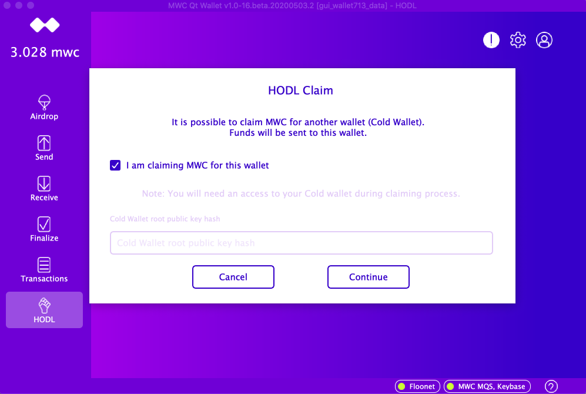

Normally there is one transaction available to claim and few historical transactions. Press "Claim MWC" to start the process.

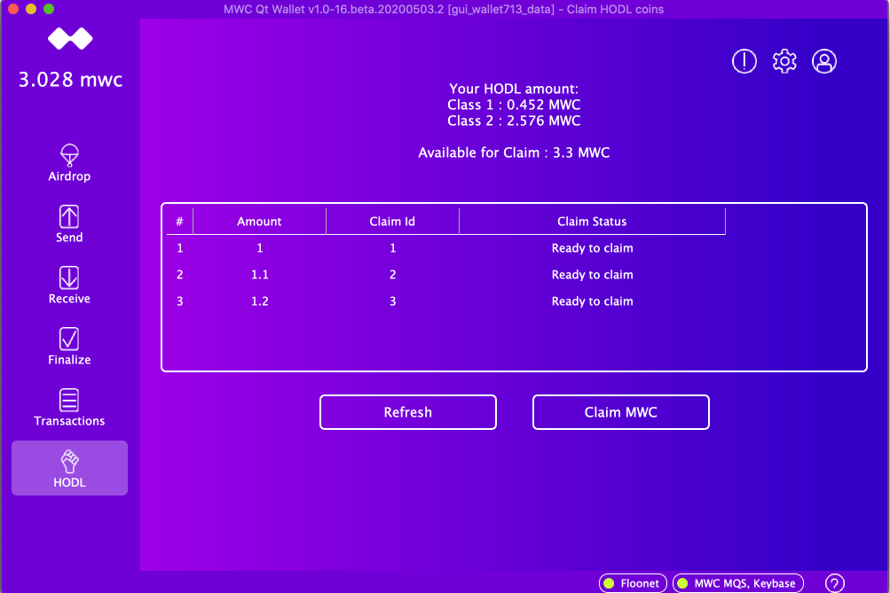

Claiming process should take few seconds. You should see the success message at the end.

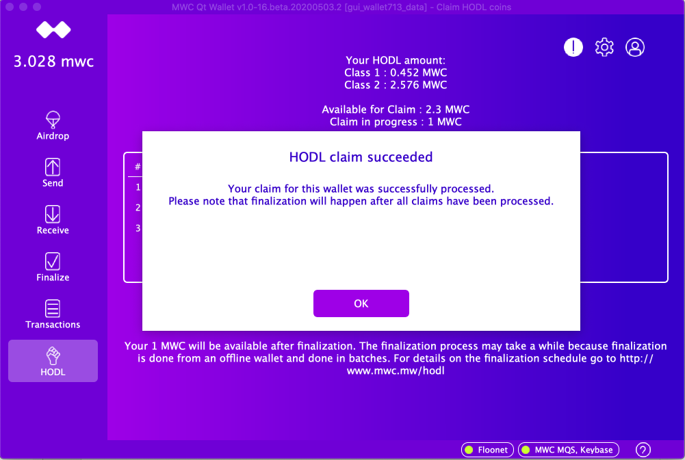

Press OK. You are done. You should see the transaction status "Response accepted"

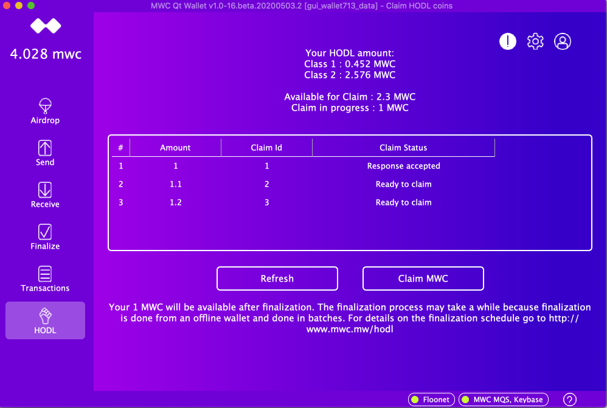

Finalization process may take a while because it will be done manually offline. When your transaction is processed,
status will be changed to 'Finalized'.

## Claim MWC for Cold (OFFLINE) wallet.

Please note, this workflow requires 2 wallets. Your offline cold wallet that you will need to sign the message and your online hot wallet that 
will be used for claims. Coins will be sent to your hot wallet. Then you can transfer them to your cold wallet as usual.

Start your online hot wallet. If you don't have it, please create a new hot wallet for claiming.

Select the HODL tab in the hot wallet. HODL server will say that this wallet is not registered and it is expected. You will claim for another wallet.
Press "Claims" button to continue.

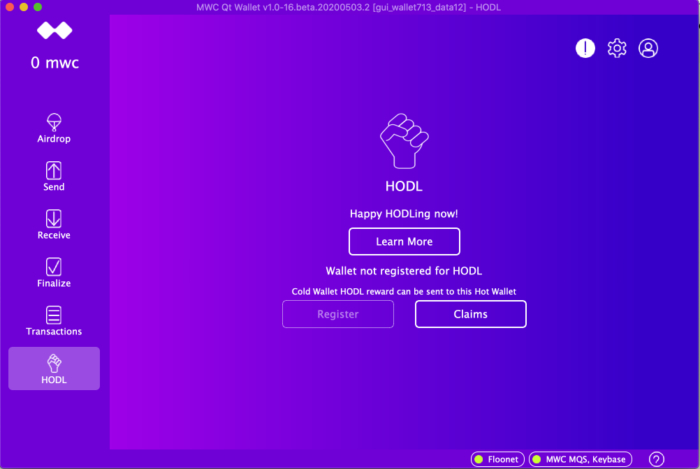

Uncheck the "I am claiming MWC for this wallet". Now you need to obtain public key hash from you Cold Wallet.

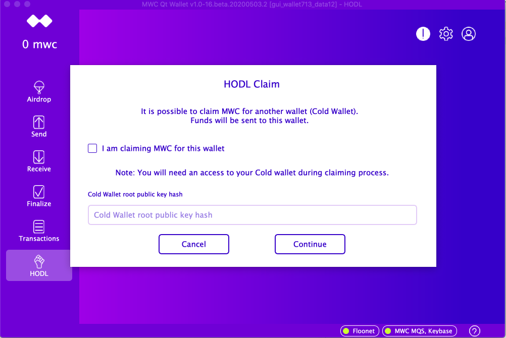

Start your Cold Wallet and select HODL tab there. Please copy 'Wallet root public key hash' into your Hot wallet at the form above

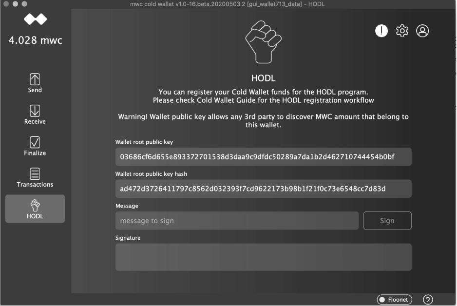

When you input the Hash code, please press "Continue"

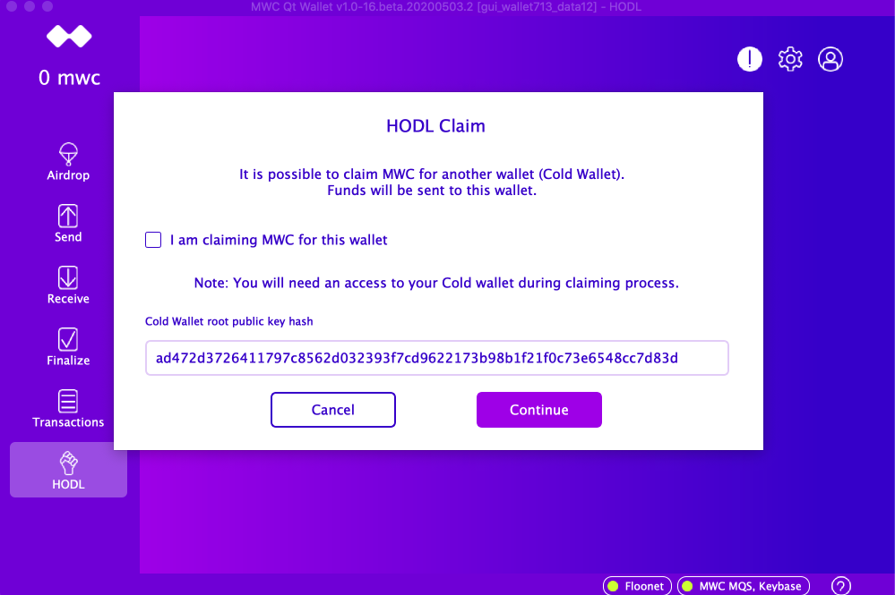

Now you should be able to see registered coins, and available claims for your Cold Wallet. To continue press "Claim MWC" button.

During claiming process you will be asked to sign the message with your Cold wallet. Please copy "Message to sign with Cold Wallet" to your Cold Wallet side. 

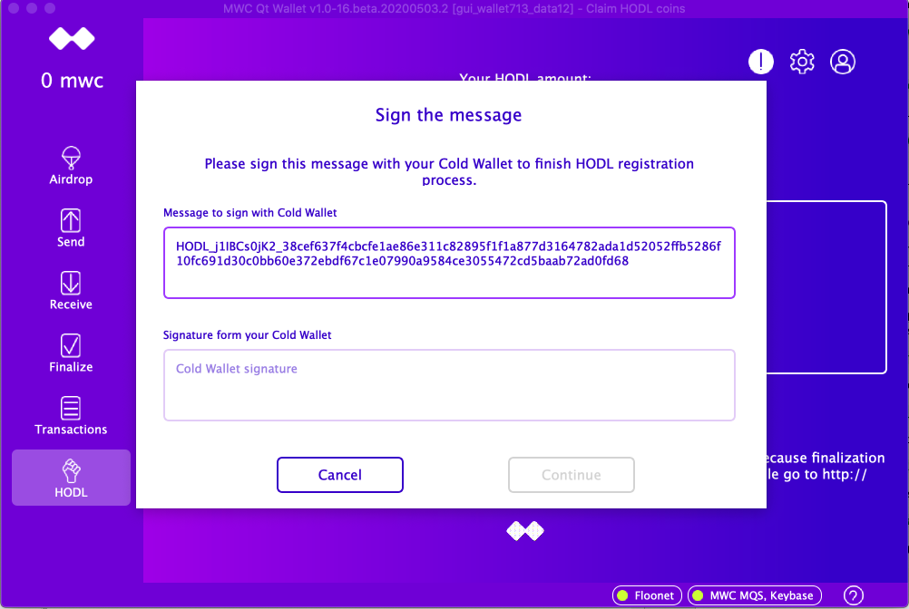

In your cold wallet, HODL Page, input the message to sign and press "Sign" button

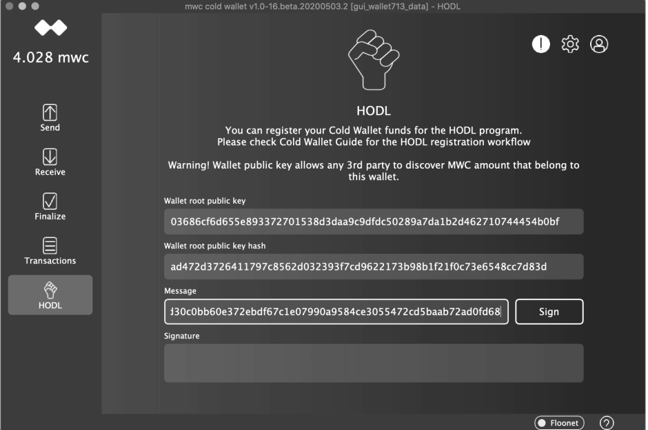

Copy "Signature" value to your hot wallet at the form above.

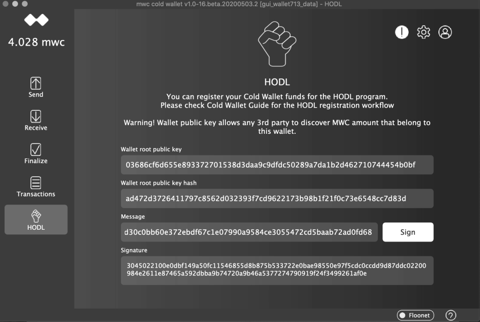

Input the signature into the hot wallet and press "Continue"

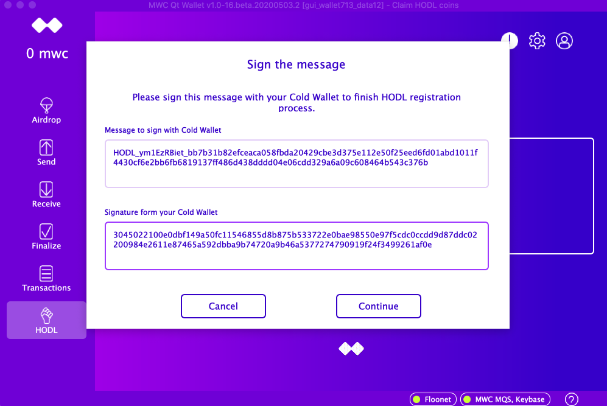

You should see the success message.

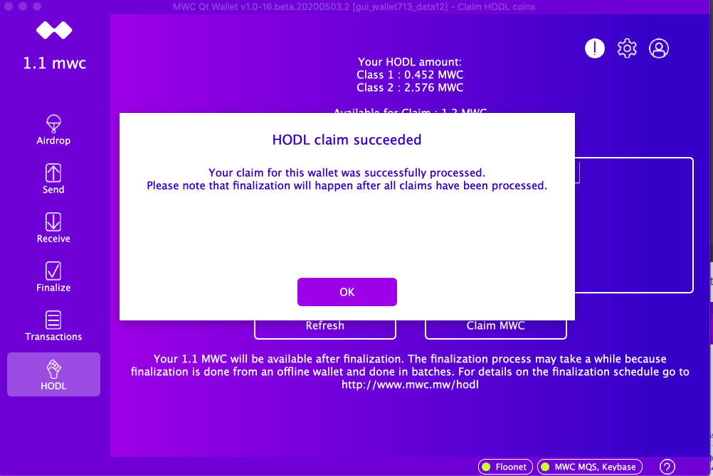

Press OK. You are done. You should see the transaction status "Response accepted"

Finalization process may take a while because it will be done manually offline. When your transaction is processed,
status will be changed to 'Finalized'.
