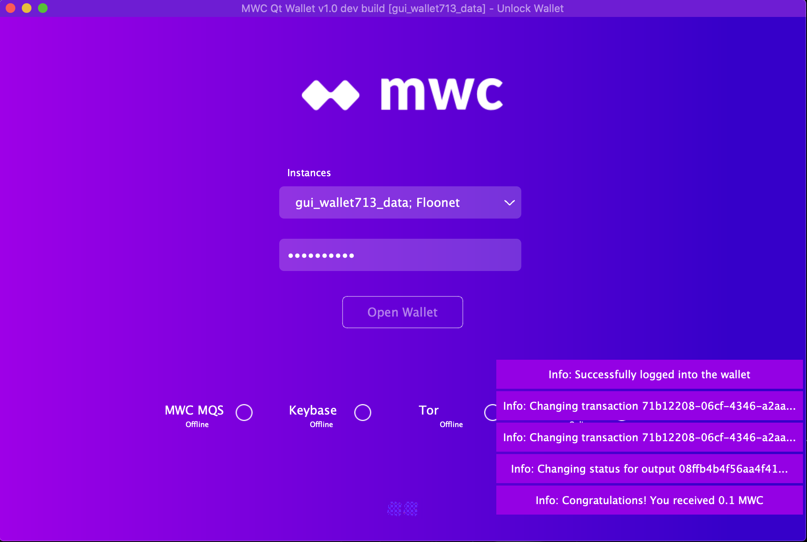

**MWC Qt Wallet Notification Windows**

**Contents:**
- [Notification Windows](#notification-windows)
- [Notification Window Content](#notification-window-content)
- [Notification Message Security](#notification-message-security)
  * [Locked Wallet](#locked-wallet)
  * [Iconified Wallet](#iconified-wallet)
- [Pop-Ups Which No Longer Appear](#pop-ups-which-no-longer-appear)
- [Disabling Notification Windows](#disabling-notification-windows)

# Notification Windows

MWC Qt Wallet has been enhanced to display notification messages in windows which appear and disappear in the lower right hand corner of your wallet. The notifications displayed are a subset of the events which can be found in the Notifications and the status messages which are displayed in the bottom status bar. The intent is to display those messages which would be of most interest to wallet users, such as listener status, receipt of MWC, and transaction and output status.

Each notification message is displayed for around 10 seconds and will appear on top of whichever wallet screen you may be in.  Any buttons which are partially covered by the notification windows can still be activated by clicking on that portion of the button that is not covered by a window. 

A maximum of 5 notication windows will be displayed at any one time. When a notification window disappears, the windows still being displayed will shift downward to take its place and any waiting notifications will then be displayed.

Up to 25 notifications can be pending at any one time. Any additional notifications will not be queued until space in the queue becomes available. You can examine the Notifications to see the full list of notifications for your wallet.

# Notification Window Content

Each notification window displays a summary of a message received by the wallet. To see the entire content of a notification message, you can click on the notification window for that message. This will bring up a pop-up with the complete message.

You will need to click the OK button for the pop-up to disappear. 

# Notification Message Security

## Locked Wallet

When MWC Qt Wallet is locked, individual notification messages are not displayed. Instead a single notification window is displayed indicating how many messages are waiting to be read. As new notification messages come into MWC Qt Wallet, the single window is displayed with the current count of pending messages to be read. Clicking on this notification window has no effect.

While your wallet is locked, clicking on the "Notifications Waiting To Be Read" window has no effect. Once your wallet is unlocked, pending notifications will start to be displayed again.

## Iconified Wallet

When your wallet is iconified, individual status messages are also not displayed and the same "Notifications Waiting" status window will be displayed as new notifications come in. However, in this case the "Notifications Waiting" window will appear in the lower right hand corner of your main laptop or desktop screen above your status bar.

When your wallet is iconified clicking on the “Notifications Waiting To Be Read” window will restore your MWC Qt Wallet to the screen. If your wallet is unlocked, any pending notification messages will then be displayed. If your wallet is locked, the pending notification messages will be displayed once you unlock your wallet.

# Pop-Ups Which No Longer Appear

With support for notification windows, the following pop-ups no longer occur:

    1. Congratulations! You have received xxx MWC

# Disabling Notification Windows

If you prefer to not have notification windows appear for your wallet, you can disable notification windows. In the Wallet Config settings screen, uncheck the checkbox next to Enable Notification Windows.

When notification windows are disabled, any pop-ups which were disabled from previous releases, will again appear.

