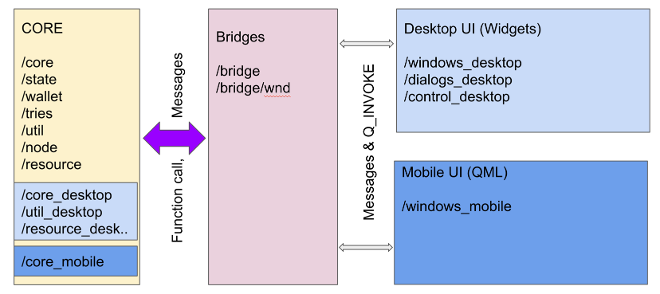

# Project Structure

### Background

mwc-qt-wallet supporting both Desktop and mobile platforms. Even both of them are build on QT, the 
technology is very different. Desktop app using QWidgets for UI elemenets, Mobile is using QML, that is 
JavaScript defenition of UI and not comparible with QWidgets. Also Mobile package is a very different for the desktop.

From development point, we want to reuse as much code as possible, that will minimize functionality duplication and 
make maintenance easier. 

## High lievel Architercure

QML define app architecture pretty strictly. Since QML is a JavaScript definition of UI that can have some
functionality, it requires Bridges to interact with C++ code. Technically there is a core backend
that does business logic and a UI front end. Bridges have to follow static data model.   

Both Mobile and Desktop app fit that model.
 

Core and bridges can interact with each other without limitations. Direct functional calls and messages are supported.

UI can talk with Bridges only and only with messages (Q_INVOKE calls are messages). Please note, 
even Desktop code can call derectly any methinds, please don't do, use bridges. That will enforce
to add some interface to bridge and implement complicated logic on core side that is shared. 
It is exactly what we need.

Please check what Types can be used on Bridge - UI side

https://doc.qt.io/qt-5/qtqml-cppintegration-data.html
 
**NOTE: int64 is not in the list.** Also qt doesn't support int64 for Json. That is this we are 
using String if we want to store int64. 

**NOTE: For messages pass parameters by value.** Let's not make any assumptions about how qt handle the messages. 
Even it is allowed pass by references and poinres, we better use values only. We don't have much data to transfer,
so no large performance impact is expected.   
 
## Project name conventions

Files and folders can have suffix 'mobile' or 'desktop'. Shared code (core & bridges) don't have any suffixes.

#### Desktop project

mwc-wallet-desktop.pro  - QT Creator project.

CMakeLists.txt - CMake project

Both those files include core and desktop sources. 

#### Mobile project

mwc-wallet-mobile.pro  - QT Creator project. Include core and mobile files only.

For mobile there is no cmake config. I don't think it is possible.

# UI Windows

Core with states need to work with UI. We nned ability to show/hide windows.  

**mwc-qt-wallet/core/WndManager.h** introduces the interface that should be able to show windows and dialogs.
Note, interface covering ONLY core to UI calls. UI to UI are not covered because it is much easier to
handle such calls directly, there are no advantage to expose that t core.

Desktop defines Widget manager at **mwc-qt-wallet/core_desktop/DesktopWndManager.h**

Mobile defines QML manager at **mwc-qt-wallet/core_mobile/MobileWndManager.h**

# Bridges

Because of the bridges, 'State' role was changed. Before 'States' covered business logic and provided interface 
to the mwc713 wallet functionality. Now wallet, config, utils has it's own bridges. So States providing only
business logic functionality when needed.

## Bridge Manager

Location: /mwc-qt-wallet/bridge/BridgeManager.h

Because bridges provide 'static' interface, at any time new bridge can be created and it should be functioned 
normally. Bridge to core object call is simple because core follows static data model.

But core to bridge calls are more complicated. By default core doesn't aware about any active bridges and 
breadges lifecycle defined by UI.
To solve this problem there is a BridgeManager. BridgeManager act as a catalog of active bridges. 
Core can allways iterate through all registered bridges and update all of them.
Please note, not all bridges participate in BridgeManager.

## Bridges for core functionality

**bridge::Config**  (/mwc-qt-wallet/bridge/config_b.h) - config related functionality for QT wallet and mwc713. 
Please note, bridge is a facade, so it is accessing to different objects, like wallet.  

**bridge::Wallet** (/mwc-qt-wallet/bridge/wallet_b.h) - mwc713 functionality.

**bridge::StateMachine** (/mwc-qt-wallet/bridge/state_machine_b.h) - State machine managing the active pages. 
Here you can switch pages right way.

**bridge::Util**  (/mwc-qt-wallet/bridge/wallet_b.h) - access to all utility methods that UI need. It is expected 
that UI doesn't need to use many, so one bridge can provide access to any needed util.

**bridge::CoreWindow**  (/mwc-qt-wallet/bridge/corewindow_b.h) - Main window functionality. Example: wallet current 
directory & update about active state change.

**bridge::HodlStatus**  (/mwc-qt-wallet/bridge/hodlstatus_b.h) - HODL functionality, modile doesn't need that. That is why 
it is separated to another bridge.

**bridge::Node**   (/mwc-qt-wallet/bridge/node_b.h) - Embedded node interface. Mobile now doesn't need it. 
May be in the far future it can be used.

## Panel Bridges

Panels normally using Core functionality bridges and it's own bridge, that is covered by state functionality

**bridge::InitAccount** (/mwc-qt-wallet/bridge/wnd/a_initaccount_b.h) - Cover functionality for all create new account windows.

**bridge::NewSeed** (/mwc-qt-wallet/bridge/wnd/c_newseed_b.h) - Mnemonic related workflow (show mnemonic and test the words)

**bridge::InputPassword** (/mwc-qt-wallet/bridge/wnd/a_inputpassword_b.h) - Login page

**bridge::Outputs**  (/mwc-qt-wallet/bridge/wnd/e_outputs_b.h) - Marker for outputs window. If this bridge exist, assuming 
that output page is visible. Data for that page provided by Bridge::Wallet.

**bridge::Receive**  (/mwc-qt-wallet/bridge/wnd/e_receive_b.h) - Receive page.

**bridge::Transactions**  (/mwc-qt-wallet/bridge/wnd/e_transactions_b.h) - Marker for transaction window. If this bridge exist, assuming 
that output page is visible. Data for that page provided by Bridge::Wallet.

**bridge::Finalize**  (/mwc-qt-wallet/bridge/wnd/g_finalize_b.h) - Finalization page.

**bridge::Send**  (/mwc-qt-wallet/bridge/wnd/g_send_b.h) - Cover functionality for all 3 send pages: send online and offline

**bridge::Hodl**  (/mwc-qt-wallet/bridge/wnd/h_hodl_b.h) - Cover functionality for both hodl pages.

**bridge::Accounts**  (/mwc-qt-wallet/bridge/wnd/k_accounts_b.h) - Accounts pages. That functiuonality backed by config, 
but let's keep it separate because it is very specific to this page.

**bridge::AccountTransfer** (/mwc-qt-wallet/bridge/wnd/k_accounttransfer_b.h) - Account tranfer page.

**bridge::Airdrop** (/mwc-qt-wallet/bridge/wnd/m_aidrop_b.h) - Airdrop page, Mobile doesn't need it.

**bridge::NodeInfo** (/mwc-qt-wallet/bridge/wnd/u_nodeinfo_b.h) - mwc Node status page.  

**bridge::Events** (/mwc-qt-wallet/bridge/wnd/x_events_b.h) - wallet events (messages that user suppose to see).   

**bridge::WalletConfig** (/mwc-qt-wallet/bridge/wnd/x_walletconfig_b.h) - Some functionality is duplicated as Config, but 
most of it is needed for that page only. Also only this bridge can handle update settings.    

**bridge::SelectMode** (/mwc-qt-wallet/bridge/wnd/y_selectmode_b.h) - Running mode selection. Example: Cold wallet, online wallet.
Mobile doesn't need it because it is allways run as online wallet.

**bridge::ProgressWnd** (/mwc-qt-wallet/bridge/wnd/z_progresswnd_b.h) - Progress wnd has it's own bridge because it is 
used by several states.
    

 

  

 