# Testing scenario, About

The purpose of this document is to formalize QT wallet testing scenario. This document explains the step to follow in 
order to test QT wallet featueres manually.

Note, such testing expected to be done rarely, it can be done manually. So far no plans to automate it.

All scripts below are expected that we are using **MacOS** and **bash** based terminal.  

# Init wallet

backup your data
```
mv ~/mwc-qt-wallet  ~/mwc-qt-wallet-backup
```

Start Wallet, you should see

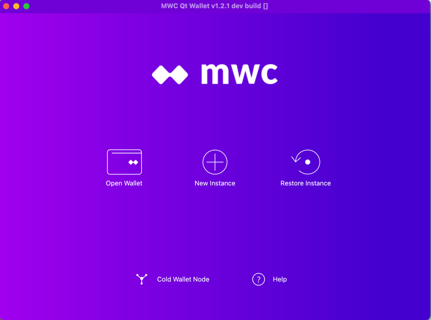

Check the tooltips for all elements.

Check the tab order, UI should be able to work without mouse, Tab and Enter should allow to select any item.

Check window resize.

Check 'Help'

## Open Wallet

Open wallet from path without wallet data. <br>
Response: You should see request to create a new wallet at that location

Open existing wallet from your backup data. Select path at  mwc-qt-wallet-backup/gui_wallet713_data1/<br>
Response: Open wallet page. The wallet name should be your existing name

Check if can see your transactions, amounts. Network should be correct. Wallet shouldn't scan all the data.  
Send -> Contact must be empty
Wallet Configuration should be default.

Close the QT wallet

## New Instance

Clean up the wallet data  
```
rm -rf ~/mwc-qt-wallet
```

Open QT wallet

Press "New Instance" button

You should see: 

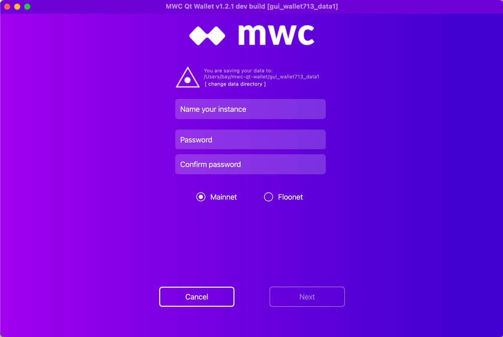

Check tooltips.

Check tab order.  Note 'change data directory' is not in tab order, can be selected with mouse only.

Check window resize.

### 'Cancel' button

Press 'Cancel'<br>
Response: go back to original page

### 'change data directory' button

Press "New Instance" button<br>
Response: You should see the new instance page

Click 'change data directory', create folder ~/del_me_wallet and select it<br>
Response: Location 'You are saving your data to' should update with correct path.

### Instance name and pasword

At 'Name you instance', 'Password' and 'Confirm password' try to add miltibyte symbols: гчф 湖 😃💁<br>
Response: For password you should see error about unicode characters.  For wallet name Unicode is acceptable.

Update password with 'My new password'<br>
Response: Error that password is not strong enough.

Update password with 'TestMWCP@sw0rd'

Select 'Floonet'

Press 'Next'

## Mnemonic phrase Length

You should see:

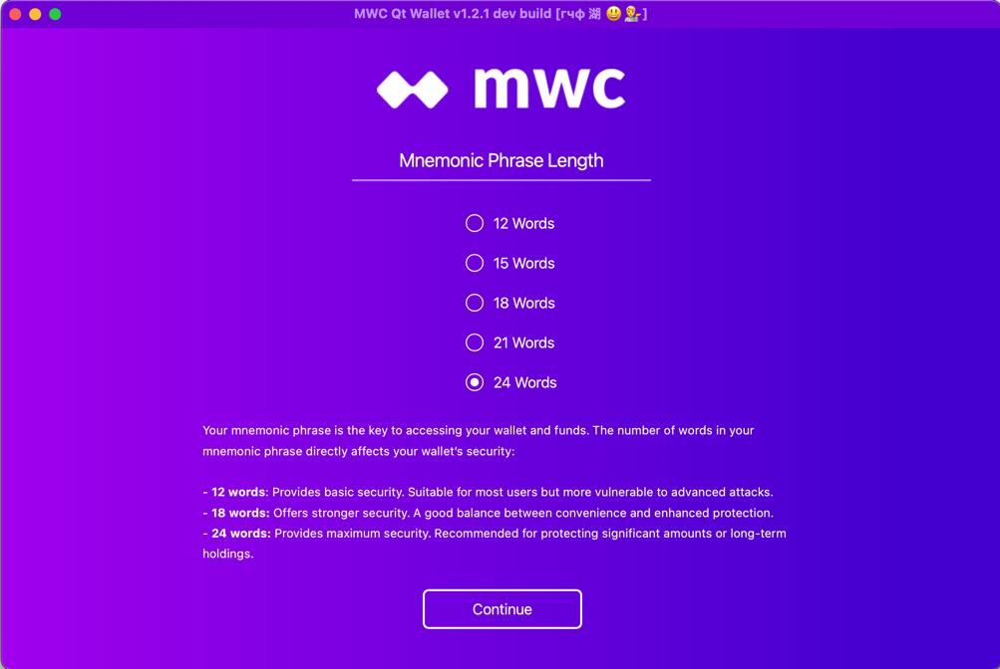

Check tooltips. Only "Continue" has them

Check tab order.

Check window resize.

Specify '18 Words' and press 'Continue'

## Mnemonic phrase

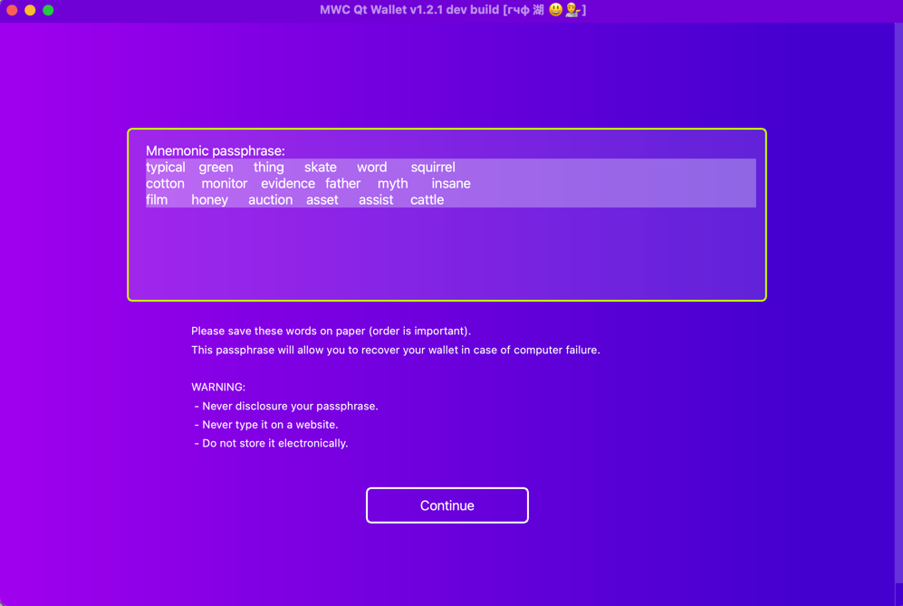

Check tooltips. Only "Continue" has them

Check tab order.

Check window resize.

Mnemonic phrase 'edit' must be anly read only. You can only select the text and copy in the buffer. Text can't be updated there. 

Save the mnemonic somewhere.

Press 'Continue'

## Check mnemonic words

You should see<br>
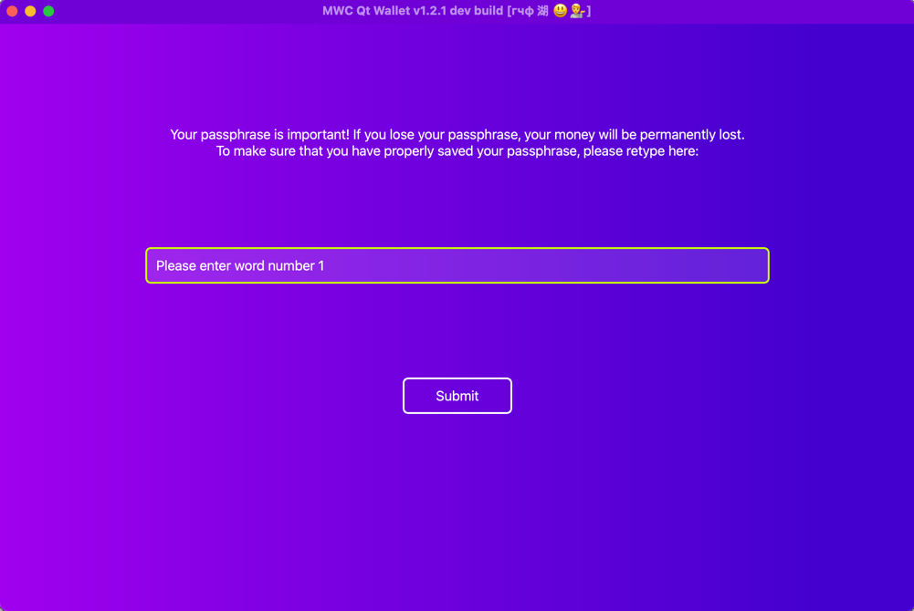

Check tooltips. 

Check tab order.

Check window resize.

Input couple of your words. Check if 'Enter' move you next for the next word. Try press "Submit" as alternative toi Enter<br>
Response: you should see autocomplete helper. Enter/Submit should move you to the next word

### Invalid mnemonic word

Input miltibyte symbols: гчф 湖 😃💁<br>
Response: Nothing should be in autocomplete 

Press 'Submit'<br>
Response: Message - 'The word number 3 was typed incorrectly. Please review your passphrase and we will try again 
starting where we left off.'

Next you should see 'Mnemonic phrase' page.

Press 'Continue'<br>
Response: 'Check mnemonic words' page with word that was failed (in my case Word 3)

Do that few times. You should not exit, user can try forever, there is no limit.

### Create wallet interruption

Close the wallet. ( User didn't store the phrase, and didn't finish confirmation) 

Open the wallet.<br>
Response: You should see the 'Init wallet' page, no wallets must be exist to open.  

### Finish mnemonic validation 

Now retry all steps to reach 'Check mnemonic words' page and continue<br>
Response:  AT the end you should see Congrats message 'Thank you for confirming all words from your passphrase. Your 
wallet was successfully created'

Validate:  The new wallet is not expected to scan the whole chain. In a second you should see the 'receive' page and 
wallet should be ready to use immediately. 

### Check new wallet location

Wallet was created at non default location at ~/del_me_wallet/. Let's check it it was created there  

```
> ls ~/del_me_wallet/
archived_txs	contacts	db		net.txt		saved_proofs	saved_swap_deal	saved_txs	wallet.seed
> cat  ~/del_me_wallet/net.txt
Floonet
x64
гчф 湖 😃💁
```

## Validate other phrase lengths and clean up

Create wallets for  12, 15, 18, 21, 24 words. Keep your mnemonics for further testing. Validate that the number of words is correct for each choice.

Close the wallet.

Clean the data:

```
rm -rf ~/mwc-qt-wallet
```

## Restore instance

Start the QT wallet.

Select 'Restore instance'

You should see:


Check tooltips.

Check tab order.  Note 'change data directory' is not in tab order, can be selected with mouse only.

Check window resize.

### Cancel button

Press 'Cancel'<br>
Response: go back to original page

### Change data directory

Press "New Instance" button<br>
Response: You should see the new instance page

Click 'change data directory', create folder ~/del_me_wallet and select it<br>
Response: Location 'You are saving your data to' should update with correct path.

### Instance name & password

At 'Name you instance', 'Password' and 'Confirm password' try to add miltibyte symbols: гчф 湖 😃💁<br>
Response: For password you should see error about unicode characters.  For wallet name Unicode is acceptable.

Update password with 'My new password'<br>
Response: Error that password is not strong enough.

Update password with 'TestMWCP@sw0rd'

Select 'Floonet'

Press 'Next'

### Restore account page

You should see the 'Restore account' page

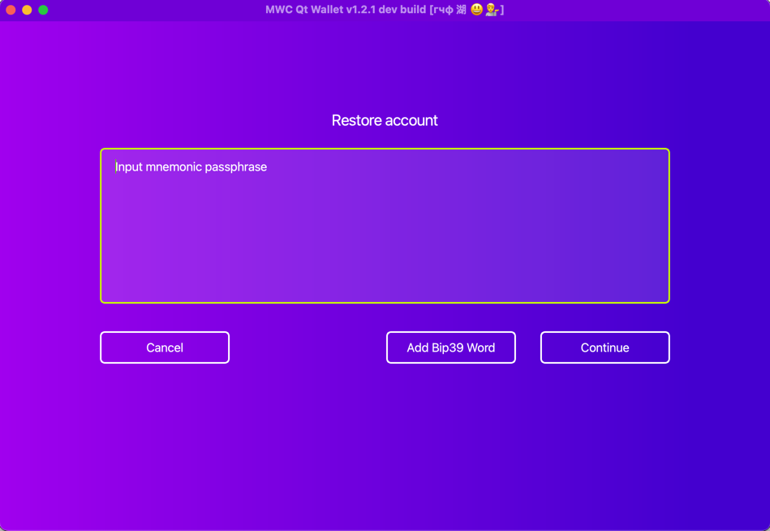

Check tooltips.

Check tab order.

Check window resize

### Celcel test

Press 'Cancel' and validate that wallet retuned back, no wallet instance is created.

### Input mnemonic 

Input your mnemonic, from prev tests you should have them.

Delete last two words from mnemonic. Press 'Continue'<br>
Response: Error -  Your phrase should contain 12, 15, 18, 21 or 24 words. You entered 17 words.

Enter some unicode letters: гчф 湖 😃💁<br>
Response: Error:  Your phrase contains non dictionary words: гчф

Finish you mnemonic enter with 'Add Bip39 Word' button

### Recovery progress

Press 'Continue'<br>
Response: You should see the recovery progress.

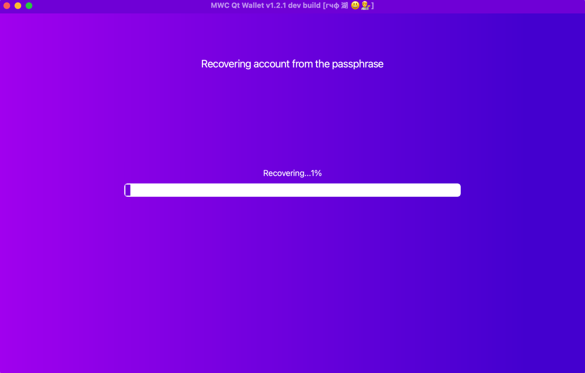

### Recovery interruption

Close the wallet<br>
Response: Wallet should exit in a few seonds. Ufter restart the acount update will take a while

### Check resulting wallet data & clean up

Check if wallet was create at expected location<br>
```
> ls ~/del_me_wallet/
archived_txs	contacts	db		net.txt		saved_proofs	saved_swap_deal	saved_txs	wallet.seed
```

clean up the data:
```
rm -rf ~/del_me_wallet/*
rm -rf ~/mwc-qt-wallet
```

### Full Restore instance workflow 

Retry 'Restore instance' steps, but not close the wallet. <br>
Response: Eventually progress should reach 100%.   Resize the window.<br>
Next: Success message

### Validate restored menmonic

Go to menu -> Show passphrase<br>
Response: Show Password request Dialog.  

Input the password 'TestMWCP@sw0rd', press confirm<br>
Response: Mnemonic passphrase page

Validate that Mnemonic passphrase match expected.

### Close & clean up

Close the wallet.

clean up the data:
```
rm -rf ~/del_me_wallet/*
rm -rf ~/mwc-qt-wallet
```

### Test recovery for all mnemonic combinations

Do the recovery for all lengths of mnemonic: 12, 15, 18, 21, 24 words

## Cold Wallet Node

Press 'Cold Wallet Node'<br>
Response: Message - You are switching to 'Online Node'.

### Cancel button

Press 'Cancel' and see that you return back.  Press 'Cold Wallet Node'.  Press 'Continue'

### Cold Node new instance 

Your should see:

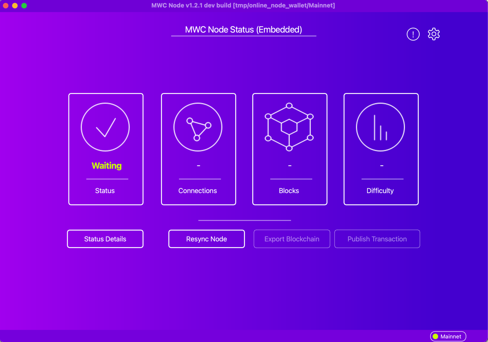

After some time node should start synchronising.

The network must be "Mainnet"

Don't wait until sync will be finished. Close the wallet. Closing process should be relatevely fast.

## Clean up & restore data from the Backup

```
rm -rf ~/del_me_wallet
rm -rf ~/mwc-qt-wallet
mv ~/mwc-qt-wallet-backup ~/mwc-qt-wallet
```

# Open existing wallet

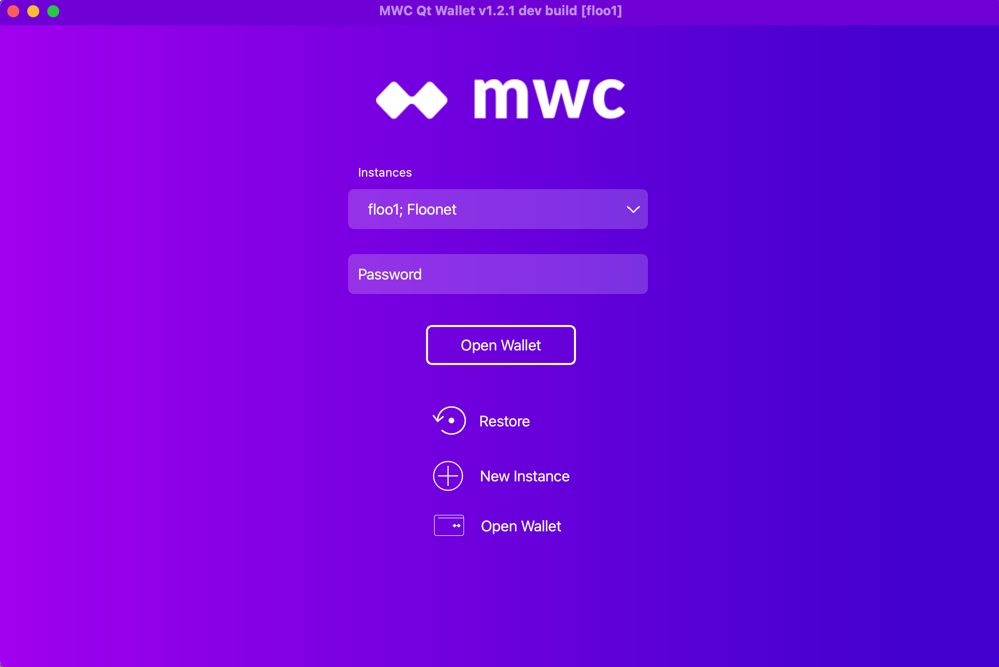

Check tooltips.

Check tab order.

Check window resize

### Validate Restore workflow

Click "Restore"
Response: Restore wallet workflow. Validate if it is restore workflow, than press Cancel

### Validate New instance workflow

Click 'New instance'
Response: Creating new instance workflow.  Validate if it is restore workflow, than press Cancel.

# Validate Open Wallet

Click 'Open Wallet'
Response: Same as described at 'Open Wallet' section above

Select your instance, input incorrect password, press "Open Wallet"
Resposne: Message - Password / Incorrect password. Please enter the correct password to proceed.

Select your instance, input password with symbols: гчф 湖 😃💁
Response: Message:  Password / Input string contains not acceptable unicode characters.

Select your instance, input correct password, press "Open Wallet"
Response: Your last page will be open.

# Wallet Configuration

Select:   Menu -> Wallet Configuration
Response:

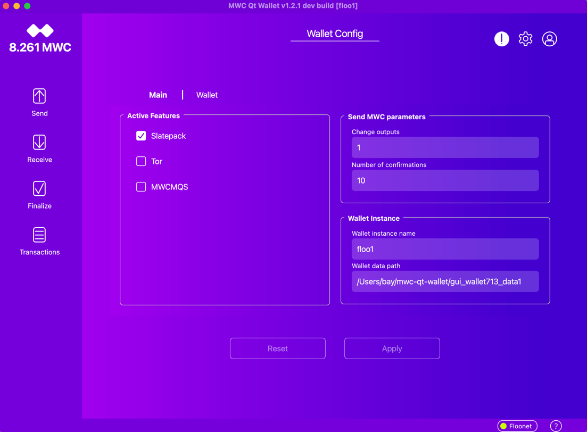

Check tooltips.

Check tab order.

Check window resize

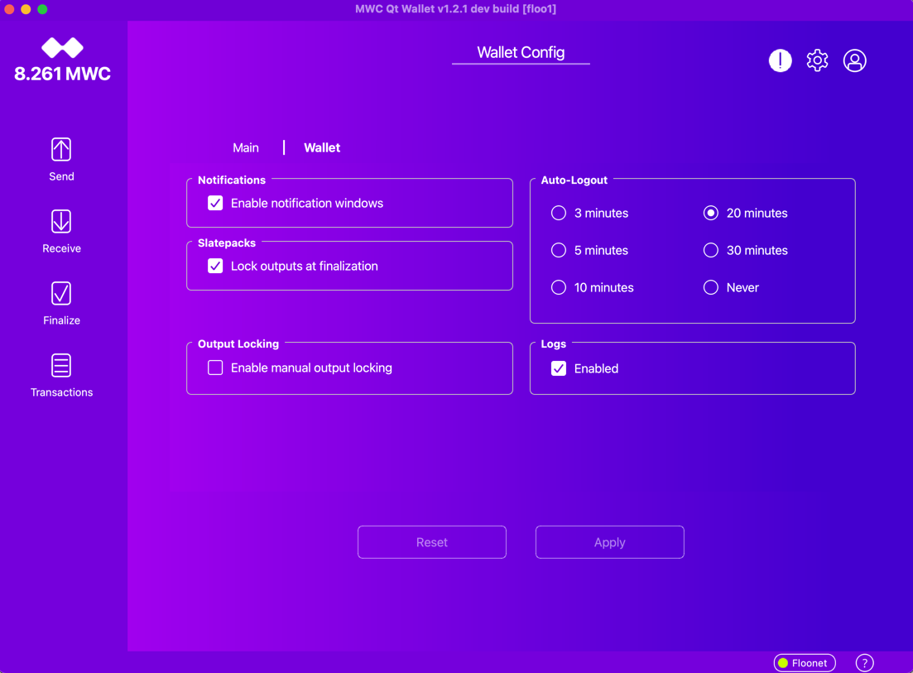

Check tooltips.

Check tab order.

Check window resize

Check 'Help' at the bottom right 

Next, let's check features one by one.

## Validate Reset and Apply

Apply button - must apply changes.<br>
Reset button - reset setting to default, but not apply them.<br>
At screenshot above there are default values. 

If reset is highlighted, press the Reset button, then Apply Button<br>
Response: Setting similat to screenshots above

For every setting at 'Main' and 'Wallet' tabs:
 - Change the setting (Note, 'Wallet data path' is read only, not editable) 
 - validate that 'Apply' and 'Reset' is highlighted
 - change it back
 - validate that 'Apply' is disabled
 - Change it once more, 
 - validate that 'Reset' is highlighted (Exception: "Wallet Instance")
 - Press "Reset"
 - Validate that value changed base, 'Apply' is disabled


Switch to default wallet wallet params. Press "Reset" and "Apply" buttons if they are enabled. 

##  Wallet Configuration. Change outputs.

### Change outputs invalid values

Try input 'Change output' numbers outside the range 1-15<br>
Respose: Error about value.

Try input some unicode symbols: гчф 湖 😃💁
Respose: Error about value.

### Change outputs workflow validation

Update 'Change output' to '3'. Press "Apply" button<br>
Response: "Reset" highligted, "Apply" disabled. Change output value is 3.

Switch to setting => Outputs page. Count your outputs. 
Note, if change outpts amount is lass than 0.1 MWC, number of change outputs will be reduced. 

Send some coins to another account (not self send) with slatepack.<br> 
Response: At 'Confirm Send Request' validate that the 'Change outputs' value is 3.   Change it to 2.

Switch to setting => Outputs page. Count your outputs.<br>
Response: you should see 2 new outputs with same amounts. Note, if you see less, it is possible because wallet doesn't produce multiple outputs smaller than 0.1 MWC

Switch to 'Wallet Configuration', 'Main' tab. Check that 'Change outputs' value is 2. 
Note, if change outpts amount is lass than 0.1 MWC, number of change outputs will be reduced.

Press 'Reset' button, press "Apply".

##  Wallet Configuration. Number of confirmations.

### Number of confirmations invalid values.

Try input 'Number of confirmation' outside the range 1-10<br>
Respose: Error about value.

Try input some unicode symbols: гчф 湖 😃💁<br>
Respose: Error about value.

### Number of confirmations validation.

Wait until transaction will be confirmed, but number of confirmations will be less that 10. 

At "send", 'Transaction', 'Receive', 'Outputs' pages validate that available balance doesn't include Unconfirmed coins.

Validate that you can't send 'Unconfirmed' amount, you can send only available coins

Update Wallet Configuration => "Number of confirmations" to 1. 

At "send", 'Transaction', 'Receive', 'Outputs' pages validate that available balance include All coins, Unconfirmed is 0.

Validate that you can send all coins, 'Unconfirmed' is 0.  You don't need to send, cancel send operation.

Switch to 'Wallet Configuration', 

Press 'Reset' button, press "Apply".

##  Wallet Configuration. Wallet instance name, Wallet data path

Switch to 'Wallet Configuration', 'Main' tab.

Change 'Wallet instance name' to 'гчф 湖 😃💁' plus add symbols until you can add them. Max number of characters must be limited  Press Apply 

### Instance name & Wallet data path save/restore

Press 'Account' => 'Logout / Change Wallet'<br>
Response: Wallet should switch to Lock page.

Check if your new wallet name is in the list of "instances" and it is selected by default.

Close the Walleet.

Open the Wallet.

Check that new instance name in the list of "instances" and it is selected by default. Input your password and press "Open Wallet"<br>
Response: Wallet should be open at the config page, 'Wallet' tab

### Wallet data path files validation

Switch to the 'Main' tab. Validate 'Wallet data path' path value.

In Terminal validate the path value and a wallet name:
```
> cd <path_value>
> ls
archived_txs	db		saved_proofs	saved_txs	wallet.seed
contacts	net.txt		saved_swap_deal	tor
> cat net.txt
Floonet
x64
<your_new_wallet_name> 
```

### Wallet name data validation

Change wallet name back to your original name. Press "Apply" button.

In Terminal check that teh name is updated:
```
> cd <path_value>
> cat net.txt
Floonet
x64
<your_updated_name>
```

Press 'Account' => 'Logout / Change Wallet'<br>
Response: Wallet should switch to Lock page.

Check if your wallet name is correct. Login Back to the wallet

##  Wallet Configuration. Enable notification Window

Switch to 'Wallet Configuration', 'Wallet' tab.

'Enable notification window' is checked.

Shut down your your network connection. Wait until wallet check connection to the node.<br>
Response: See the notifications pop up: 

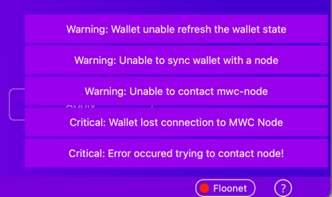

Restore back you your internet connection, wait until Node status will be healthy.

Uncheck 'Enable notification window', press "Apply".

Shut down your your network connection. Wait until wallet check connection to the node.<br>
Response: No notifications to pop ups. Messages will be shown in status bar only.

Press 'Reset' and 'Apply' buttons.

##  Wallet Configuration. Slatepacks, Lock outputs at finalization

### Validate ON value for Lock outputs at finalization

Check if 'Lock outputs at finalization' is ON. 

Initiate Send slatepack transaction. Create Send Init slatepack.<br>
Response: Check 'transactions' page. You must see unconfirmed Transaction.<br>
  Check "outputs" page. You must see only "Unspend", nothing Locked or unconfirmed   

At another wallet generate 'Receive' slatepack. At 'Finalize' page finalize your transaction<br>
Response: Check "outputs" page. You must see some "Locked" output and some Unconfirmed

Wait until transaction will be confirmed.

Check "outputs" page, no "Locked" and "Unconfirmed" are expected.

### Validate OFF value for Lock outputs at finalization

Switch back to "Wallet Configuration", uncheck 'Lock outputs at finalization', press Apply

Initiate Send slatepack transaction. Create Send Init slatepack.<br>
Response: Check 'transactions' page. You must see unconfirmed Transaction.<br>
   Check "outputs" page. You must see some "Locked" and "Unconfirmed "outputs.
  
At 'transactions' page cancel latest unconfirmed transaction.<br>
Response: Transaction status changed to "Cancel" <br>
   Check "outputs" page, no "Locked" and "Unconfirmed" are expected.

Initiate Send slatepack transaction. Create Send Init slatepack.<br>
Response: Check 'transactions' page. You must see unconfirmed Transaction.<br>
Check "outputs" page. You must see some "Locked" and "Unconfirmed "outputs.

At another wallet generate 'Receive' slatepack. At 'Finalize' page finalize your transaction<br>
Response: Check "outputs" page. You must see some "Locked" output and some Unconfirmed

Wait until transaction will be confirmed.

Check "outputs" page, no "Locked" and "Unconfirmed" are expected.

Switch to 'Wallet Configuration', Press 'Reset' and 'Apply' buttons.

##  Wallet Configuration. Manual output Locking

### Validate OFF value for Manual output locking

Check if "Enable Manual output Locking" id OFF.

Go to 'Outputs' page and see that all outputs are unspent, no extra buttons at outputs are available.

### Validate ON value for Manual output locking

Switch to 'Wallet Configuration', Check "Enable Manual output Locking", press Apply

Go to 'Outputs' page and see that all outputs are unspent, but now they have 'Lock' option.<br>
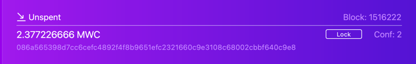

Lock all outputs except one by pressing 'Lock' button.<br>
Response: Message -  By manually locking output you are preventing it from spending by QT wallet.

### Save/Restore Manual output locking status 

Close the Wallet.

Open QT Wallet, at "Outputs" page validate that Lock statuses are correct.

Go to 'Receive' page.<br>
Validate that 'Available' amount includes only unlocked output. 'Locked' is equal to Locked outputs amounts.

Go to 'Transaction' page.<br>
Validate that 'Available' amount includes only unlocked output. 'Locked' is equal to Locked outputs amounts.

Go to meny -> 'Accounts' page.<br>
Validate that 'Available' amount includes only unlocked output. 'Locked' is equal to Locked outputs amounts.

Press 'transfer between accounts' icon. Transfer some coins, make change outputs 1.

Got to "Outputs" page and validate that 'Locked' output is the only that was left not manualloy locked, plus 1 unconfirmed output.

Wait until transaction will be confirmed.<br>
Validate that you have 2 manually locked ouputs and one unsped output.

Now let's send some coins Go to 'Send' page.<br>
Validate that 'Available' amount includes only unlocked output. Send some MWC to another wallet, use 1 change output.

Got to "Outputs" page and validate that 'Locked' output is the only that was left not manualloy locked, plus 1 unconfirmed output.

### Reset Manual output locking to OFF.

Switch to 'Wallet Configuration', Press 'Reset' and 'Apply' buttons. "Enable Manual output Locking" must be OFF.

Switch to outputs and see that no Locks on outputs are available.

Go to 'Receive', 'Transaction', 'Send'  page to validate that all coins are available to spend now, nothing manually locked.

##  Wallet Configuration. Logs

### Enable logs and validate them  
Go to 'Wallet Configuration', 'Wallet' tab. Check if Logs 'Enabled' is ON.

Validate that the logs are active. At the console:
```
tail -f ~/mwc-qt-wallet/logs/mwcwallet.log
```

Do some action with QT wallet, the logs records should be appended

### Disable logs and validate them

Go to 'Wallet Configuration', 'Wallet' tab.<br> 
Uncheck Logs 'Enabled'. Press "Apply" button.<br>
Response: Message - You just disabled the logs....   Press "Keep the logs" button

Do some action with QT wallet, the logs records should not be appended

### test logs clean up

Go to 'Wallet Configuration', 'Wallet' tab.<br>
Check Logs 'Enabled'. Press "Apply" button.<br>
Response: Message - You just enabled the logs...

Do some action with QT wallet, the logs records should be appended

Exit from 'tail -f' command.

Go to 'Wallet Configuration', 'Wallet' tab.<br>
Uncheck Logs 'Enabled'. Press "Apply" button.<br>
Response: Message - You just disabled the logs....   Press "Clean up" button

Validate that logs are deleted. At the console:
```
> ls ~/mwc-qt-wallet/logs/mwcwallet.log
ls: ~/mwc-qt-wallet/logs/mwcwallet.log: No such file or directory
```
Response: You must see 'No such file or directory' message

### Restore Logs setting

Go to 'Wallet Configuration', Press "Reset" and "Apply" buttons.

##  Wallet Configuration. Auto-logout

Go to 'Wallet Configuration', 'Wallet' tab.  Select 'Auto-logout' time '3 minutes'. Press Apply

Wait for 3 minutes<br>
Response: Wallet should be locked after 3 minutes.

Do the same for 10 minutes.

Go to 'Wallet Configuration', Press "Reset" and "Apply" buttons.

# Send Page, Slatepack only

## Send all coins with unencrypted slatepack

Select "Send" page. You should see: 

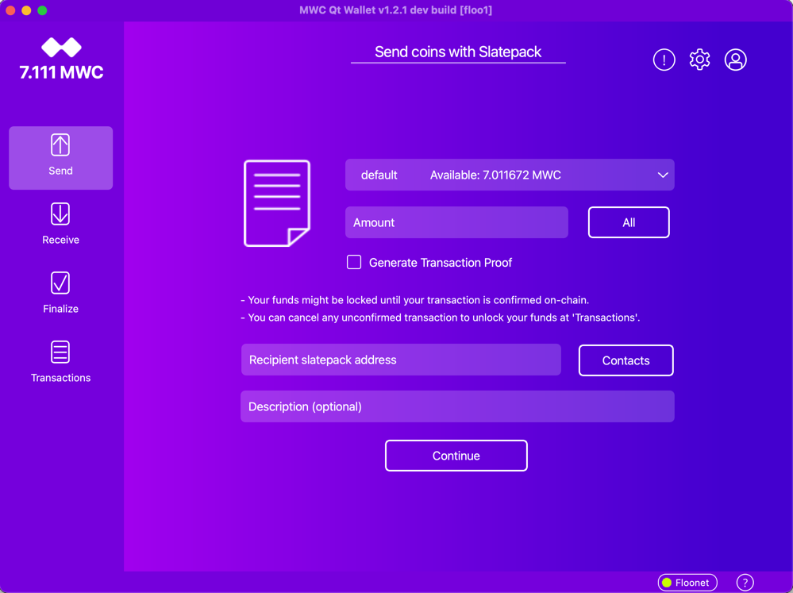

Validate tooltips.

Validate tab order, resize.

Validate the status bar. Only network should be there, no Listeners status.

Check 'Help' at the bottom right

### Test amount values, proof, description and recipient inputs

Try specify invalid number of MWC to send, try unicode symbols гчф 湖 😃💁, presss "Continue"<br>
Response: Message:   Please specify the number of MWC to send

Press 'All' button. 
Response: you should see send amount equal to 'Available' number

Check "Generate Transaction Proof"

In 'Description' try unicode symbols гчф 湖 😃💁. Press 'Continue' <br>
Response: Message -  String 'XXXXXXX' contains not acceptable unicode characters

In 'recipient slatepack address' try unicode symbols гчф 湖 😃💁. Press 'Continue' <br>
Response: Message -  Please specify valid recipient wallet address

In 'recipient slatepack address' try full onion address in format like `http://<address>.onion`. Press 'Continue' and do send. Then retry from this step<br>
Response: Address should be accpted

In 'recipient slatepack address' try Slatepack address in format like `<address>`. Press 'Continue' and do send. Then retry from this step<br>
Response: Address should be accpted

Leave recipient slatepack address empty.

Change 'Description' value to "sender message".

### Send confirmaiton dialog

Press 'Continue'<br>
Response: Confirm Send Request dialog window

Validate Tab order

Validate tooltips

Input the password, try incorrect password, symbols гчф 湖 😃💁 <br>
Response: Button Confirm must be disabled until correct password will be specified

Input incorrect 'TTL Values': Try symbols, negative numbers, numbers less than 10.<br>
Response: Message - Please specify valid TTL value. Minimum valid TTL value is 10.

Input invalid 'Change outputs' number,  symbols гчф 湖 😃💁<br>
Response: Message - Please specify outputs number from 1 to 10.

Specify 'TTL Values' 1000, 'Change outputs' 1. Press 'Continue'<br>
Response: 'Resulting Slatepack' Page

### Resulting Slatepack Page

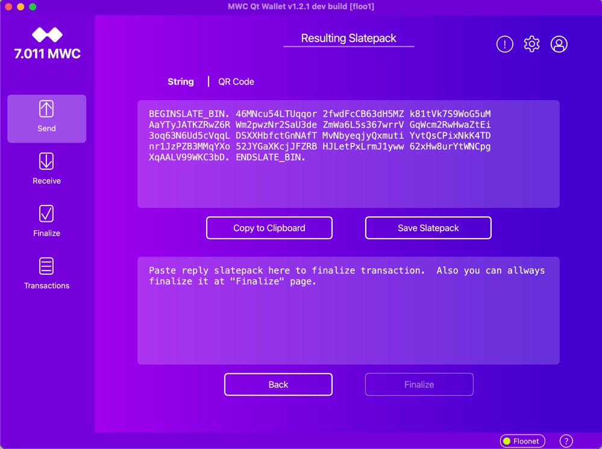

Press "String" tab if it is not active.

Check tab Order, resize

Check tooltips

### Save slatepack data as a string

Press "Copy to Clipboard". Validate that slatepack is copied by pasting it somewhere

Press "Save Slatepack", save it onto file, default file extension will be '*.tx'. Validate the file content. If should have slatepack as a text inside

### Save slatepack data as a QR code

Switch to the "QR Code" tab


Check tab Order, resize

Check tooltips

### Validate QR code readability, saving it 

Validate that QR code is readable by mobile phone.<br>
Response: You should see slatepack content in QT viewer.

Press "Copy to Clipboard".<br>
Response: Validate that slatepack QR code is copied by pasting it somewhere

Press "Save QR image" into the file.<br>
Response: Validate that file exist, has '*.png' extension and contain the QT code data. 

### Response Slatepack check and finalize 

Switch to "String" tab.

Copy the Slatepack and transfer it to the another wallet, receive it there.<br>
Response: Validate that 'Sender's Description' value is "sender message"

At recipient wallet specify description "reciever message"<br>
Press "Generate response", and deliver the resulting slatepack to this wallet.

Paste adjusted invalid slatepack 'reply slatepack to finalize transaction' window.<br>
Response: Notification message -  Invalid Slatepack. The data appears to be corrupted or incomplete. Please double-check that you copied the entire Slatepack correctly. 

Paste Slatepack from different stage (you will need to prepare it ahead)
Response: Message that it is invalid type of the slatepack.

Paste reply slatepack at 'reply slatepack to finalize transaction' window.<br>
Response: "Finalize" button should be enabled 

Press 'Finalize' button<br>
Response: Message - Transaction XXXXXXXX was finalized successfully.

## Validate that all coins are sent. 

Go to 'Transactions'.

Double click on the last transaction record.<br>
Response: Transaction details. 

Validate that 'Change output' and 'Credited (MWC)' values are 0

Wait for transaction to be confirmed. Validate that the account amount is 0 (we really send All coins)

## Validate Proof.

Validate "Proof" by clicking 'Proof' button at that transaction<br>
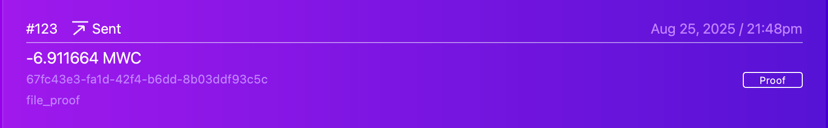

Response: wallet should ask for the file name to save the proof. Then it should show the proof dialog:

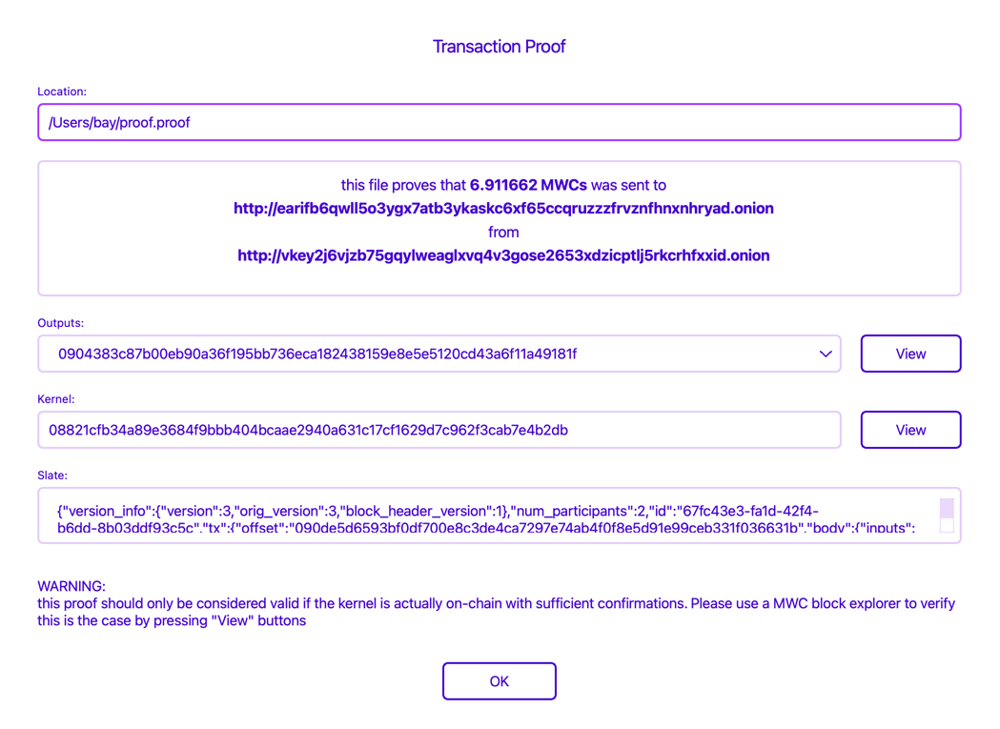

Check tab Order, resize

Check tooltips

Validate file at location:
```
cat /Users/bay/proof.proof
```
You should see some data in json format with field:  'encrypted_message', 'tor_sender_address', 'tor_proof_signature'

Validate proof message 'this file ....'. Amount, addresses sent to and from must be valid. You can view them at 'Recieve' page. 

press "View" for outputs (there is only 1 because of sending "All" coins)<br>
Response: In the browser page with that output should be open. Output must exist.

press "View" for Kernel<br>
Response: In the browser page with that kernel should be open. Kernel must exist.

Press OK.

## Send All.
Try to send All with a slatepack

## Contacts

Press "Contacts"<br>
Response: contacts dialog<br>
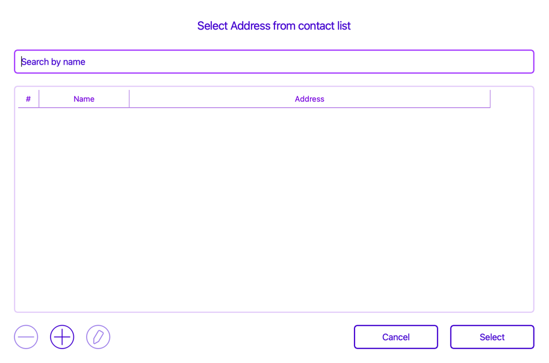

Check tab Order, resize

Check tooltips

### Add some new contacts

Expected that your contact list is empty. Add some contacts. Both Slatepack/Tor addresses and MQS (Assuming that you already have some instances for testing).<br>
Press add contact "+" button<br>

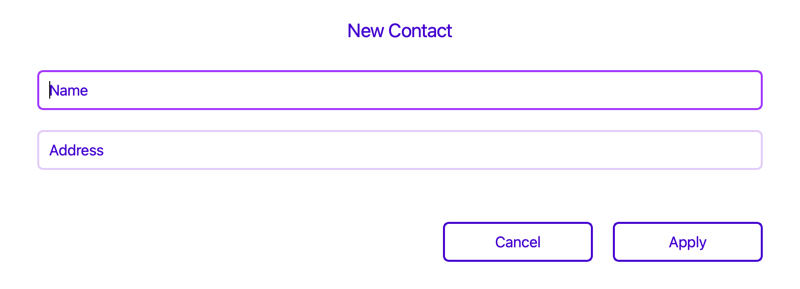

Check tab Order, resize

Check tooltips

### Http base contact

New contact can be created for http adress like http://127.0.0.1:1234, MWCMQS address like xmjFs9ecrXXUCQsbMGT6ii9CTeb9CC2UzyZVgBJC5ZURzwKqLCR4, Tor/SP address irwmhazgs4v5nxi3hmekq3bul4heh3sxfggftz5cyudomnwiqikxikyd

### Validate incorrect inputs handling

Check try add contact with the same name.<br>
Response: Message - Contact with a name XXXXXXX already exist. Please specify unique name for your contact

Try add contact with the same address<br>
Response: OK, address duplication is totally fine

Try add contact with unicode name гчф 湖 😃💁<br>
Response: OK, allowed. Restart wallet and see it contact name still valid 

### Save/restore contacts

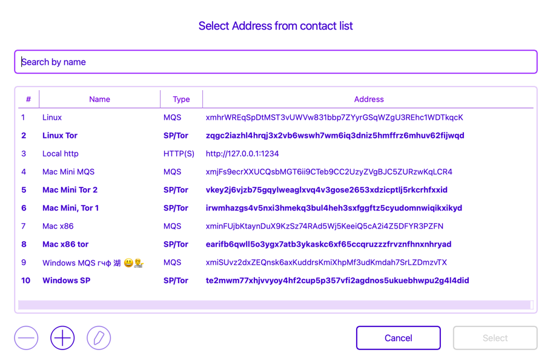

Validate that "Select" is enable only if highligted contact is selected

Double click on not highlighted contact<br>
Response: Message - Please select a contact with SP/Tor address type.

Try to delete the selected contact

Try to edit selected contact

Exit the dialog

## Send some coins with encrypted slatepack

Send back to this wallet some coins.

Select the account with come coins

Specify amount

Generate Transaction Proof - ON

Specify invalid 'Recipient slatepack address': MQS address, some symbols, unicode symbols гчф 湖 😃💁<br>
Response: message - Please specify valid recipient wallet Slatepack address

Specify unicode 'Description' value: гчф 湖 😃💁<br>
Response: message - String 'XXXXXXX' contains not acceptable unicode characters

From contact select contact, try select by double clic on contact, than with "Select" button.<br>
Select not this wallet contact.<br>
Response: Validate that contact name is printed below

Press 'Continue'.

Confirm Send Request, Specify Number of outputs 2.

Copy the slatepack to another wallet, receive it, generate the response, 

Copy response SP.

Press "Finalize"<br>
Response: Transaction XXXXXXX was finalized successfully.

Go to "Transactions" page. Validate that the number of outputs is 2.

Double click on the latest Tx.

# Receive Page, Slatepack Only

Press 'Receive'<br>
Response: The receive page<br>
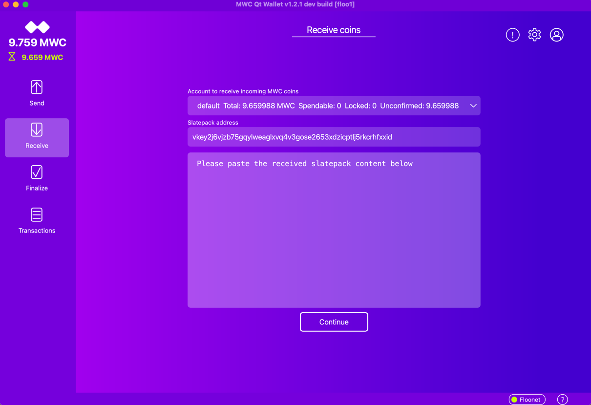

Check tab Order, resize

Check tooltips

Check Help. Help must be about SP only in this case

### Test slatepack decoding error

Generate Send slatepack for another wallet. Specify SP address from another wallet.<br>
Paste that Slatepack<br>
Response: Error status: The slatepack is encrypted for another wallet address, you can't process it.<br>
'Continue' button is disabled

Make slatepack data invalid<br>
Response: Invalid Slatepack. The data appears to be corrupted or incomplete. Please double-check that you copied the entire Slatepack correctly.<br>
'Continue' button is disabled

Generate another slatepack, enrypted for this wallet. Paste it.<br>
Response: Message with Amount and another wallet address.  Check if another wallet address printed correctly 

### Recieve page

Press 'Continue'<br>
Response: Recieve page<br>
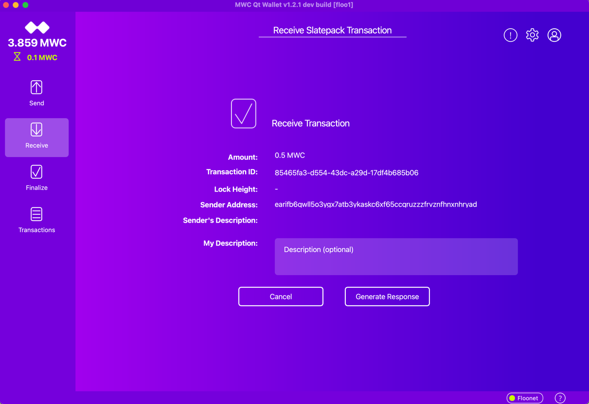

Check tab Order, resize

Check tooltips

Check Help. Should be the same as on prev page

### Receive cancellation

Press "Cancel"
Response: Switch back to starting receive page, page should have initial state.

Go into 'Transaction' and check that no receive transaciton was created.

### Generate response

Switch back to the receive page, paste the slate, press 'Continue'

Specify 'Description': "Thanks"

Press "Generate response"<br>
Response: resulting slatepack page

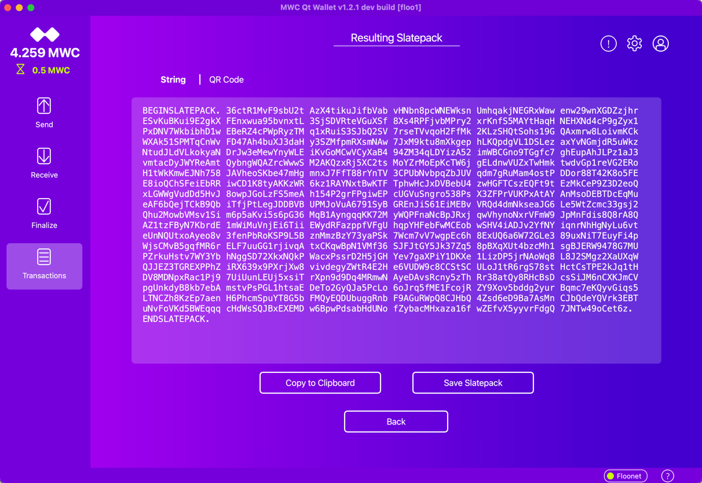

Check tab Order, resize

Check tooltips

Check Help. Should be the same as on prev page

### Response SP as a string 

Press "Copy to Clipboard"<br>
Response: Validate the SP is copied. Try to paste it in the text editor

Press "Save Slatepack", specify the file to save the SP.<br>
Response: Check the file content if it has correct SP content.<br>
Note: file extension can be wierd, it is not what we can do about.

### Response SP as a QR code

Switch tab to 'QR Code'<br>
Response: Page with a QR code:<br>
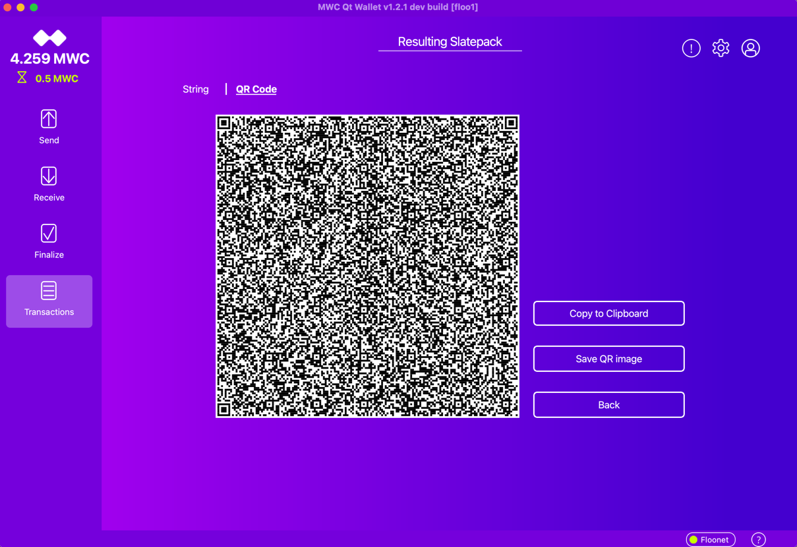

Check QR code acceptable with your cell phone. The QR code content should match the Slatepack

Press "Copy to clipboard"<br> 
Validate by paste the image into some editor

Press "Save QR image", specify some file.<br>
Validate file content, file extension should be 'png'<br>
Note, background can be strange, not fixing it

### Back button

Press "Back" button.
Response: Back to 'Receive' page

### Finalize and check description

Finalize this SP at the sender's wallet. Check if description 'Thanks' was shown.<br>
Finalize transaction.<br>

### Receive success message in on first confirmation.

Wait until it will be mined.<br> 
Response: Congratulation dialog:<br>
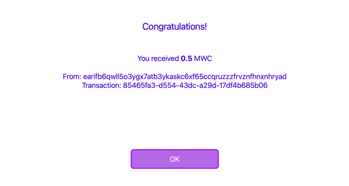

# Finalise, if Slatepack enabled

### Validate if Finalize visibility controls by SP feature

Finalize should be visible only for the slatepacks. Go to 'Wallet configutation'. Activate features and Slatepack. Press 'Apply'.<br>
Response: "Finalize" option must exist only if 'Slatepack' is selected. Other features shouldn't affect that.

Unselect "Slatepack". Check if "Finalize" is gone. Close the QT wallet.

Open QT wallet. Check if "Finalize" is gone. At 'Wallet configutation', press "Reset", than "Apply"<br>
Response: "Finalize" button should be back

### Finalize page

Press "Finalize" button.<br>
Response: you should see the page<br>
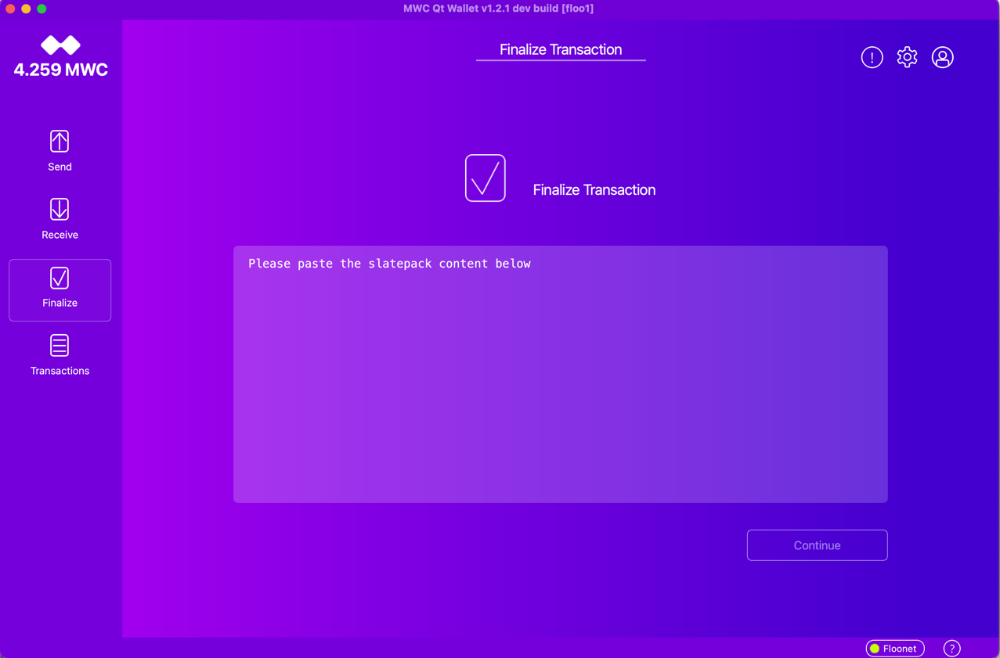

Check tab Order, resize

Check tooltips

Check Help.

Prepare response Slatepack, by sending slatepack, specify description "Sender message"<br>
At receiver wallet specify description "Receiver message"

### Validate slatepack decoding errors

Paste Slatepack encrypted for another address (you can change SP address at Settings => 'Slatepack address')<br>
Response: Message that slatepack enrypted for another wallet address

Paste invalid slatepack (just change something at valid SP)<br>
Response: Message that data is corrupted

### Finalize workflow

Paste valid SP, See at the bottom tarnsaction ID and receiver address.<br>
Validate that receiver address is valid and transaction id is correct (check "Transaction" page)

Note, 'Continue' should be enabled only when valid Slatepack will be entered.

Press "Continue"<br>
Response: 'Finalize Transaction' page<br>
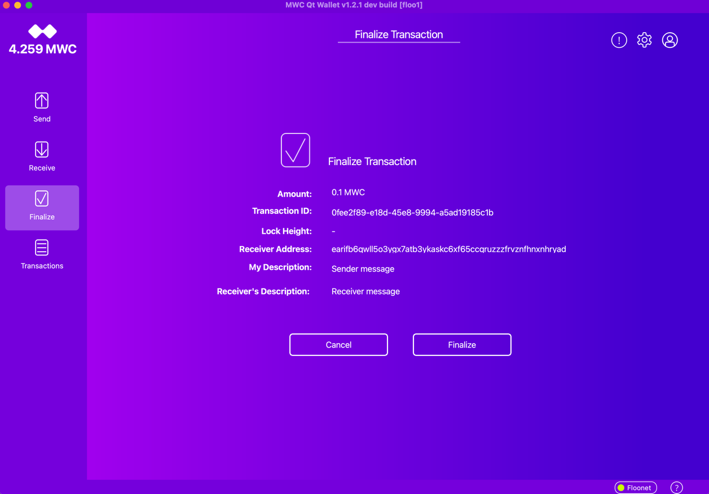

Check tab Order, resize

Check tooltips

Check Help, must be same as at Finalization.

Check transaction detals: amounts, descriptions, receiver address.

Check: My Description & Reciever's Description. Both should be correct

### Cancel button

Press "Cancel"<br>
Response: Return back to 'Finalize' page

### Finalize

Repat steps to finalize. Press 'Finalize' button<br>
Response: Confirmation finalize request<br>
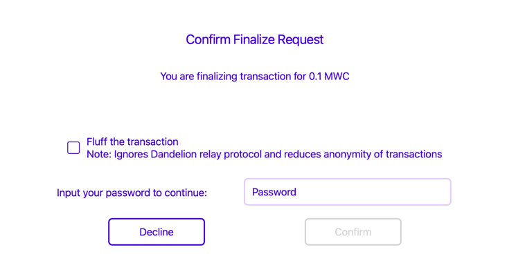

Check that there is no TTL param, only password and 'Fluff' flag

Check tooltips

### Transaction confirmation dialog, network related errors

Press "Decline"<br>
Response. Back to 'finalize transaction' page

Press 'Finalize' button. At confirmation enter the password and press 'Confirm', but break the network connection first.<br>
Response: In intenal node - nothing should happens. If external - Message about Node connection error

Wait for some time while node status will be red. Try to finalize transaction.<br>
Response: Message about Node heath status

### Finalize and wait for confirmations 

Restore network connection, wait until node status will be green. Then finalize transaction.<br>
Response: Success message that transaction will be finalized

Go to "Transaction" and wait until transaction will be confirmed.<br> 
Validate that there will be a notification message that Transaction is confirmed

# TTL 

Intiate Sending with slatepack of 3 transactions with TTL  10, 15, 20 blocks.<br>
Receive them with another wallet. Note the height of the blockchaion.

Wait until 10, 15, 20 blocks will be mined. Monitor transactions during that time on both send and receive wallets.<br>
Response: Transactions should be automatically cancelled when number of TTL blocks will be mined. User will need to press "Refresh" periodically. 

Send SP transaction with TTL 10.<br>
Get response and switch to the Finalize page<br>
Wait for 10+ blocks<br>
Try to finalize it<br>
Response: Message - failed finalizing slate!, Wallet error: Transaction Expired

# Switching to MQS & Tor

Go to "Wallet Configuration", Press "Reset" if it is enabled. At "Active features" page make Slatepack OFF, Tor and MQS - ON.<br>
Press 'Apply'<br>
Response: 'Finalize' page must be gone.  At the bottom right you should see 'Listeners' status window. It should be red first, than become green

# Listeners page

Press Listeners window at bottom right<br>
<br>
Response: "Listeners" page<br>
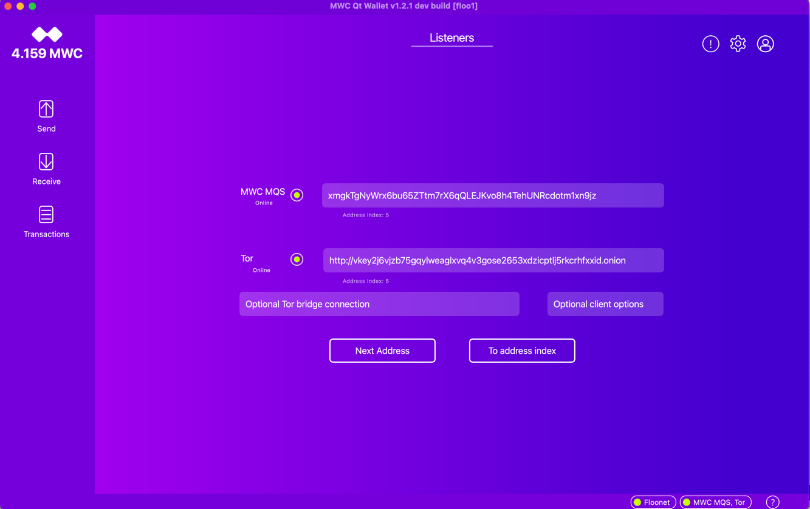

Check tab Order, resize

Check tooltips

Check Help

### Validate Active features impact to Listeners status and page 

Validate this page for all combinations of "Wallet Configuration" -> "Active features" -> Slatepack, Tor and MQS values<br>
Note: For Slatepack you can select this page with Options -> Slatepack Address<br>
Validate: Check next address, to address index works for every feature combinations. Validate that same index generated the same address.
Note: Online serveces are expected to restart on the index change, that takes few seconds. 

Close Wallet, than start Start Wallet.

Validate that the address index was restored correctly.

### Network issues

"Wallet Configuration" -> "Active features" -> Slatepack - OFF, Tor - ON and MQS - ON<br>
Switch to' Listeners'<br>
Validate that both Tor and MQS are online.<br>
Disable network connection, wait for some time<br>
Validate: MQS & Tor connection become red.

Check notification: We are expecting one message that Listeners was started, and one that they was stopped.

Enable Network, wait for some time<br>
Validate: MQS & Tor connection become green.

Try simulate Network dusruptions for intervals 30 sec, 1 min, 5 min, 10 min. Check if wallet was able to restore 

Close the wallet.

### Start wallet with offline network

Shout down the network.

Start Wallet.

Check if wallet was able to start, the listeners and node should be Red

Turn ON the network connection.

Validate that connection to node and Listeners should be restored

Press "Next Address" and "To address index" and validate that address was changed when Network on and Off with Green/Red listeners statuses.<br>

# Send, online only (MQS & Tor, no Slatepack)

At "Wallet configuration" select MQS & Tor. Unselect Slatepack.

Press "Send" icon<br>
Response: send page for online methods<br>
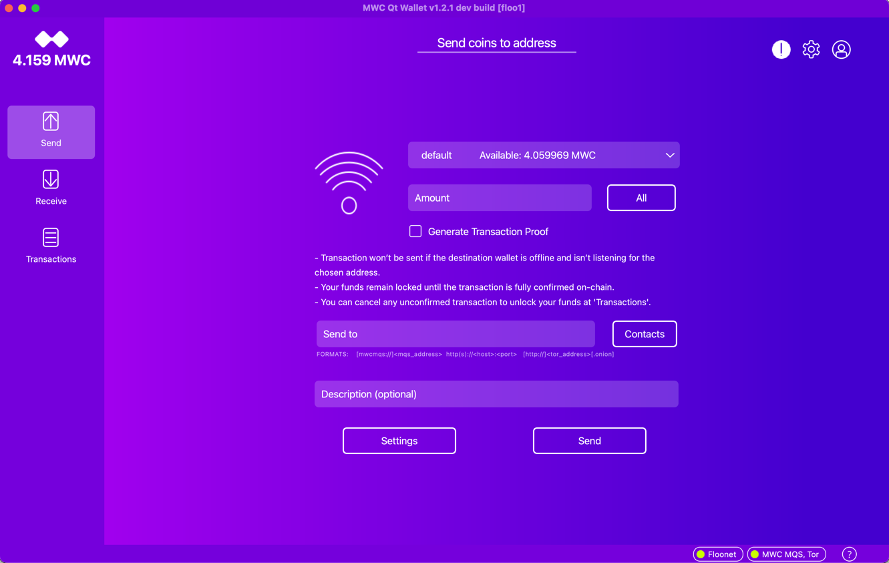

Check tab Order, resize

Check tooltips

Check Help

### Send with/without proofs

Send with proof coins to MQS and Tor address, Network should be good<br>
Response: Success message that coins was sent.<br>
Validate: Validate that coins was sent. Check if other wallet created transacitons for received coins. Check if your wallet created transacitons.<br>
Validate proofs: Download proofs, review proof files with wallet, review proof file with explorers.

Send coins without proofs for Tor and MQS<br>
Response: Success message that coins was sent.<br>
Validate: Validate that coins was sent. Check if other wallet created transacitons for received coins. Check if your wallet created transacitons.<br>
Validate proofs: Check that transaction doesn't have proofs do download

### Network interruptions

Send coins to offline address. Check if the unable to send message was shown..<br>
Note, send waiting time will be around a minute<br>
Validate: No transaction must be created, no outputs are locked

Send coins to TOR&MQS addresses and turn off network during that process. Check if the unable to send message was shown.<br>
Note, send waiting time will be around a minute<br>
Validate: No transaction must be created, no outputs are locked<br>
Note: With MQS you might get response after the incident becuase MQS keeping it in the memory for soem time. That transaction still will be ignored because it was failed. 

### Sending to not activated feature address.

At 'Wallet Configuration', at Active Features select Tor Only, press "Apply"<br>
Go to send page, try send to MQS address<br>
Response: Message that mqs feature is disabled

At 'Wallet Configuration', at Active Features select MQS Only, press "Apply"<br>
Go to send page, try send to Tor address<br>
Response: Message that tor feature is disabled

## Validate Format string and Contacts

Check if  FORMATS comment should match selected features. Try all Tor and MQS combinations, check that format include selected plus http

Press "Contacts" and check that you can select contact only for selected features.

## Send All.
Try to send All with a MQS and TOR

# Receive, online only (MQS & Tor, no Slatepack)

At 'Wallet Configuration', 'Active features' specify Tor & MWCMQS, press "Apply" 

Switch to 'Receive' page<br>
Response: page with both listeners and addresses<br>
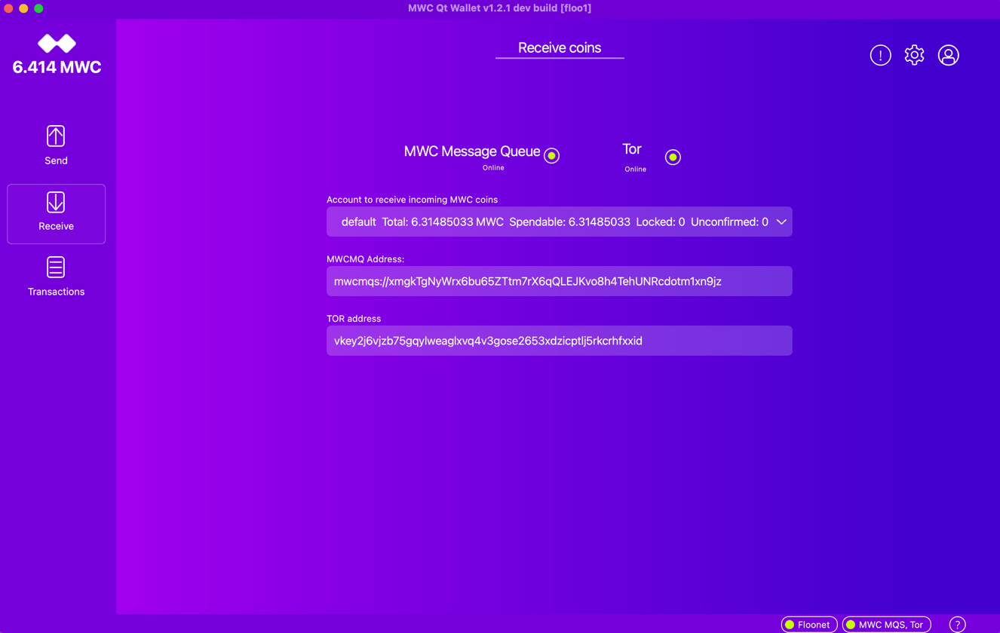

Check tab order, resize

Check tooltips

Check help

Check if addresses are valid, they should match to addresses at 'Listeners' page

### Receive target account 

Select account to receive the funds<br>
Validate that selected account is stored. Switch the pages, close/open the wallet. Receive account should stay. It can be different from transaction account

Send funds with Tor, specify some description<br>
Check: There was message at the bottom about the funds, event in events list. Events should have description.<br>
When block mined - Congrats dialog 

Select another account to receive the funds

Send funds with MQS, specify some description<br>
Check: There was message at the bottom about the funds, event in events list. Events should have description.<br>
Switch to another page<br>
Wait when block is mined, see if congrats dialog will be shown

Go to transaction page. Validate that funds was receives on expected accounts, as you selected for mqs and Tor transactions.

Test how receive looks for all combinations of features: Tor, MQS, Slatepack (Use "Wallet Configuration" to change those values) 

# Receive, online & offline (MQS & Tor, Slatepack)

At 'Wallet Configuration', 'Active features' specify Tor, MWCMQS & slatepack, press "Apply"

Switch to 'Receive' page<br>
Response: page with both listeners and addresses<br>
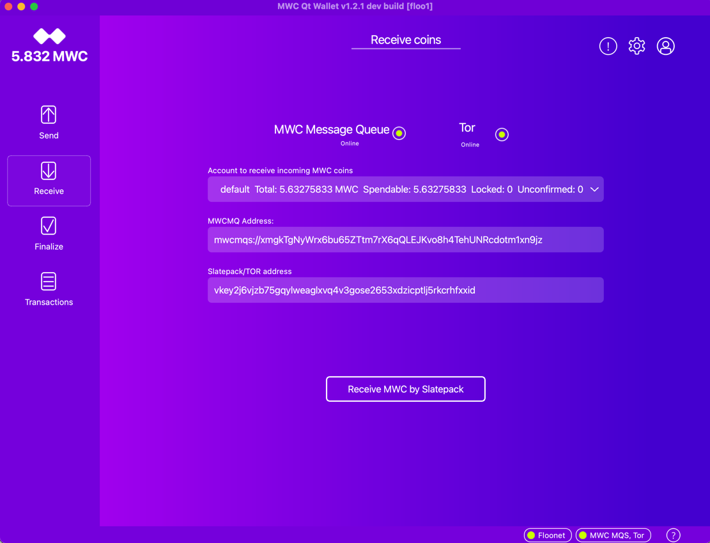

Check tab order, resize

Check tooltips

Check help

Validate MQS & Tor addresses, should match expected

### Receive by slatepack option

Press "Receive MWC by Slatepack"<br>
Response: Message box to input SP<br>
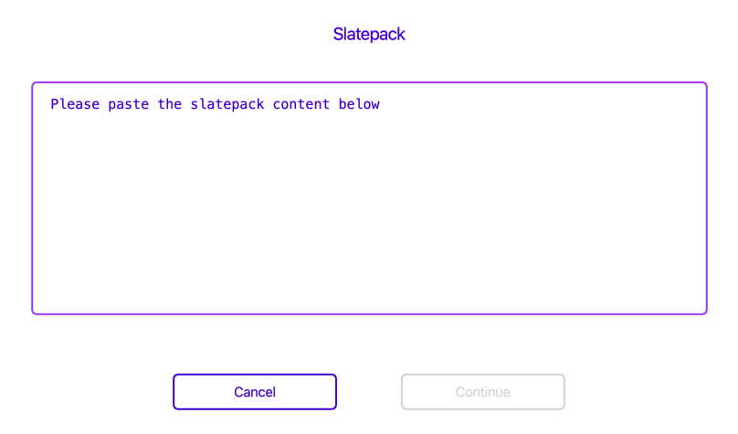

Paste you SP data here. Try paste currupted data to see that correct SP parsing results are printed

Press "Continue" and finish recieve workflow. Press "Back" button at the end.<br>
Validate that Back return you to starting 'receive' page

# Receive confirmations

## Validate that multiple receive will not overwelm the UI. 

Create on your another wallet multiple outputs, for example, send 6 transactions to it.

At your primary wallet check that MQS and Tor listeners are active.

Logout from the wallet (or wait for autolock)

Send 6 transactions with Tor & MQS to your primary wallet.

Wait when they will be mined.

Check: Congrats dialogs with amounts, description and from address<br>
Check: Number of dialogs should be 4, even 6 was sent. We show only first 4 messages

## Validate that multiple receive when Wallet is Locked

Lock the wallet and send 6 transactions online to it.<br>
Check: Congrats dialogs with amounts, description and from address<br>
Check: Number of dialogs should be 4, even 6 was sent. We show only first 4 messages

Specify 3 minutes autolock and what until the wallet will be autolocked.<br>
Send 6 transactions to it.<br>
Check: Congrats dialogs with amounts, description and from address<br>
Check: Number of dialogs should be 4, even 6 was sent. We show only first 4 messages

# Event Window

Press '!' icon at top right corner.<br>
Validate: tooltip of that icon<br> 
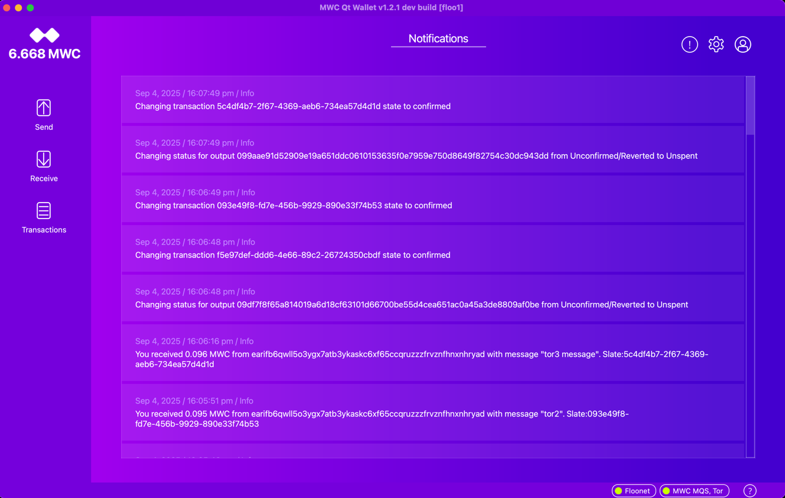

Check the messages, you should see all your events from last online versions.<br>
Plus all warnings/errors that you saw before.<br>
Validate that important messages are highlighted. If you don't have any, stop the network, it will produce some

Double click on any message<br>
Response: message details dialog<br>
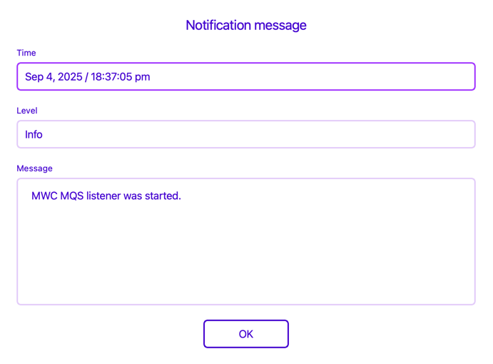

Switch to another tab and produce some warning message (turn network off)<br>
Response: '!' should be highlighted:<br>


Turn network ON

Press '!' icon<br>
Response: Notification window. '!' icon should be not highlighted any more.<br>

New messages shouldn't be added into the list. Press '!' icon to update the list.

Switch to another tab. Wait for some time<br>
Validate that '!' icon is not highlighted (expected that no new messages appear)

# Send (Slatepack & Online)

Go to 'Wallet configulation', Activate all features: Slatepack, Tor, MWCMQS. Press 'Apply'<br>
Response: 'Receive' button should be visible now. All listeners should start

Press 'Send' button<br>
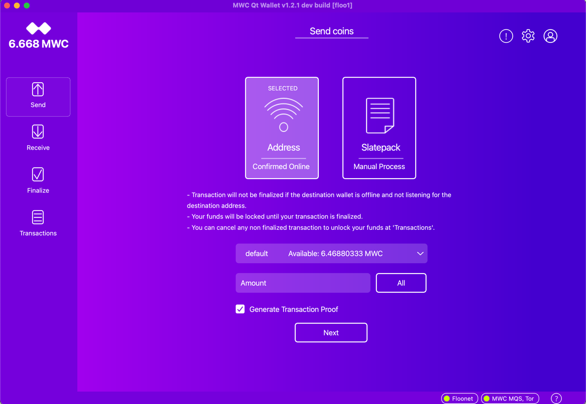

Check Tab Order, resize

Check tooltips

Check Help

## Send, Online methods

Press 'Address'

For amount press "All" to check if it works.
Response: All available amount except fee should appear in the 'Amount' field

Select account, Specify amount to send, no Transaction proof, press "Next"<br>
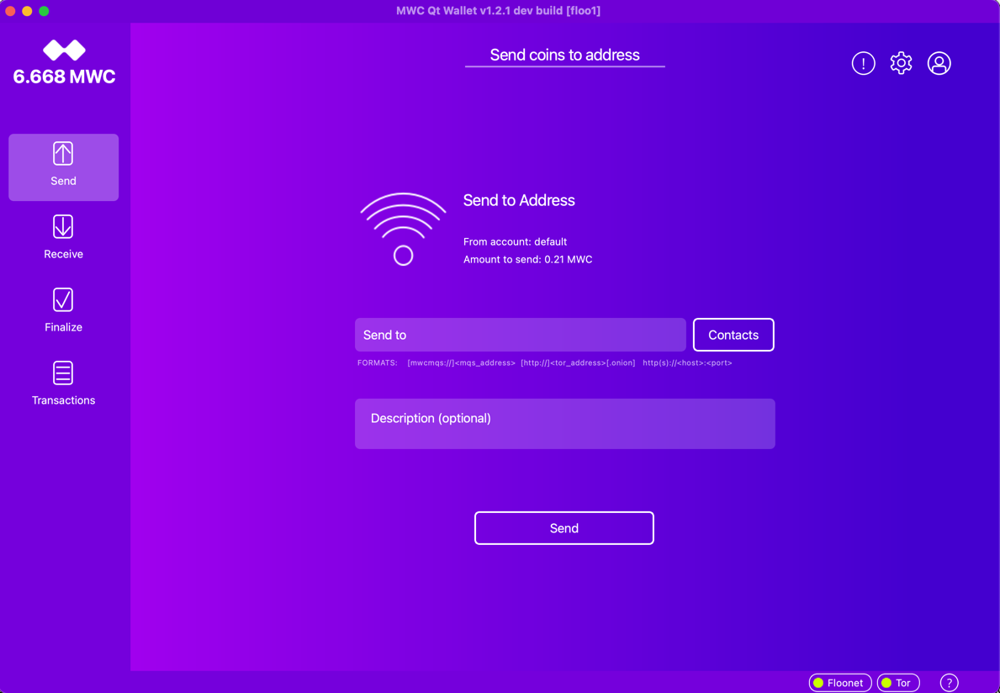

Check Tab Order, resize

Check tooltips

Check Help

Check if  FORMATS comment should match selected features. Try all Tor and MQS combinations, check that format include selected plus http

Press "Contacts" and check that you can select contact only for selected features.

Press "Send". Confirm transaction.

Repeat: Send transaction 2 to MQS, Proof is off.

At 'Send' Transaction proof - ON

Repeat: Send transaction 3 to Tor, Proof is on.

Repeat: Send transaction 4 to MQS, Proof is on.

Switch to 'Transaction' and check that first two transaction don't have proof. Last two transactions do have proof<br>
Check addresses for those 4 transactions.

## Send slatepack

At 'Send' page select 'Slatepack' type, No Transaciton proof. Specify amount and press "Next"<br>
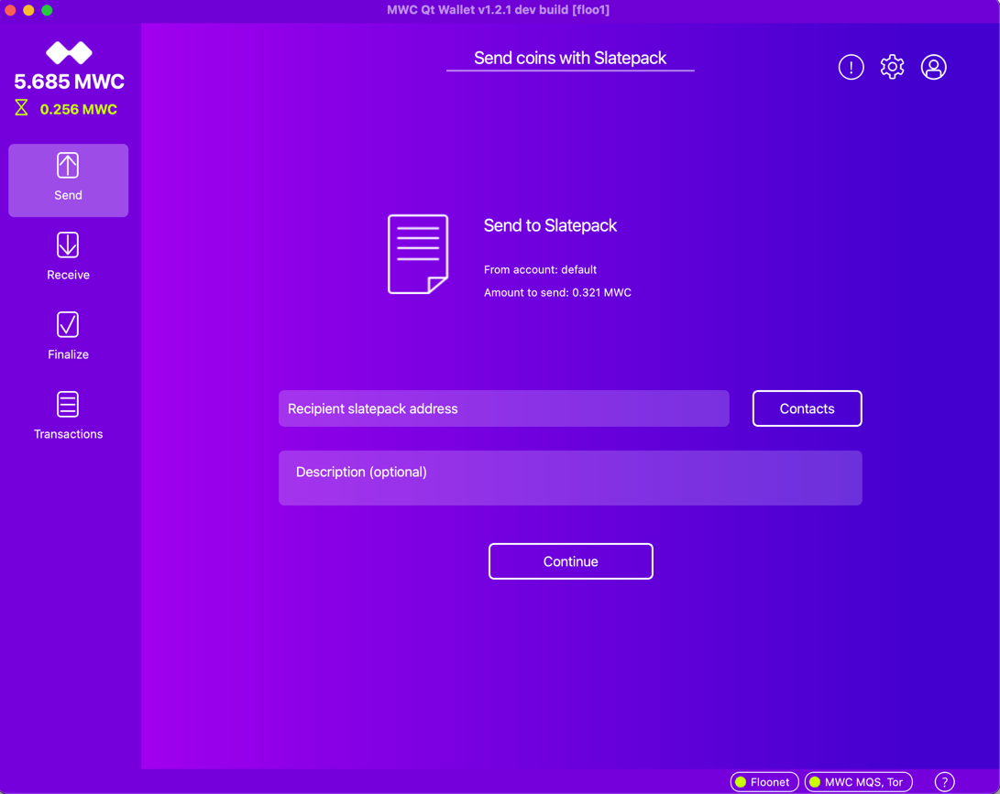

Check Tab Order, resize

Check tooltips

Check Help

Press Contact, validate that only SP/Tor addresses can be selected.<br>
Select address from contacts<br>
Check: Contact name below address line

Paste SP address<br>
Check: No contact name below address line

Specify some description and press 'Continue'

Finish SP sending process.

Repeat: Send another SP transaction with 'Transaciton proof' is ON

Validate in "Transaction" page that there are two new transactins. One of them has proof, another is not.<br>
Validate the proof. Try to download it, then view

Repeat: Send another SP transaction and don't specify recipient address. Unencrypted slatepack should be produced.<br>
Validate: The slatepack should start/end with 'BEGINSLATE_BIN' instead of 'BEGINSLATEPACK'<br>
Finish that transaciton and check that it is legit.

Validate that unencrypted SP can't have a Proof. UI will ask for address of proof is enabled.

# Transactions

Press 'Transactions'<br>
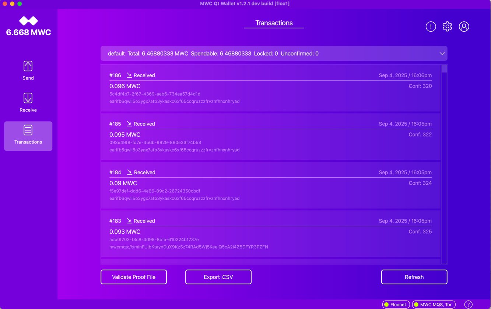

Check Tab Order, resize

Check tooltips

Check Help

Switch accounts and see that correct transactions are displayed for them

### Transaction details dialog

Double click on any confirmed Send transaction<br>
Response:<br>
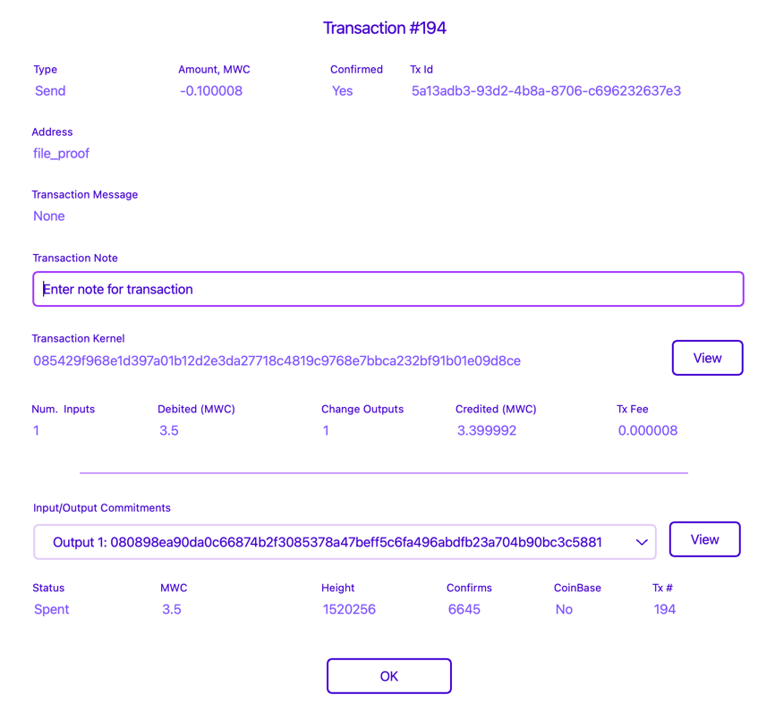

Check Tab Order

Check tooltips

Note, inputs/Ouputs has only inputs/outputs belong to this wallet, not to the peer 

Check that in 'Input/Ouput' selected change Output by default.<br>
If transaction doesn't have any change outputs (only inputs). If all spent - the first will be selected by default

Press "View" for Kernel<br>
Response: web explorer should be open with a kernel info

Press "View" on inputs/outputs<br>
Response: web explorer should be open with a commit info

Change selected inputs/outputs<br>
Check: input/output details must be changed.

### Transaction notes

Enter into Transaction Note something with unicode symbols гчф 湖 😃💁<br>
Close Dialog with OK<br>
Response: Note must be shown at transaction<br>
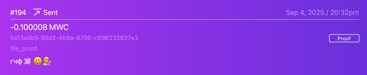

Close and open QT wallet<br>
Check: Transaction note is correct

### Validate Proof file

Press "Validate Proof file", specify saved before proof file<br>
Validate: Transaction proof dialog, tested before, should be opened

### Export .CSV

Press "Export .CSV", specify resulting file name.<br>
Validate: Open that file with Excel or alternative and see that Transaction data at CSV file is valid <br>

### Auto-refresh

Send some coins online to this wallet while you at Transaction page.<br>
Check: New transaction should be shown as soon as it was received. State should unconfirmed (new Tx is highlighted)

Wait while transaction will be confirmed.<br>
Response: 'Congrats' dialog and next you should see your new transaction without that neon mark.

Scroll in the middle of transactions. Items are rendered dynamically, so we want to skip some.<br>
Wait for new block so autorefresh will be treggered.<br>
Response: You shoudn't see that last visualized transactions was shifted. 

## Transaction - Cancel

Any not confirmed transaction should have 'Cancel' button. If it is cancelled, Transaction status should be changed to 'Cancelled'.<br>
Also, with cancelled transaction no other operations are possible.<br>
If cancelled transaction will be confirmed, it's status should be reverted.

### Cancel not confirmed transaction

Send online transaction to other wallet

At 'Transaction' page view it, check that it is not confirmed, so can be cancellable.<br>
Press 'Cancel'<br>
Response: Cancel confirmation dialog. Than Tx status should be 'Cancelled'<br>
Also wallet pending coins should be updated soon.

### Reverting cancel on confirmation

Wait until Transaction is confirmed.<br>
Response: You should see the critical message like this: Changing transaction 92f01330-de80-4d33-a69e-7a0ed227fd7d from Canceled to active and confirmed<br>
Notification should be highlighted<br>
Transaction status should be reverted to "Send"
Wallet pending coins should be back (Assuming that number of confirmations is set to 10)

### Cancel not finalized transaction

Send coins with Slatepack, get a response SP. Don't finalize the slatepack.

Go to Transaction page view it, check that it is not confirmed, so can be cancellable.<br>
Cancel this transaction.

Go to 'Finalize' page. Finalize this cancelled Tx Slatepack
Response: At the last step you should get a message:  Transaction XXXXX has already been finalized, cancelled, or has expired.

### Viewing transaction with/without cancellation

Receive online transaction from another wallet.

At 'Transaction' page view it, check that it is not confirmed, so can be cancellable.<br>
Press 'Cancel'<br>
Response: Cancel confirmation dialog. Than Tx status should be 'Cancelled'<br>
Also wallet pending coins should be updated.

Wait until Transaction is confirmed.<br>
Response: You shoudl see the critical message like this: Changing transaction 92f01330-de80-4d33-a69e-7a0ed227fd7d from Canceled to active and confirmed<br>
Notification should be highlighted<br>
Transaction status should be reverted to "Receive"
Wallet pending coins should be back (Assuming that number of confirmations is set to 10)

Check if can view not confirmed, cancelled and not cancelled transactions. Double click on it and view the details 

### Cancel SP transaction after finalization

Receive another TX with slatepack. Cancel it before finalize it on another wallet.

Wait until Transaction is confirmed.

Check if status will be reverted back.

## Transaction - Repost

### Repost of already posted transaction

Send transaction while it is not confirmed should have 'Repost' button.

Send coins online. While new transaction is not confirmed, press 'Repost' button<br>
Response: You should message:  "Transaction is already posted and stored at the transaction pool. If transaction is not confirmed for a long time, please check if your MWC node can reach the network and miners."<br>
It is expected because node already have it in the Tx Pool.

### Repost of never posted transaction

Now let's test how it can work with success.

Switch to "MWC Node Status" and wait until node switched from 'public' to 'embedded'

Send coins with Slatepack. Right before Finalize step stop the network. Finalize should pass because embedded node still 
not realized that internet is down. But the broadcasting will fail.<br>
Close the wallet<br>

Turn ON network.<br>

Start Wallet.<br>
Go to 'Transactions' page. Wait for a few blocks to mine.<br>
Validate that transaction still not confirmed.<br>

Press 'Repost' button.<br>
Response: Message - Transaction #XXX was successfully reposted.

Press 'Repost' once more<br>
Response: Message - Transaction is already posted and stored at the transaction pool. If transaction is not confirmed for a long time, please check if your MWC node can reach the network and miners.

Wait for some time, transaction should be confirmed.

### Repost of not finalized transaction

Start new Slatepack Send transaction, just generate a first SP.<br>
Go to 'Transaction' page. 
Check: There is no 'Repost' button<br>

Cancel that SP transaction.

## Transaction - View Slatepack

### View sent slatepack and finalize

View slatepack functionality is needed to retrieve the latest SP to continue transaction. That is why confirmed SP 
transactions should not have 'View Slatepack' button. 

Start SP sending process until the step where you can copy SP. Copy it for your reference<br>
Switch to transaction. You should see "View Slatepack" button. Press it.<br>
Response: You should see page that show Slatepack to send, validate that it match the reference<br> 

Press 'Back' button<br>
Response: Return back to 'Transaction' page.

Close and open the wallet

To to 'Transaction' page. Transaction should have 'View Slatepack' button, press it.<br>
Response: You should see page that show Slatepack to send, validate that it match the reference.

Use that SP to receive at another wallet and finalize response SP.

To to 'Transaciton' page. Transaction should not have 'View Slatepack' button when finalization was successfull.

### View receive slatepack

Receive coins with Slatepack, copy SP to your reference

Switch to 'Transactions'. For this new transaction you should see "View Slatepack" button. Press it.<br>
Response: 'Resulting Slatepack' page. Validate if it match the reference.

Press "Back"<br>
Response: switch back to 'Transdaction' 

Close and open the wallet

To to 'Transaction' page. Transaction should have 'View Slatepack' button, press it.<br>
Response: 'Resulting Slatepack' page. Validate if it match the reference.

Use that response slatepack to finalize transaction at another wallet.<br>

Wait some time and see that transaction was finalized.

## Transaction - Proof

Send coins with MQS and Tor, 'Generate Transaction Proof' must be ON.

To to 'Transaction', both transactions, Unconfirmed yet, must have 'Proof' button.<br>
Press 'Proof' for both, review them.

### Proof for cancelled transacitons

Cancel both transacitons.<br>
Validate: 'Proof' button still must be there. Validate that you can get proofs for cancelled.

Wait until Transactions will be confirmed, the status will be cachnged to 'Send'<br>
Validate: 'Proof' button still must be there. Validate that you can get proofs for cancelled.

Use "Validate Proof File" to view and validate those proofs. Validate kernels online. Adresses and amount must be legit as well. 

### Proof for not finalize transacitons

Start Send coins with Slatepack, no encryption.
Response: You can't have proof and not encrypt the SP. UI should show message about that.

Start Send coins with Slatepack, WITH encryption. When Initial slatepack will be generated, go to 'Transaction'<br>
Validate: No 'Proof' buttom should exist.

Continue with SP sending, generate response SP and finalize it.<br>
Validate: 'Proof' button still must be there. Check if you can get the proof.

### Proof for received transacitons

Receive coins online with MQS and Tor. Other wallet much specify 'Generate Transaction Proof' as ON<br>
Response: You should get 2 Receive transactions, no proofs for them.

Receive coins as Slatepack. Other wallet much specify 'Generate Transaction Proof' as ON<br>
Response: You should get receive transaction, no proof to it.

# Outputs

Got to settings, press "Outputs"<br>
Response: 'Outputs' page<br>
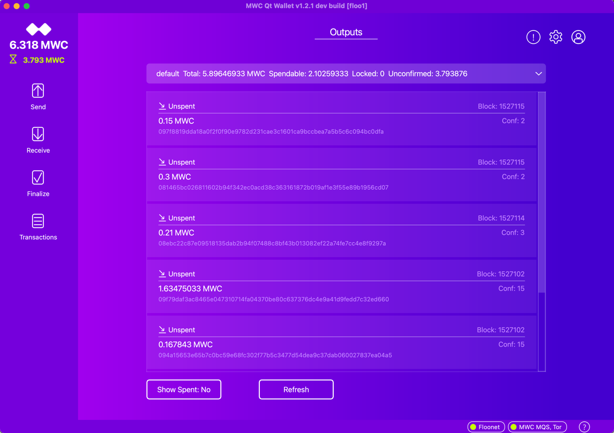

Check Tab Order, resize

Check tooltips

Check Help

Change account to view outputs from<br>
Response: Output from that account. Sum of outputs amounts should match 'Total' value for account 

### Output details

Double click on output<br>
Response: Selected output details:<br>
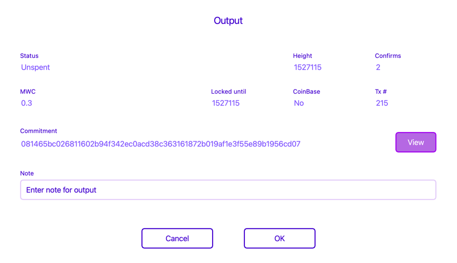

Check Tab Order

Check tooltips

Review outputs details, should match expected values. 

Press 'View' button<br>
Response: Outputs details should be viewed in the browser.

### Ouput notes

Enter Note, Try unicode symbols: гчф 湖 😃💁<br>
Press 'OK'<br>
Response: output should have note message now:<br>
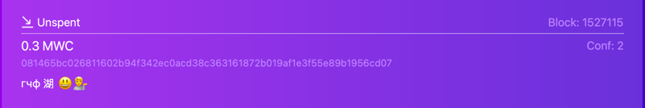

Close wallet, open the wallet.

Check if note for commit is correct.

### Trigger Show spent option

Click "Show Spend: XX" to trigger the status<br>
Validate if you see spent outputs or not

### Auto-refresh

Send some coins to this wallet.<br>
Validate: You should see new output

Wait for some time until Tx will be confirmed.
Validate: Output should become confirmed

# Node Overview

Got to settings, press "Node Overview"<br>
Response: 'MWC Node Status' page<br>
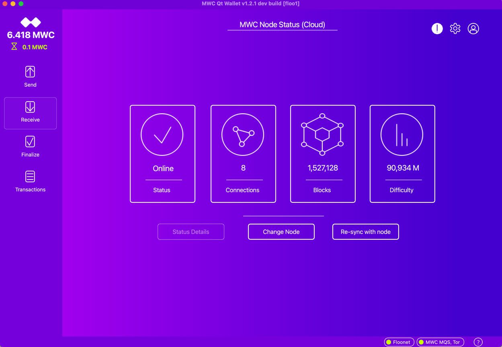

Check Tab Order, resize

Check tooltips

Check Help

### Embedded node status, sync process

At "Node Overview" page you should see node status, number of peers e.t.c.

Status shown for 'public' or 'embedded' node. Check that the peers are exist

Close the wallet.

Start the wallet 

Check: At "Node Overview" page there is "Embedded node status" while public node is active. When embedded status reach 'Ready',
public should switch to embedded.

### Embedded node data corruption recovery

Now let's test if QT wallet will be able to recover form node data corruption.<br>
Let's corrupt some data for both main and floo networks<br>
```
rm ~/mwc-qt-wallet/mwc-node/Floonet/lmdb/data.mdb
rm ~/mwc-qt-wallet/mwc-node/Mainnet/lmdb/data.mdb
```

Start the QT wallet. Start should take longer to start. QT wallet should erase the node data.<br>
Response: When wallet will start, at 'Node Overview' page you should see the Embedded node status as Handshaking first, than syncing from 0%.

In about 20 minutes node should finish to sync for embedded. Next node should switch from public to embedded.

Meanwhile check if wallet is robust, everything should work fine on public node,

# Re-sync with cloud and network failure

Close the wallet and delete emebdeed node data.<br>
```
rm ~/mwc-qt-wallet/mwc-node/Floonet/lmdb/data.mdb
rm ~/mwc-qt-wallet/mwc-node/Mainnet/lmdb/data.mdb
```

Start the wallet<br>

Go to "Node Overview". Make sure that public node is used. Press 'Re-sync wuth full node' button.<br>
Response: Full sync with node progress. It should take few minutes.<br>
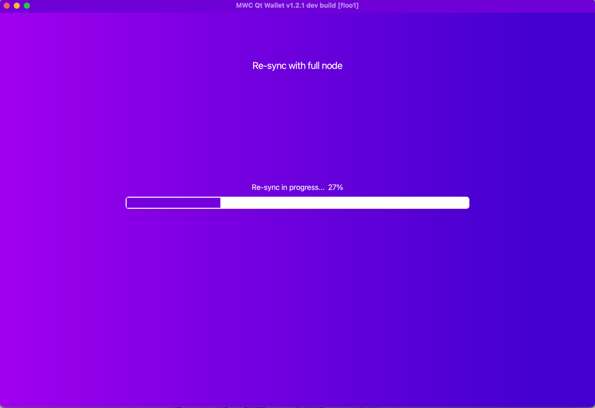

Shout down the network while scanning will be in the progress.
Response: Should see the error: Unable to reach MWC node. Please check your network connection.

### Re-sync with Cloud MWC Node, posting tx validation

Make some unconfirmed transactions. Send few SP and not finalize. Recieve few SP and not finalize.

Go to "Node Overview". Validate is wallet connected to public node.<br>
Press "Re-sync with node"<br>
Response: You should see the progress windows, no wallet functionality will be available during the sync process. 

Sync should take few minutes.

Check that all unconfirmed Tx was cancelled.

Send some coins to another wallet and wait until transaction will be confirmed.

# Re-sync with embedded and network failure

Go to "Node Overview". Make sure that embedded node is used. Press 'Re-sync wuth full node' button.<br>
Response: Full sync with node progress. It should take few minutes.<br>

Shout down the network while scanning will be in the progress.
Response Now: Nothing, while embedded node is used data to sync is available.
Long term response: At some point node might be switched to public, in that case network connect error should be shown.

### Re-sync with embedded node, posting tx validation

Make some unconfirmed transactions. Send few SP and not finalize. Recieve few SP and not finalize.

Go to "Node Overview". Wait until wallet will be connected to embedded node.<br> 
Press "Re-Sync with node"<br>
Wait for resync process, check if it finished successfully.

Check that all unconfirmed Tx was cancelled.

Send some coins to another wallet and wait until transaction will be confirmed.

# Select Running Mode

Go to Settings, select 'Select Running Mode'<br>
Response: Select Running Model page. Current selection must be 'Online Wallet'<br>

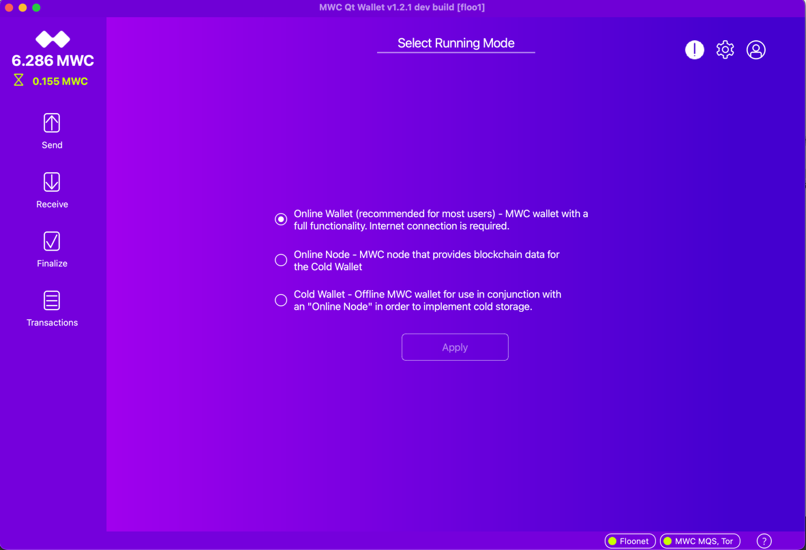

Check Tab Order, resize

Check tooltips - None at this page  

Check Help


Later will go through the Cold wallet workflow.

# View Slatepack

Go to Settings, select 'View Slatepack'<br>
Paste some slatepacks encrypted/nont encrypted, entrypted for another wallet.<br>
Check that slatepack results are decoded into the Json slate format, Content type is valid, for enripted sender/recipients are valid, or correct error is printed<br>

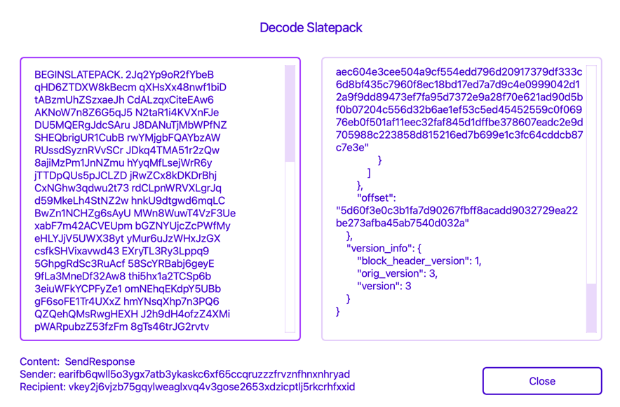

Try to type unicode symbols into the Slatepack data<br>
Response: QT wallet should print valid message about that.

Note, You need to view:
- Send, response encrypted from this wallet to another.
- Send, response encrypted from another wollet to this wallet.
- Send, response not encrypted from any wallet to any.
- Send, response encrypted from another wollet to another wallet (you should see decryption error)

# Accounts

Got to 'Account Options', select "Accounts"<br>
Response: 'Accounts' page<br>
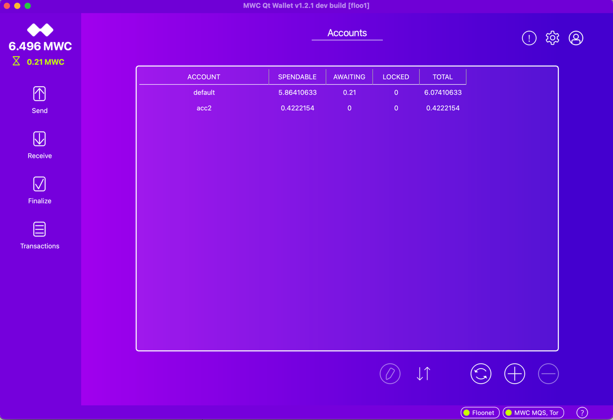

Check Tab Order (tab will stuck at the list - not fixing)

Check tooltips - None at this page

Check Help

Validate accounts amounts. You can view outputs to check if Total value is valid.

### Account naming

Double click on account, you should be able to rename all accounts except 'default'

Select account. 'Edit' icon should be enabled to any account except 'default'.

Press 'Edit' icon and rename account<br>
Validate that unicode symbols are not acceptable as account name. Try: гчф 湖 😃💁
Close and open QT wallet<br>
Validate that account name will stay.

Press 'Refresh' button, the accounts info should updated, if you have pending amounts, that can be useful.

### Create new account

Press '+' button to add a new account<br>
Try use unicode symbols: гчф 湖 😃💁<br>
Response: message about invalid symbols<br>

Press '+' button to add a new account<br>
Name your new account 'del me'

### Transfer between accounts

Press 'Transfer' icon<br>
Response: 'Transfer coins between accounts' page<br>
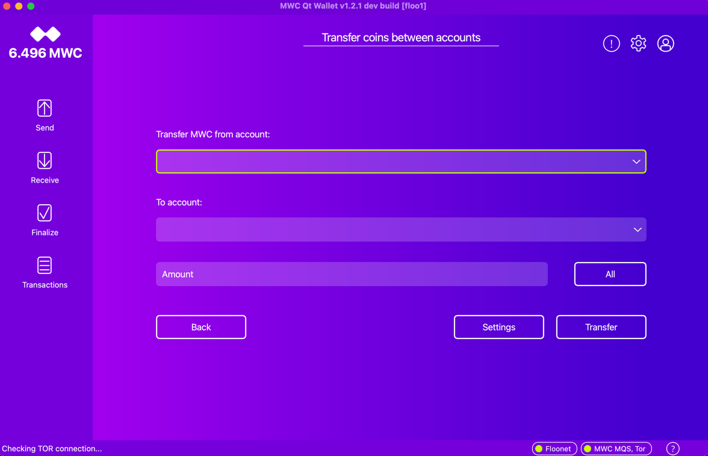

Check Tab Order

Check tooltips

Check Help

Press "Back"<br>
Response: switch back to 'Accounts' page

Press 'Transfer' icon

Select From account: 'default'<br>
Select To account: 'del me'<br>
Amount 1 MWC

Press "Transfer" button<br>
Response: "Confirm Transfer Request" dialog<br>
Specify change output: 3<br>
input your password and press "Confirm"<br>
Response: Message - 'Your funds were successfully transferred' and switch back to 'Accounts' page

At account page check that transferred 1 MWC is shown at del me account.

### Check transfer transactions and outputs

Switch to 'Outputs' and check that 'del me' account has 1 outputs<br>
'Default' account has 3 change outputs

Switch back to 'Acconts' page.

### Transfer all coins

Transfer from 'del me' to 'default' all coins. Press "All" to select all coins<br>
Press 'Transfer'<br>
Response: 'del me' account should have 0 total and 1 Locked

What until transaciton will be conformed.

Press "Refresh" button<br>
Response: 'del me' account should have 0 in all columns.

### Delete empty account

Select 'del me' account
Response: '-' icon should be enabled

Press '-' icon<br>
Resposne: Confirmation dialog<br>
Press "Yes"<br>
Resposne: 'del me' account should removed from the list

Close and open QT wallet

Check if there is no 'del me' account in the list

# Show passphrase

click 'Account options', press 'Show passphase' menu item<br>
Response: Request the password dialog

Input you password, validatade that you can input unicode symbols.<br>
'Confirm' will be enabled only when your password will be correct<br>
Press 'Confirm'<br>
Response: 'Wallet mnemonic passphrase' page with your mnemonic phrase.<br>
Validate: that you can copy paste mnemonic into any text editor.

# Contacts

click 'Account options', press 'Contacts'<br>
Response: "Contacts" page<>
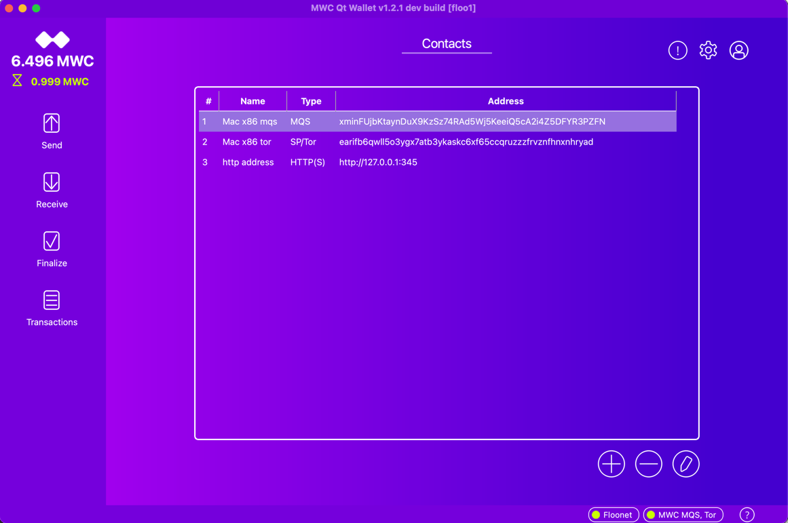

Check Tab Order

Check tooltips

Check Help

### Adding new contact

Press '+' and add some contacts<br>
Response: You should see the new contact in the list

Try to add the contact with the same name<br>
Response: Name collision message

### Edit contact

Select some contact, press "Edit" icon<br>
Response: 'Edit contact' dialog<br>
Change the contact and see that it was updated in the list<br>
Try to use already exist contact name<br>
Response: Name collision message<br>
Try to use invalid address<br>
Response: Message - Please specify correct address for your contact

### Delete contact

Select the contact and press '-' icon<br>
Response: Remove a contact confirmation.<br>
Press "Yes"<br>
Response: Check that selected contact was removed from the list

### Contacts save/restore, contact type 

Close and open the wallet<br>
Validate that contacts was recovered correctly.

Validate 'Type' column. The type should be recovered from the address

# Viewing Key

click 'Account options', press 'Viewing Key'<br>
Response: "Viewing Key" page<br>
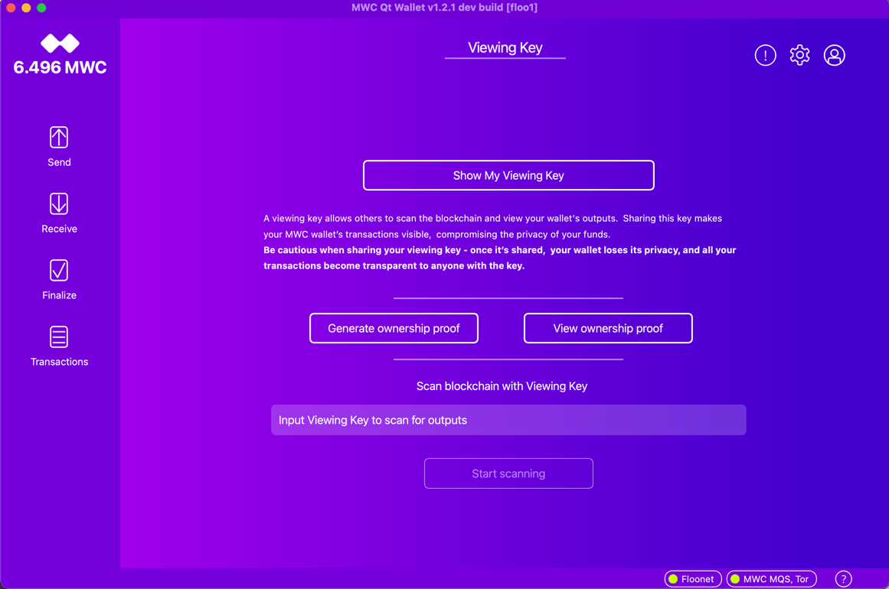

Check Tab Order

Check tooltips

Check Help

### Show Viewing Key

Press "Show My Viewing Key"<br>
Response: Value the you can copy/paste. Copy it for your reference

### Scan for self viewing key

Paste the viewing key into 'Input viewing key to scan for outputs'<br>
Response: 'Start scanning' should be activated

Shout down the network while scanning will be in the progress.<br>
Response: You should see the error if you run puplic node: Unable to reach MWC node. Please check your network connection.
If you are running embedded node, this error message will never happen, wallet will continue to use embedded node because 
it has some data (better than public).<br>
Update: Enetually embedded node will be marked as offline as well and than the error will be shown. But that takes time, scan will finish faster.

Restore network and start scanning: 

Press 'Start scanning'<br>
Response: Progress fr scanning the blockchain<br>
Wait until scanning will be finished<br>
Response: 'View outputs' page<br>
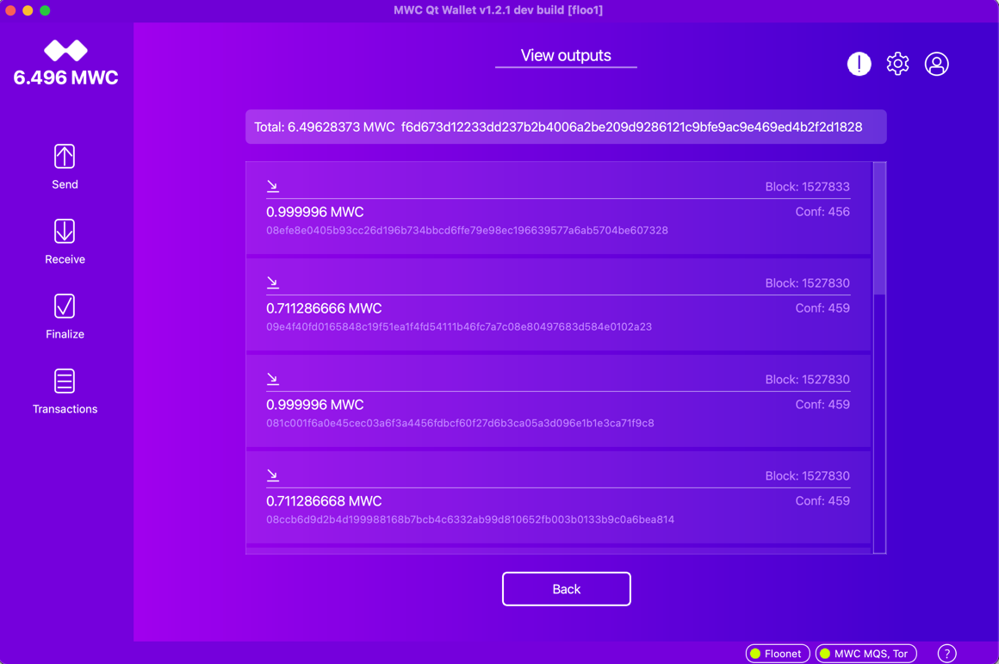

Check Tab Order

Check tooltips

Check Help

### Check found outputs

Validate that Total equals to the total of all accounts at your wallet.

List of outputs include the all outputs from your wallet.

Double click to  the output<br>
Response: Output diealog with details of this output.<br>
Press 'View' button<br>
Response: View output in the web explorer

Check that outputs are exist at your wallet.

### Scan for viewing key from other wallet

Repeat 'Input viewing key to scan for outputs' for viewing key from another wallet.<br>
Validate results as before

Repeat 'Input viewing key to scan for outputs' for not existing viewing key (generate viewing ket for mainnet account)<br>
Validate that no outputs was found, the total is 0

Press "Back" button<br>
Response: switch back to 'Viewing key' page

### Generate Ownership proof

Press "Generate Ownership proof"<br>
Resposne: 'Generate Ownership proof' page<br>
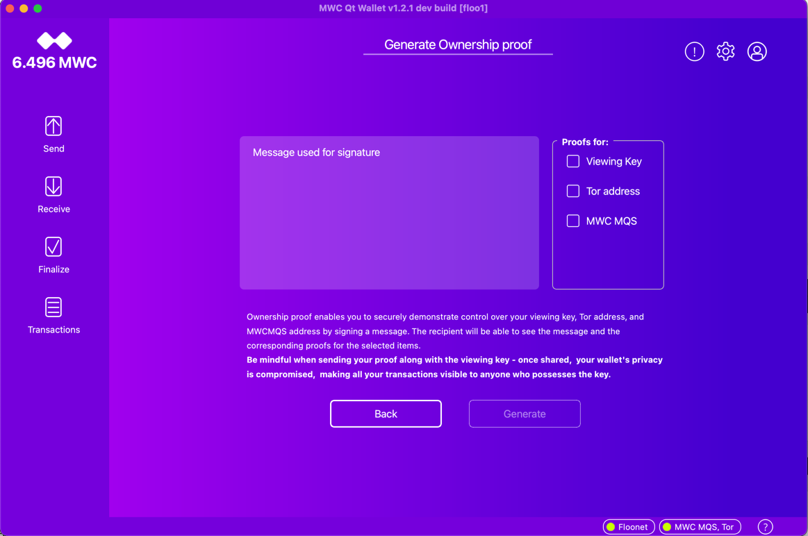

Check Tab Order

Check tooltips

Check Help

Press 'Back'<br>
Response: should be back at 'Viewing Key' page

Press "Generate Ownership proof"<br>

Specify message: 'Testing message'<br>
Select all 'Proofs for'<br>
Press "Generate"<br>
Resposne: Proof json message<br>
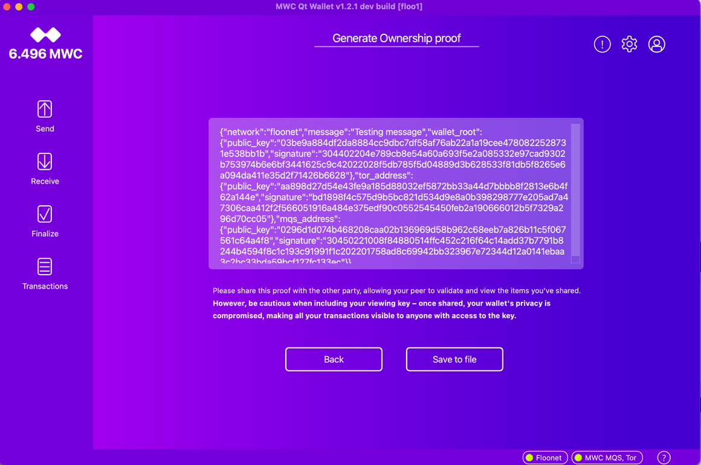

Check Tab Order

Check tooltips

Check Help

Copy that message for further testing

Press "Save to file", specify the file name.<br>
Validate: Check that saved file has the same content that is shown on this page.  

Press 'Back' button<br>
Response: should be back at 'Viewing Key' page

### View ownership proof, invalid data messages

Press "View ownership proof"<br>
Response: 'Validate Ownership proof' page<br>


Press 'Back' button<br>
Response: switch to 'Viewing Key' page

Press "View ownership proof"
Response: 'Validate Ownership proof' page

Paste some invalid proof<br>
Press 'Validate' button.<br>
Response: Message - Unable to validate ownership proof...

Input some unicode characters: гчф 湖 😃💁<br>
Press 'Validate' button.<br>
Response: Message - Incorrect input error

Try to input forged Proof. Chnage network, message, signatures.<br>
Response: Message that proof is invalid

Press "Load From file"<br>
Specify file location, open the file<br>
Validate: Proof content should be loaded

Press 'Validate'<br>
Response: proof result page<br>
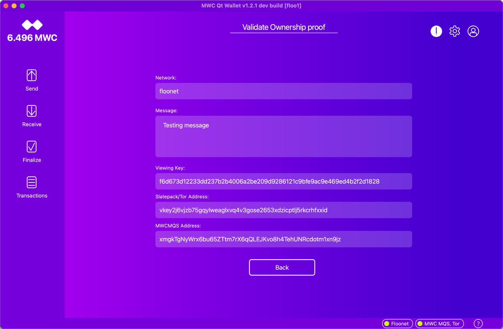

Validate that the Viewing key, Wallet Address and MQS addres are valid

Try to update ownership file with unicode symbols and process it<br>
Response: File shgould be loaded, but not validated

Generate and validate proofs for different combinations of 'Proofs for' and different messages.<br>
Validate that proofs are contain only expected data

Generate the proof on another wallet and view it on this wallet.<br>
Validate proof results: Viewing keys, addresses, message and network. 

# Logout / Change Wallet

click 'Account options', press 'Logout / Change Wallet'<br>
Response: Login page. Note that Listeners (if they are activated) should be maintained online.<br>
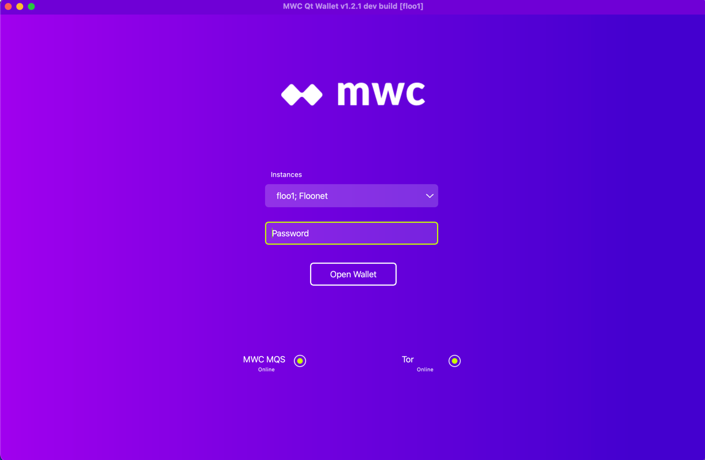


Send coins to this wallet<br>
Response: coins should be accepted

Shout down network<br>
Response: Check that listeners turn red.

Restore network<br>
Response: Listeners should turn green.

Type your password and open the wallet.

Do Logout and open another wallet. 

# Cold Wallet Workflow

Note, we are going to test the cold wallet on the same host for debugging purposes. Also the regular testing as it is 
described at mwc-qt-wallet/DOC/cold_wallet.md will be needed to test the release.  

Prepare the mnemonic from your current wallet that already has some coins.

Close QT wallet

backup your data
```
mv ~/mwc-qt-wallet  ~/mwc-qt-wallet-backup
```

## Provision cold wallet from the scratch (cold1)

STOP the network, no internet connection allowed!!<br>

Start QT wallet and create a brand new wallet with a new mnemonic ('New Instance' choice). Note, wallet will run as a regular one,
that is why there will be some connection related warnings that we are ignoring.

When wallet will be created, go to 'Setting' and press "Select running mode" menu.<br>
There select 'Cold Wallet' and press "Apply"<br>
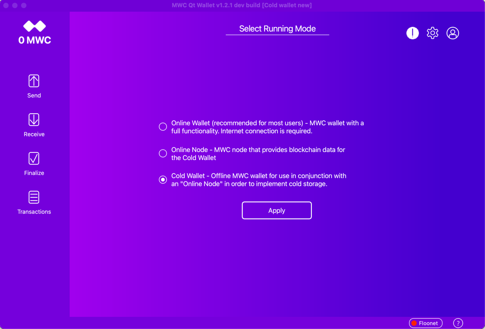<br>
Response: Message - Changing running mode requires restart.<br>
Press 'Continue'<br>
Resposne: QT wallet must restart in the Cold wallet mode now. Login into your new wallet.

Validate:<br>
- In wallet configuraiton only Slatepack is selected, no online services. No MWCMQS and Tor features should exist.
- Node status should be red
- Outputs, transactions should work and show empty lists.

Close the QT wallet

backup this cold wallet data
```
mv ~/mwc-qt-wallet  ~/mwc-qt-wallet-cold1
```

## Provision cold wallet from the passphrase (cold2)

STOP the network, no internet connection allowed!!<br>

Start QT wallet. Select 'Restore instance'<br>
Use the stored before the passphrase from yout tesing wallet.

When wallet will be created, go to 'Setting', press "Select running mode" menu.<br>
There select 'Cold Wallet' and press "Apply"<br>

QT wallet must restart in the Cold wallet mode now. Login into your new wallet.

Validate:<br>
- In wallet configuraiton only Slatepack is selected, no online services. No MWCMQS and Tor features should exist.
- Node status should be red
- Outputs, transactions should work and show empty lists.

Close the QT wallet

backup this cold wallet data
```
mv ~/mwc-qt-wallet  ~/mwc-qt-wallet-cold2
```

## Start as a Cold Wallet Node

Enable the network, node requied to run on another host with a network.

Start QT wallet. Select 'Cold Wallet Node'<br>
At confirmation request press "Continue"<br>
Response:  The node should start as Mainnet (we will need switch to the floonet.)<br>
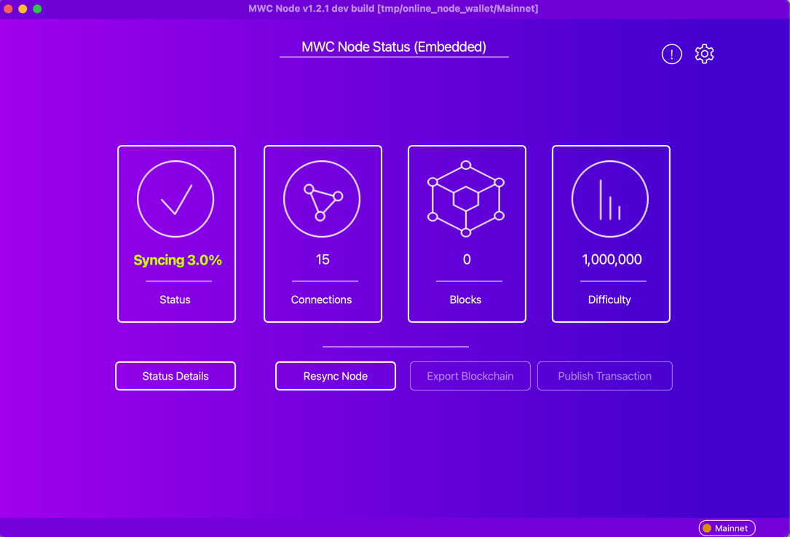<br>

Validate UI:
- No left panel for wallet operations.
- Check events
- Options has only 3 items: Configuration, Node Overview, Select Running mode

Click 'Select Running mode'<br>
Validate that 'Online Node' is selected.

Click 'Configuration'<br>
Response: 'Node config' page<br>
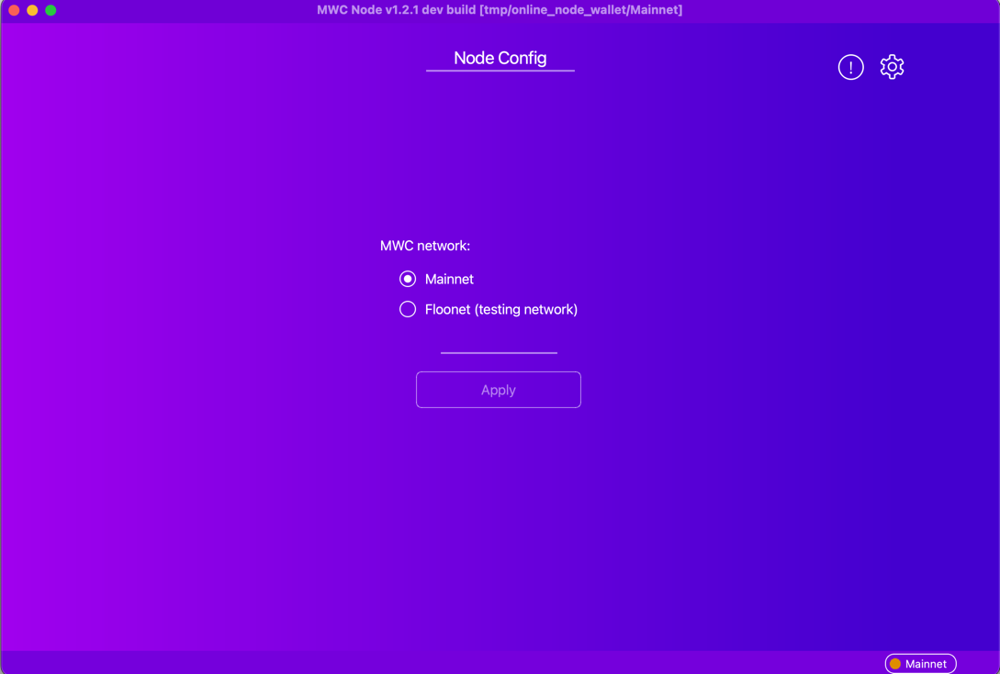<br>

Select 'Floonet' and press "Apply". 
Response: The QT wallet will restart, thatmight take a minute.

Now network should be 'Floonet'

At the 'MWC Node Status' page:

Check Tab Order

Check tooltips

Press "Resync node"<br>
Response: Embedded node should restart and start sync process from the 0% progress. 

Wait until the sync will be finished. Until sync od complete 'Export Blockchain' and 'Publish Transaction' should be disabled.

Press "Export Blockchain", specify filename with a blockchain data<br>
Response: Success message - MWC blockchain data was successfully exported to the archive ...

Close the Cold Wallet Node.

backup this cold wallet node data
```
mv ~/mwc-qt-wallet  ~/mwc-qt-wallet-node
```

## Create send SP from cold2

Restore cold2 data
```
mv ~/mwc-qt-wallet-cold2  ~/mwc-qt-wallet
```

STOP the network, no internet connection allowed!!<br> 

Start QT wallet, logging into cold2 wallet.

Press 'Import blockchain data', select eported before the block chain data<br>
Response: message - MWC blockchain data was successfully imported from the archive .... <br>
The node status should be ready, wallet should start updating, status line should show the progress<br>
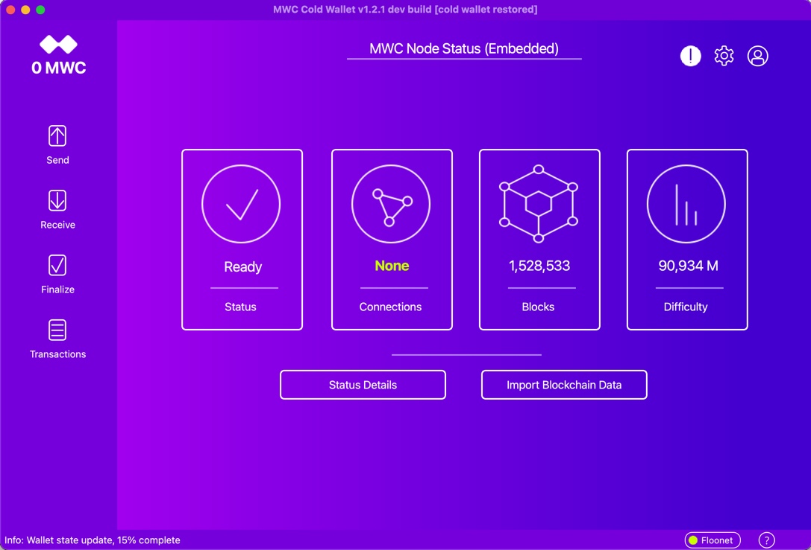<br>

Switch to 'Transactions'<br>
Response: wallet should start updating, transaction will be in waiting state, status line should show the progress

Wait until the wallet finish update, should take couple of minutes.

Check wallet balance, it should match what restored wallet expected to have,

To to 'Transactions' and check if outputs was restored into transactions.

Got to 'Settings' -> 'Outputs'<br>
Validate that output match expected.

Create Send slatepack, store that slatepack somewhere

Close QT wallet

backup cold2 data
```
mv ~/mwc-qt-wallet ~/mwc-qt-wallet-cold2
```

## Cold1 Receiving SP from cold2

Restore cold1 data
```
mv ~/mwc-qt-wallet-cold1 ~/mwc-qt-wallet 
```

STOP the network, no internet connection allowed!!<br>

Start QT wallet, logging into cold1 wallet.

Receive the Slatepack and generate the response. Save response into the file as cold wallet usage required.

Close the QT wallet

backup cold1 data
```
mv ~/mwc-qt-wallet ~/mwc-qt-wallet-cold1
```

## Finalize Transaction with Cold2

Restore cold2 data
```
mv ~/mwc-qt-wallet-cold2  ~/mwc-qt-wallet
```

STOP the network, no internet connection allowed!!<br>

Start QT wallet, logging into cold2 wallet.

Finalize the slatepack.<br>
At the last finalize stage you should specify resulting location<br>
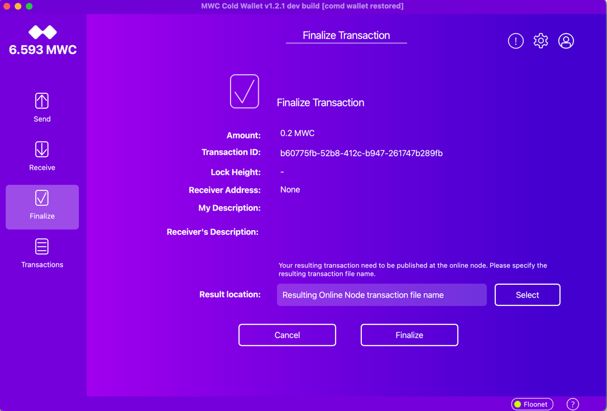<br>

Press "Select" button and specify the resulting transaction file name

Press 'Finalize'<br>
Response: Message - Transaction was finalized successfully but it is not published because you are running Cold Wallet...

Press 'OK', Close the QT wallet

backup cold2 data
```
mv ~/mwc-qt-wallet ~/mwc-qt-wallet-cold2
```

## Cold node publishing transaction

Restore cold node
```
mv ~/mwc-qt-wallet-node  ~/mwc-qt-wallet
```

START the network, internet connection required!!<br>

Start QT wallet, it should start as a cold node

Wait until the node finish syncing. It should be fast, only new blocks needs to be downloaded.

Press 'Publish Transaction' button<br>
Select mwctx file that was stored before<br>
Response: Message - You transaction at XXXXX successfully delivered to your local node...

Press 'OK', wait until block with transaction will be mined

Press 'Export Blockchain', select location<br>
Response: Message - MWC blockchain data was successfully exported to the archive

Close QT Cold Node

Backup cold node
```
mv ~/mwc-qt-wallet ~/mwc-qt-wallet-node
```

## Validate transaction on Cold1 

Restore cold1 wallet
```
mv ~/mwc-qt-wallet-cold1  ~/mwc-qt-wallet
```

STOP the network, no internet connection allowed!!<br>

Start QT wallet, logging into cold1 wallet.

Press 'Import Blockchain Data', specify latest blcokchain data<br>
Resposne: message - MWC blockchain data was successfully imported

Got to "Transaction", wait until the wallet state will be updated

Check if your receive transaction exist and has confirmed.<br>
View the transaction (double click in it) and see that ll data exist (View in web browser is not expected to work offline)<br>
Specify some Note, it should be stored

Go to 'Outputs', check that output does exist and has confirmations.<br>
View the outout (double click in it) and check the details<br>
Specify the note

Close QT wallet

Backup cold1 wallet
```
mv ~/mwc-qt-wallet ~/mwc-qt-wallet-cold1
```

## Validate transaction on Cold2

Restore cold2 wallet
```
mv ~/mwc-qt-wallet-cold2  ~/mwc-qt-wallet
```

STOP the network, no internet connection allowed!!<br>

Start QT wallet, logging into cold1 wallet.

Press 'Import Blockchain Data', specify latest blcokchain data<br>
Resposne: message - MWC blockchain data was successfully imported

Got to "Transaction", wait until the wallet state will be updated

Check if your receive transaction exist and has confirmed.<br>
View the transaction (double click in it) and see that data exist (View in web browser is not expected to work offline)<br>
Specify some Note, it should be stored

Go to 'Outputs', check that output does exist and has confirmations.<br>
View the outout (double click in it) and check the details<br>
Specify the note

Close QT wallet

Backup cold2 wallet
```
mv ~/mwc-qt-wallet ~/mwc-qt-wallet-cold2
```

## Restore original wallets

Restore cold2 wallet
```
mv ~/mwc-qt-wallet-backup  ~/mwc-qt-wallet
```

Start you rinternet connection.

Congratulations!!! Testing is done!!!

# After Release is done. Linux, Windows, MacOS Intel x64, MacOS Arm

On all versions specifically validate:

- notification window<br>
  At wallet config, Check 'Enable notification window'. Then check if notification windows are visible when Wallet in Focus, other app in focus, 
 other app is overlapping wallet window (in this case notification can be overlapped as well)  

- Font size.<br>
  At wallet config check if font size can be adjusted. Should be available for Linux. Adjust it and test the app.

- Embedded MWC node
- Send/receive with MWCMQS & Tor  
